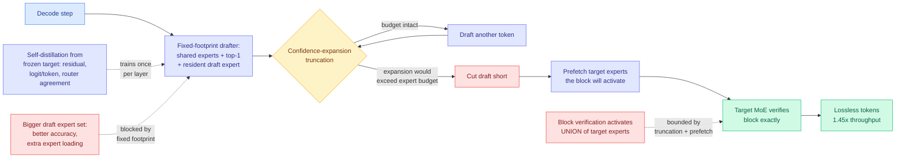

# DraftExpert: Expansion-Aware Self-Speculative Decoding for End-Device MoE Inference

**arxiv:** [2607.24434](https://arxiv.org/abs/2607.24434) · **Source:** [Kurate cs.LG weekly leaderboard #20, 2026-08-03](../../raw/kurate/2026-08-03-cs-lg.md) (score 1389, ai_rating 5.8/10) · **Author:** Dengke Han

## TL;DR

A mixture-of-experts model, where each token is routed through a small subset of specialized sub-networks instead of the whole network, looks perfect for a phone or a single-user workstation: only a few experts fire per token, so the compute is small. The problem is that the *weights* of all the experts still have to live somewhere, and on end devices they do not fit in accelerator memory. They get staged on demand, from CPU RAM to a GPU or from Flash to a mobile NPU, and that staging is the latency.

DraftExpert points out that this breaks speculative decoding in a way nobody had named. Speculative decoding runs a cheap drafter to propose several tokens and then verifies them in one pass of the expensive target model, and it is normally close to free because the verification pass costs about one target step. Under expert offload, neither half holds. **Growing the draft expert set improves draft accuracy but triggers extra expert loading**, so a better drafter is a slower one. And **verifying a block of k tokens activates the union of the experts those k tokens route to**, which is a much larger set than one token's experts, so verification is no longer one target step. The paper calls this expansion, and builds the whole system around bounding it.

The fix is a fixed-footprint drafter. One lightweight draft expert per layer lives permanently on the accelerator, self-distilled from the frozen target using residual, logit/token and router-agreement signals. At decode time the drafter is always exactly shared experts plus top-1 routed expert plus the resident draft expert, which is a constant memory footprint no matter how uncertain the model is. Confidence-expansion truncation cuts the draft short when continuing would blow the expert budget, and target-expert prefetching starts loading what verification will need while drafting is still running. Final tokens are still exactly verified by the target, so output is lossless. On DeepSeek-V2-Lite and Moonlight-16B-A3B, across both CPU-to-GPU and Flash-to-NPU offload: **1.45x average decode throughput, 84 to 87% draft acceptance, 86 to 88% prefetch hit rate.**

## The mechanism worth keeping

Three pieces, and the ordering matters.

**Router agreement as a distillation signal.** The draft expert is not trained only to match the target's output distribution. It is also trained to agree with the target's *router*. That is the piece that makes prefetching work at 86 to 88% hit rate, because a drafter that predicts which experts the target will pick is a drafter whose speculation doubles as a memory-prefetch oracle. The draft is doing two jobs: proposing tokens and predicting the memory access pattern.

**Confidence-expansion truncation is a cost-aware k.** Classical speculative decoding fixes the speculation depth k, and the [speculative decoding page](speculative-decoding.md) has carried "content-adaptive k" as an open question since April, on the grounds that the optimal depth varies with rollout phase. DraftExpert answers it in the offload setting with a different objective than the usual one. It does not stop drafting when confidence drops because acceptance would fall. It stops when the *expert union* the block would activate is about to exceed what can be staged, which is a memory-traffic criterion rather than a probability criterion.

**Fixed footprint is the actual invention.** Everything else follows from refusing to let the drafter's memory cost vary. A variable-footprint drafter under offload has a feedback loop where uncertainty causes expert loading which causes latency which is exactly when you least want it.

## Relation to prior wiki state

**Answers the open question left by [speculative decoding in production (08-01)](2026-08-01-speculative-decoding-in-production-openai-tinygrad.md).** That entry recorded OpenAI crediting speculative decoding for a 20% serving-cost reduction and an 80% price cut on its cheapest model, and tinygrad hitting 245 tok/s single-user on DeepSeek-V4-Flash with two Blackwell cards using DSpark K5 fixed-depth speculative decode composed with W4A8 kernels and an fp8 KV cache. Both are datacenter or workstation settings where the weights fit. DraftExpert is the first paper in this wiki to report speculative decoding numbers in the regime where **they do not fit**, and the numbers are much smaller: 1.45x rather than the 2x-plus that fits-in-memory settings report. That gap is the price of offload and it is worth logging, because the marketing around on-device MoE quietly assumes datacenter speedups transfer.

**Confirms the honest footnote from the same entry.** tinygrad reported that long-context speculative acceptance of 90.5% on repetitive synthetic prompts falls to roughly 64% on real code, a 27-point workload gap. DraftExpert's 84 to 87% acceptance is measured on two specific models and the paper does not report a prompt-distribution breakdown, so by tinygrad's own finding that number should be read as an upper bound rather than a deployment figure.

**Extends the embedded-drafter line.** [Nemotron 3 Super (04-21)](2026-04-21-nemotron3-super-hybrid-moe.md) made the target its own drafter via multi-token-prediction heads, eliminating the external draft model and staying automatically aligned. DraftExpert is the same instinct pushed into the MoE weight-locality problem: the drafter is not a separate model and not an MTP head but **one small resident expert per layer**, which is the unit that matters when experts are the thing being paged.

**Adds a hardware dimension the [memory hierarchy page](../hardware/memory-hierarchy.md) predicted.** That page records the shift where, as context grows, dominant memory traffic moves from weights to KV cache. Under end-device MoE offload the opposite holds: the KV cache for a single user is small, and **expert weights are the traffic**. DraftExpert is therefore the weight-side analogue of KV-aware tiering, and the router-agreement prefetcher is the same idea as KV-aware placement applied to a different tensor.

## Gaps

Single-author, two models, both in the 16B-class sparse family, so nothing says whether the fixed-footprint drafter holds at the extreme sparsity ratios frontier MoE models now ship, where far more experts compete for a much smaller active set. The 1.45x is an average and the paper does not report the spread across the two offload paths, which likely differ a lot because Flash-to-NPU bandwidth is an order of magnitude below CPU-to-GPU. Training cost for the per-layer draft experts is not priced against the inference saving, which matters for a technique aimed at end devices where the model ships pre-trained. And the prefetch hit rate is reported without a miss-penalty number, so what happens on the 12 to 14% of misses is unquantified, and a miss under Flash offload is expensive.

## Industrial read

The interesting claim is not the speedup. It is that **speculation and memory prefetch are the same computation** once weights are paged. A drafter that predicts the target's routing is a prefetch oracle you were already paying for, and any on-device MoE runtime that runs speculative decoding without wiring the drafter's router output into its paging layer is leaving the free half of the technique on the floor. Expect this to show up in llama.cpp-class runtimes before it shows up in a follow-up paper.

## Related pages

- [Speculative Decoding](speculative-decoding.md)
- [Knowledge Distillation](knowledge-distillation.md)
- [Memory Hierarchy for AI](../hardware/memory-hierarchy.md)
- [Speculative decoding in production (08-01)](2026-08-01-speculative-decoding-in-production-openai-tinygrad.md)
