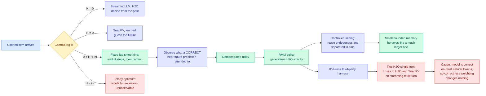

# Eviction as Estimation: A Fixed-Lag Smoothing View of Test-Time Memory

**arxiv:** [2607.24667](https://arxiv.org/abs/2607.24667) · **Source:** [Kurate cs.AI weekly leaderboard #13, 2026-08-03](../../raw/kurate/2026-08-03-cs-ai.md) (score 1389, win rate 47.1%, ai_rating 5.5/10) · **Authors:** Maruthi Vemula, Neeraj Praneeth Gajula

## TL;DR

Every KV cache eviction method in production decides at the moment an item arrives. The KV cache is the store of attention keys and values for tokens already processed, and when it is bounded, something must be thrown away. StreamingLLM and H2O decide from the past, using accumulated attention mass. SnapKV decides from a guess about the future. This paper says all of them are the same estimator with a different input, and puts them on one axis: the **commit lag H**, the number of steps a policy waits before it commits to a decision. Online filters and learned predictors sit at H=0. Belady's offline optimum, which knows the whole future, sits at H=infinity. The whole middle of that axis, **fixed-lag smoothing**, was empty. The paper fills it with RMM, a training-free policy that waits a bounded number of steps, watches which items a *correct* near-future prediction actually attended to, and only then commits. That measured quantity is called **demonstrated utility**, and it is a strict generalization of H2O that collapses back to H2O exactly when the measurement is uniform.

Then the paper does the rare thing. It runs itself on independent third-party benchmarks, inside NVIDIA's KVPress harness against KVPress's own implementations of SnapKV, H2O and StreamingLLM, and reports that the advantage mostly disappears. RMM ties H2O on single-turn question answering and loses to both H2O and SnapKV in streaming multi-turn. The diagnosis is exact and is the paper's real contribution: **on natural text the model is correct about most tokens, so weighting attention by correctness barely changes the weights.** Demonstrated utility collapses onto accumulated attention unless reuse is sharp and endogenous, and no standard benchmark exercises that. The authors' own framing is "the framework and an honest map of when measuring beats accumulating, not a new state of the art."

## What the framework actually buys

The reframe is the deliverable. Eviction has been treated as a ranking problem: score every cached item, keep the top k. This paper recasts it as **estimation of a hidden binary signal**, whether an item will be reused, and once you do that, the signal-processing vocabulary applies unchanged. Filtering estimates the present from the past. Prediction estimates the future from the past. Smoothing estimates the past from a longer window that includes some of the future. Belady's policy is unimplementable because it needs the entire future request sequence, but fixed-lag smoothing needs only H steps of it, and those H steps are free: the model is going to generate them anyway.

The measurement trick is the clever part. You cannot read the future request sequence, but you can read what the model *did* over the last H steps, and you can filter that by whether the model was right. If the model produced a correct token at step t+3 while attending heavily to cached item i, item i demonstrated its utility. Belady's unobservable future request becomes something read off the model itself.

## Why it fails on real benchmarks, and why that matters

The failure has one cause and the paper states it plainly: **correctness is nearly constant on natural text.** Demonstrated utility is accumulated attention weighted by correctness, and if correctness is 1 almost everywhere, the weighting is the identity. RMM reduces to H2O, and then loses slightly on overheads. The gain only appears in the controlled setting where reuse is *endogenous*, meaning the model's own earlier output determines what gets reused later, and *separated in time*, meaning the reuse happens far enough away that recency and accumulated attention do not already identify it.

Those two conditions are not exotic. They describe agent traces, long multi-step tool use, and any workload where an early decision is consulted much later. They are simply not what LongBench and Needle-in-a-Haystack measure. The finding is therefore as much about the benchmark suite as about the method: **the KV eviction literature is being graded on a task distribution where all the policies are close to equivalent.**

## Relation to prior wiki state

**Directly extends [Error Certificates for KV-Cache Eviction (07-28)](2026-07-28-kv-eviction-error-certificates.md)**, which proved that a deterministic top-k evictor cannot know what it destroyed, because an adversary can alter the evicted values so everything the serving system still holds looks identical while the true attention error grows without bound. That paper bought attribution by making eviction random. This one buys information by making eviction *late*. Read together they map two independent escapes from the same blind spot, and the escapes are orthogonal: randomization tells you how much error you created, fixed-lag smoothing reduces the error you create. Nobody has combined a Poisson-sampled tail with a smoothed commit, and the composition is obvious enough that it should exist within a quarter.

**Sharpens the negative space around [LOCKS (07-29)](2026-07-29-locks-page-local-key-summaries.md)**, which gave every KV page its own spectral summary resident at roughly 10% of cache size, estimated per-page attention mass by log-sum-exp without reading any candidate keys, and matched full-cache quality at 100K-plus context while touching about 2% of tokens. LOCKS wins by making *selection* cheap. RMM tries to win by making selection *better* and finds there is very little better available on standard benchmarks. Those two results are consistent and jointly uncomfortable for the field: if the ceiling on selection quality is this low on the tasks everyone reports, then the remaining headroom in KV eviction is in bandwidth and in workloads nobody benchmarks, not in smarter scoring.

**Contradicts the implied premise of [Make Each Token Count (05-12)](2026-05-12-make-each-token-count-kv-eviction.md)**, which claimed learned, globally calibrated eviction can *surpass* the full cache because irrelevant tokens dilute attention. That paper's gains came from a trained retention gate with a shared cross-layer calibration. RMM is training-free and gets nothing on the same class of benchmarks. The two are not strictly incompatible, since a learned gate can capture structure that a correctness-weighted attention statistic cannot, but the tension is real and worth naming: **one paper says the scoring function has a lot of headroom, another says it has almost none.** The variable that would settle it is whether Make Each Token Count's gains survive the KVPress harness against KVPress's own baselines, which is exactly the comparison RMM ran and Make Each Token Count did not.

**Complements [KAP (08-02)](2026-08-02-kap-knowledge-access-planning.md)**, which argued that in retrieval-augmented systems the relevance signal already existed upstream and was destroyed by prompt serialization, and compiled it into a runtime access plan touching 5.5% of source KV at 128K. KAP gets its signal from outside the model. RMM gets its signal from inside the model but late. Both are arguments that the H=0 in-cache scoring regime everyone works in is information-starved by construction.

## Gaps

The controlled setting is synthetic and the paper does not say how far its structure is from any real workload, so "reuse is endogenous and separated in time" remains a described regime rather than a measured one. There is no latency accounting for the H-step wait, and a bounded commit lag means items sit undecided in memory during the window, which is a real memory cost that a bounded-memory paper should price. The correctness signal also requires knowing the model was right, which at serving time means either a verifier or a proxy, and the paper does not report which it used or what a cheap proxy costs. Finally, H is a free parameter with no reported sweep, so how much of the framework's value survives at the small H a latency budget would permit is unknown.

## Industrial read

Nobody should deploy RMM. Everyone building eviction should adopt the axis. The commit-lag framing is the first thing in this literature that lets you say what a new policy is *doing* rather than what it scores, and the paper's honesty about the collapse onto H2O is more actionable than another two points on LongBench: it says that if your workload looks like natural text question answering, **your eviction policy choice is nearly free and you should pick the cheapest one**. The place to look for real gains is agent traces, where reuse is endogenous by construction because the agent consults its own earlier decisions, and where no eviction paper in this wiki has reported a number.

## Related pages

- [KV Cache](kv-cache.md)
- [Error Certificates for KV-Cache Eviction (07-28)](2026-07-28-kv-eviction-error-certificates.md)
- [LOCKS (07-29)](2026-07-29-locks-page-local-key-summaries.md)
- [KAP (08-02)](2026-08-02-kap-knowledge-access-planning.md)
- [Memory Hierarchy for AI](../hardware/memory-hierarchy.md)
