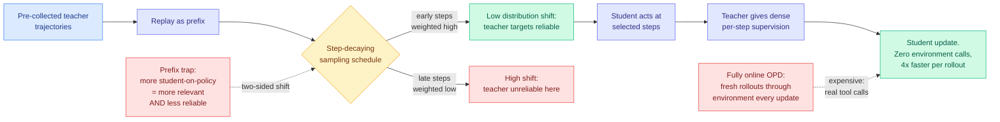

# ReOPD: Multi-Turn On-Policy Distillation with Prefix Replay

**arxiv:** [2607.04763](https://arxiv.org/abs/2607.04763) · **Source:** [DAIR.AI Top AI Papers of the Week, via Gmail starred 2026-08-03](../../raw/gmail/2026-08-03-starred.md) · **Authors:** Baohao Liao, Hanze Dong, Christof Monz, Xinxing Xu, Li Dong, Furu Wei (Microsoft Research, University of Amsterdam)

## TL;DR

On-policy distillation trains a student on its own rollouts while a teacher supplies the targets, which is the right thing to do because it puts the supervision exactly where the student actually goes. For an agent, that gets expensive fast: every update needs fresh student rollouts *through the environment* (real tool calls, real search queries, real Python execution) plus teacher queries at every visited state.

ReOPD makes the environment interaction an offline asset. Collect teacher trajectories once, replay them as **prefixes**, let the student act at selected steps inside those replayed prefixes, and have the teacher supply dense per-step supervision. **Zero tool calls during student training. At least 4x faster per rollout. Accuracy preserved or improved.**

The reason this is a paper and not an engineering note is the pathology it names, which is real and had no name. Call it the **prefix trap**. In multi-turn on-policy distillation you want histories that look like the student's own distribution, because that is what on-policy means. But pushing histories toward the student simultaneously drags the teacher onto states the teacher itself handles badly, where its targets are unreliable. So there are **two distributions moving in opposite directions**: student occupancy and teacher reliability. Maximizing on-policy-ness minimizes supervision quality. ReOPD's answer is to stop treating prefix selection as an implementation detail and treat it as a design problem, then solve it with something deliberately simple: a **step-decaying sampling schedule** that weights early, lower-shift prefixes more heavily rather than trying to match the student everywhere.

## Why the prefix trap is the contribution

The speedup is the headline and the trap is the durable part. The distillation literature has treated "more on-policy is better" as monotone, and the whole argument for on-policy distillation over plain sequence-level knowledge distillation rests on it. ReOPD identifies a regime where the relationship is **non-monotone**, and the mechanism is specific to multi-turn: in single-turn distillation, moving toward the student's distribution moves you toward harder prompts, but the teacher is still competent on them. In multi-turn, moving toward the student's distribution moves you toward *histories the student created*, which are histories no competent policy would have produced, and a teacher conditioned on an incoherent history is not a teacher.

The step-decaying schedule is a blunt instrument for this, and the paper says so by calling it simple. Its virtue is that shift accumulates with turn index, so decaying by step is a first-order approximation of decaying by shift, with no shift estimator to fit.

## Relation to prior wiki state

**Names the mechanism behind a threshold the wiki already recorded but could not explain.** The [Extrapolation Cliff paper (05-14)](2026-05-14-extrapolation-cliff-on-policy-distillation.md) found a closed-form threshold above which on-policy distillation collapses. That was a single-turn result about capability gap. The prefix trap is the multi-turn version and it has a different cause: not that the student is too far below the teacher, but that **the student can construct states where the teacher's competence does not apply at all.** These are two distinct collapse modes for the same technique and the wiki should stop treating them as one.

**Fourth entry on the [knowledge distillation page](knowledge-distillation.md) attacking teacher-student incompatibility, and the first to attack it on the time axis.** [TESSY (04-18)](2026-04-18-tessy-teacher-student-sft.md) inserted hybrid token sequences, [Switch-KD (04-18)](2026-04-18-switch-kd-vision-language-distillation.md) a shared text probability space, [BPM (07-29)](2026-07-29-bpm-cross-tokenizer-opd.md) bytes, mapping each teacher token's probability mass onto the longest student token whose bytes prefix it and recovering the byte-prefix marginal exactly at over 99% of positions, and [MAPD (08-02)](2026-08-02-mapd-multi-agent-protocol-distillation.md) a style-normalized JSON reasoning protocol. All four fix a mismatch in *representation*. ReOPD fixes a mismatch in *state*: the teacher and student disagree not about how to encode a token but about which histories are worth being competent on.

**Composes with [MAPD (08-02)](2026-08-02-mapd-multi-agent-protocol-distillation.md) almost too neatly.** MAPD's teacher is an offline multi-agent pipeline with a repair loop that compiles exploration traces into a protocol, and the wiki flagged that its unpriced component is running that pipeline per query before training starts. ReOPD's whole point is that pre-collected teacher trajectories are a **reusable** asset amortized across many student updates. Run MAPD's pipeline once, replay its trajectories as ReOPD prefixes, and MAPD's biggest cost objection weakens considerably. Neither paper cites the other.

**Confirms the direction [TIP (04-16)](2026-04-16-tip-token-importance-on-policy-distillation.md) opened**, which found that most teacher-generated tokens carry no learning signal and roughly 10% is enough. TIP cut waste on the token axis. ReOPD cuts it on the environment axis, and reports the same shape of result: the expensive thing was mostly not necessary.

## Gaps

Math-with-Python and search are two environments, both with cheap deterministic feedback and short horizons relative to a real agent task, so how the step-decaying schedule behaves when shift accumulates faster (a browser agent, a long coding session) is unknown. The schedule has no adaptivity: it decays by step index rather than by any measurement of actual shift or teacher confidence, which is the obvious next paper and also the obvious criticism, since the whole framing is "reliability-aware prefix distribution design" and the instantiation is not reliability-aware, it is step-aware. The 4x is per-rollout and does not include the one-time cost of collecting teacher trajectories, which is the thing being amortized and whose break-even point is unstated. And "preserves or improves accuracy" against fully online on-policy distillation is a parity claim, so the paper's value is entirely cost, which makes the missing amortization number the important one.

## Industrial read

The reusable-asset framing is the part that changes budgets. Agent-environment interaction has been priced as a per-training-run cost, and ReOPD reprices it as **capital**: collect a teacher trajectory corpus once, distil many students against it across tools, tasks and scales. That is the same economic shape as a pretraining corpus, and it implies teams should be storing and versioning their teacher trajectories rather than discarding them after a run. Most are discarding them.

The caution is the prefix trap itself, which applies to anyone doing multi-turn on-policy training of any kind, not just distillation. If your supervision comes from a stronger model queried at states your weaker model reached, **the states where you most need help are the states where your helper is least reliable**, and no amount of on-policy purity fixes that.

## Related pages

- [Knowledge Distillation](knowledge-distillation.md)
- [MAPD (08-02)](2026-08-02-mapd-multi-agent-protocol-distillation.md)
- [BPM cross-tokenizer OPD (07-29)](2026-07-29-bpm-cross-tokenizer-opd.md)
- [RL for LLMs](../llms-foundation-models/rl-for-llms.md)
