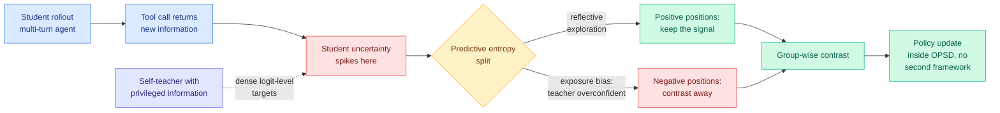

# CRPO: Contrastive Reinforced Policy Optimization via Privileged Self-Distillation

**Source:** Kurate weekly cs.LG leaderboard #2, ai_rating 6.0/10 · [arXiv 2607.28026](https://arxiv.org/abs/2607.28026) · published 2026-07-30 · raw: [`raw/kurate/2026-08-04-cs-lg.md`](../../raw/kurate/2026-08-04-cs-lg.md)

**Authors:** Xingjian Wu, Junlin Liu, Xingchen Liu, Xuhang Zhu, Jianing Wang, Linsen Guo (corresponding), Xiaoyu Li, Xuezhi Cao, Xunliang Cai — all **Meituan**

**Not on HuggingFace Daily Papers.**

## TL;DR

On-policy self-distillation (OPSD) trains a model against itself, where the teacher branch is the same policy given privileged information the student does not have. It gives you dense per-token supervision at low cost, which is why it has been eating into reinforcement learning with verifiable rewards (RLVR), whose single scalar reward has to supervise an entire generation. CRPO's contribution is a diagnosis of *where* OPSD's supervision goes wrong in multi-turn agentic settings and a cheap fix that stays inside the OPSD framework. The diagnosis: because the self-teacher holds privileged information, it becomes **overconfident exactly at the positions where the student is genuinely uncertain**, which in agent tasks is right after a tool call returns new information. Two harms follow. The teacher's reasoning routes converge onto the specific patterns present in the demonstrations, so the student generalizes worse, and multi-turn optimization directions become unclear because position-level supervision is unreliable. CRPO's fix uses **predictive entropy to sort positions into two kinds**: positive positions where high entropy reflects genuine reflective exploration, and negative positions where it reflects exposure bias, then runs a group-wise contrast between them so only reliable fine-grained signal survives. Across 13 reasoning and deep-search benchmarks it beats both RL and self-distillation baselines, with the claimed gains in training stability and long-horizon generalization.

---

---

## Key claims

- **Exposure bias in OPSD is position-localized and the location is predictable.** It concentrates where the student's uncertainty spikes, which in agentic settings is immediately after new tool output arrives. That is an actionable claim: you know where to look without training a detector.
- **Predictive entropy is a usable discriminator between two things that look identical.** High entropy from genuine exploration is signal worth keeping; high entropy from the teacher's privileged view is noise. Same statistic, opposite treatment, sorted by the contrast.
- **Staying inside one framework is the cost argument.** Prior fixes (RLSD, SDAR, RLCSD) bolt an RLVR objective onto the self-distillation objective and pay for maintaining two optimization frameworks. CRPO reformulates OPSD contrastively instead, adding no extra framework.
- **13 benchmarks across reasoning and deep search**, with the headline claims being training stability and generalization in long-horizon interaction rather than a single-number win.

## Gaps

No ablation reported in the abstract on the entropy threshold, which is the one hyperparameter the whole method turns on, and entropy calibration is model- and scale-dependent. "Consistently outperforms" across 13 benchmarks without per-benchmark margins makes it impossible to tell whether the gain is broad or carried by the deep-search subset where tool output is the dominant uncertainty source. And the claim that CRPO adds no computational cost relative to two-framework hybrids is a comparison against the wrong baseline: the relevant question is its cost against plain OPSD, which is not stated.

## How this relates to prior wiki pages

**This is the third instance in three days of a privileged-information branch supplying dense supervision to a deployed branch that never sees it, and [knowledge-distillation](knowledge-distillation.md) said a third instance would make it a named pattern.** The prior two: [MAPD (08-02)](2026-08-02-mapd-multi-agent-protocol-distillation.md), whose privileged student branch reads the JSON protocol the deployed branch does not get, and [CriPO (08-03)](../llms-foundation-models/2026-08-03-cripo-rubric-rl-self-distillation.md), which distills from two self-teachers that are the same policy under a different prompt to repair rubric-based RL. CRPO is the third. **[VAD (08-04)](2026-08-04-vad-visual-attribution-distillation.md), landing the same day on HuggingFace, is the fourth**, with a privileged-view teacher that sees an evidence crop the student does not. Four papers in three days, from four unrelated groups (Meituan, Microsoft/Amsterdam, Zhejiang/ByteDance, SJTU/Xiaohongshu), across three modalities and two objectives. The pattern is established: **the useful teacher is not a bigger model, it is the same model with more information, and the research problem has moved from "how do I get a teacher" to "which parts of a privileged teacher's signal are trustworthy."**

**And CRPO and VAD answer that second question in opposite directions, which is the interesting part.** CRPO discards untrustworthy signal by *position*: sort positions by predictive entropy, contrast the exposure-bias ones away. VAD discards untrustworthy signal by *decomposition*: project the teacher's correction onto a counterfactual visual-evidence direction and keep only the aligned component, throwing away the residual. Position-filtering versus direction-projection. Both are attacking the same defect that CRPO names as exposure bias and VAD names as source-mixing, and neither cites the other.

**It names the same defect [ReOPD (08-03)](2026-08-03-reopd-prefix-replay-distillation.md) named, one layer up.** ReOPD identified the **prefix trap** in multi-turn agentic OPD: pushing histories toward the student's own distribution makes them more relevant to the student and simultaneously drags the teacher onto states where its targets are unreliable, so student occupancy and teacher reliability move in opposite directions. CRPO's exposure bias is the same tension observed at token positions rather than at whole prefixes, and the two fixes are complementary rather than competing. ReOPD's step-decaying schedule chooses *which prefixes* to train on; CRPO's entropy contrast chooses *which positions inside a prefix* to trust. Nobody has composed them, and the composition is cheap: both are reweighting schemes over the same rollout data.

**It is also the same shape as [TIP (04-16)](2026-04-16-tip-token-importance-on-policy-distillation.md), which found most teacher-generated tokens carry no learning signal and roughly 10% suffices.** TIP said most of the teacher's tokens are useless; CRPO says a specific, locatable subset of them is actively harmful. Those are different claims and the second is stronger. The page's running theme, that OPD's problem is signal quality rather than signal quantity, gains its cleanest statement here.

**Contrast with the RLVR side of the same week.** [ReCo (Kurate cs.LG #19, 2607.26862)](../llms-foundation-models/2026-08-04-reco-grpo-distributional-concentration.md) attacks GRPO for concentrating on responses the base model already generates with high probability, and fixes it by normalizing response contributions and replacing the token-level importance ratio with a variance-based one that upweights non-saturated decision points. **ReCo upweights exactly the high-uncertainty positions CRPO is trying to filter.** Same week, same statistic (where is the model uncertain), opposite prescription, because ReCo is protecting exploration coverage and CRPO is protecting supervision reliability. Whether these are compatible or genuinely conflicting is unresolved and worth watching.

## Related pages

- [Knowledge Distillation](knowledge-distillation.md)
- [VAD: Visual Attribution Distillation](2026-08-04-vad-visual-attribution-distillation.md)
- [ReOPD: prefix replay distillation](2026-08-03-reopd-prefix-replay-distillation.md)
- [MAPD: multi-agent protocol distillation](2026-08-02-mapd-multi-agent-protocol-distillation.md)
- [CriPO: rubric RL self-distillation](../llms-foundation-models/2026-08-03-cripo-rubric-rl-self-distillation.md)
- [RL for LLMs](../llms-foundation-models/rl-for-llms.md)
