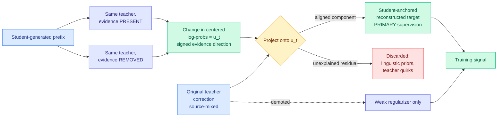

# VAD: Attributing Visual Evidence for Target Reconstruction in Multimodal On-Policy Distillation

**Source:** HuggingFace Daily Papers 2026-08-04 · [arXiv 2607.28590](https://arxiv.org/abs/2607.28590) · raw: [`raw/huggingface/2026-08-04-vad-attributing-visual-evidence-for-target-reconstruction-in.md`](../../raw/huggingface/2026-08-04-vad-attributing-visual-evidence-for-target-reconstruction-in.md)

**Authors:** Kangning Zhang, Shuai Shao, Qingyao Li, Jianghao Lin, Wenxiang Jiao, Yuan Lu, Weiwen Liu, Weinan Zhang, Yong Yu (Shanghai Jiao Tong University + Xiaohongshu), Yixing Li (CUHK), Zhengxi Lu, Zhiyuan Yao (Zhejiang), Shijian Wang (Southeast)

## TL;DR

Multimodal on-policy distillation supervises a student's own generated trajectories using a teacher that gets a privileged view, usually a crop centred on the visual evidence the student needs. The problem VAD names is that the teacher's next-token corrections are **source-mixed**: the correction combines the visual signal you wanted with the teacher's linguistic priors and its own model-specific quirks, and you cannot tell them apart. Prior work treated this as a weighting problem, asking *where* and *how strongly* to distill. VAD reframes it as an attribution problem: estimate *which part of a correction is actually supported by visual evidence*, and rebuild the target from only that part. The mechanism is a counterfactual run of the **same fixed teacher twice**, once with the evidence present and once with it removed. The change in centered log-probabilities defines a signed direction `u_t` in vocabulary space that points along "what revealing this evidence does." VAD projects the original correction onto that direction, splitting it into an intervention-aligned component and a proxy-unexplained residual, then reconstructs a **student-anchored** target from the aligned component alone. That reconstructed target becomes the primary supervision; the privileged teacher is demoted to a weak regularizer. Across six fine-grained visual benchmarks at 4B and 9B, it beats both direct privileged-view distillation and visual-advantage weighting.

---

---

## Key claims

- **Source-mixing is measurable, and prior methods left it in the target.** Vision-OPD conditions a teacher on an evidence-centred crop and distills its whole next-token distribution; the paper's diagnostics report that a substantial share of the teacher's strongest corrections are *not* well aligned with its own evidence-conditioned response. VA-OPD and V-Zero contrast informative against degraded views to prioritize tokens or trajectories, but keep the full evidence-present distribution as the underlying target, so mixed directions still leak in.
- **The refutation case is the specific thing weighting misses.** VA-OPD's positive visual advantage can capture "evidence supports the right answer" but not "evidence *refutes* the student's mistaken token." VAD's signed proxy handles both, and the paper reports its strongest target shifts exactly in the refutation case.
- **The teacher is never modified and never retrained.** Both counterfactual passes use the same fixed teacher. The cost is one extra forward pass per supervised prefix, which is the honest price.
- **Two analyses back the mechanism claim, not just the score.** Token-level analysis shows the proxy-aligned component is enriched in task-relevant visual corrections; a controlled-target analysis shows it produces stronger target shifts.
- **6 benchmarks, 4B and 9B scales**, beating direct privileged-view distillation and visual-advantage weighting.

## Gaps

Everything rests on `u_t` being a good proxy for "the visual evidence direction," and it is a one-dimensional projection of a vocabulary-sized correction. A correction whose useful visual content is orthogonal to `u_t` gets thrown into the residual and discarded, and the paper's own naming ("proxy-unexplained residual") concedes the ambiguity: unexplained is not the same as unhelpful. Evidence removal has to be implemented somehow (masking, blurring, cropping out) and that choice defines the counterfactual, so the result's robustness to the ablation operator is the load-bearing untested variable. Scale stops at 9B. And the extra teacher pass doubles teacher inference cost per supervised position, which is not priced against the alternative of simply distilling more data.

## How this relates to prior wiki pages

**Fourth instance in three days of the privileged-branch pattern, which closes it out as established.** [knowledge-distillation](knowledge-distillation.md) flagged on 08-03 that a third instance of "a privileged-information branch supplying dense supervision to a deployed branch that never sees it" would make it a named pattern. The four: [MAPD (08-02)](2026-08-02-mapd-multi-agent-protocol-distillation.md) with a privileged student branch reading the JSON protocol, [CriPO (08-03)](../llms-foundation-models/2026-08-03-cripo-rubric-rl-self-distillation.md) with two self-teachers under different prompts, [CRPO (08-04)](2026-08-04-crpo-contrastive-privileged-self-distillation.md) with an entropy-filtered privileged self-teacher, and VAD with a privileged evidence-crop view. Four unrelated groups, three modalities, two objectives, three days.

**VAD and CRPO are the same problem solved two different ways, and neither cites the other.** Both say a privileged teacher's dense signal is partly untrustworthy and must be filtered before use. CRPO filters by **position**, using predictive entropy to separate reflective exploration from exposure bias. VAD filters by **direction**, projecting the correction onto a counterfactual evidence axis and dropping the residual. A position filter cannot separate mixed causes inside a single correction; a direction projection cannot notice that a whole region of the trajectory is off-distribution. The composition is obvious and unbuilt.

**It is the multimodal instance of the wiki's longest-running distillation theme: OPD's problem is signal quality, not quantity.** [TIP (04-16)](2026-04-16-tip-token-importance-on-policy-distillation.md) found most teacher-generated tokens carry no signal and ~10% suffices. [Predictive Divergence Masks (07-24)](2026-07-24-predictive-divergence-masks.md) and [VCSD (07-25)](2026-07-25-vcsd-visual-contrastive-self-distillation.md) both worked the same axis. VAD is the strictest version so far: it does not select tokens, it **reconstructs the target**, discarding part of every correction it keeps.

**It also gives the wiki's counterfactual-supervision line a clean second data point.** [CoRT (07-30)](2026-07-30-cort-counterfactual-replay-token-credit.md) used counterfactual replay for token credit assignment in a text setting. VAD uses counterfactual intervention on the *input* rather than the trajectory, to attribute a teacher's output change to a specific input region. Two papers within a week using a counterfactual pass to decide what a supervision signal actually means, which is worth watching as a third possible pattern.

**Tier note for the reader profile:** VAD's benchmarks are visual, but the mechanism is a distillation-target construction method with nothing modality-specific in the projection step. The interesting test is whether the same projection works when "evidence" is a retrieved document rather than an image crop, which would put it directly on the efficiency page's main line.

## Related pages

- [Knowledge Distillation](knowledge-distillation.md)
- [CRPO: contrastive privileged self-distillation](2026-08-04-crpo-contrastive-privileged-self-distillation.md)
- [VCSD: visual contrastive self-distillation](2026-07-25-vcsd-visual-contrastive-self-distillation.md)
- [CoRT: counterfactual replay token credit](2026-07-30-cort-counterfactual-replay-token-credit.md)
