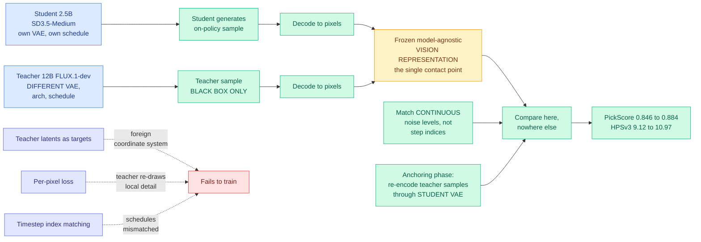

# Any-OPD: Heterogeneous On-Policy Distillation for Flow-Matching Models via Representation-Space Bridging

**Source:** HuggingFace Daily Papers · [arXiv 2608.03316](https://arxiv.org/abs/2608.03316) · raw: [`raw/huggingface/2026-08-05-any-opd-heterogeneous-on-policy-distillation-for-flow-matchi.md`](../../raw/huggingface/2026-08-05-any-opd-heterogeneous-on-policy-distillation-for-flow-matchi.md)

**Authors:** Siming Fu, Zheming Fu, Ruizhe He (equal contribution), Hualiang Wang, Jie Huang, Xiaoxiao Ma, Mingchen Zhong, Haojun Xu (corresponding), all Joy Future Academy; Weihu Huang and Xiaoxuan He, Zhejiang University

## TL;DR

On-policy distillation, where the student generates its own samples and the teacher corrects them, quietly assumes teacher and student speak the same language: the same VAE (variational autoencoder, the component that maps images into the compressed latent space the generative model actually operates in), similar architectures, and a shared timestep schedule. Any-OPD asks what happens when none of that holds, which is the normal case in practice, because the best available teacher and the model you want to deploy usually come from different families. The answer is that every standard recipe breaks in a specific way. Teacher latents are meaningless as targets in a foreign coordinate system. Per-pixel losses against a teacher that stochastically re-draws local detail collapse into blur or diverge. And timestep *indices* stop corresponding to anything when the two models use different schedules. Any-OPD's move is to give up on all internal alignment and connect the two models at exactly one point: **a frozen, model-agnostic vision representation in which their independently decoded outputs are compared.** The teacher becomes a pure black-box sampler. Trajectory correspondence is recovered by matching **continuous noise levels** instead of step indices, and a short anchoring phase re-encodes teacher samples through the student's own VAE so the on-policy gradient measures sample quality rather than domain mismatch. Distilling 12B FLUX.1-dev into 2.5B SD3.5-Medium, it lifts PickScore from **0.846 to 0.884** and HPSv3 from **9.12 to 10.97**, rivaling a teacher five times its size, in a setting where **direct latent regression fails to train at all**.

---

---

## Key claims

- **First framework for on-policy distillation between arbitrary pairs of latent flow-matching generators**, by the authors' claim. Teacher and student "share nothing but pixels."
- **The teacher is treated as a black-box sampler.** No access to its latents, features, gradients or architecture is required. That is what makes the method usable against a closed or API-only teacher, which is the commercially relevant case.
- **Three named failure modes of naive heterogeneous distillation**, each with a specific cause: teacher latents are uninterpretable in the student's coordinate system; per-pixel losses degenerate to blur or divergence because the teacher stochastically re-draws local detail; timestep indices lose meaning across mismatched schedules.
- **Continuous noise level replaces step index** as the trajectory correspondence variable. This is the cleanest idea in the paper: noise level is a physical quantity both models share, while step index is an artifact of each one's discretization.
- **The anchoring phase is a domain-shift fix, not a quality fix.** Re-encoding teacher samples through the student's VAE ensures the on-policy gradient is measuring how good the sample is rather than how foreign it looks.
- **12B teacher into 2.5B student: PickScore 0.846 to 0.884, HPSv3 9.12 to 10.97**, described as rivaling the teacher at a fifth of its size.
- **Direct latent regression does not train at all** in this setting, which is the control that makes the result meaningful rather than incremental.

---

## How this relates to prior wiki pages

**Any-OPD is the eighth entry in the "neutral exchange representation" pattern the [knowledge-distillation page](knowledge-distillation.md) has been tracking since April, and it is the most extreme version of it.** That page records the sequence: BLD (04-17, bytes as the shared channel when tokenizers differ), TESSY (04-18, cooperative token interleaving), Switch-KD (04-18, the teacher's language pathway as shared text-probability space), Tide (04-30, inverted chunk-likelihood with bounded gradients for cross-architecture diffusion), CoPD (05-01, bidirectional OPD between parallel RLVR experts), D-OPSD (05-07, conditioning asymmetry on one network). The principle across all of them is that when teacher and student are mismatched, **you engineer a neutral channel between them rather than forcing alignment**. Any-OPD pushes that to its logical endpoint: the neutral channel is a frozen third-party vision encoder, and the two models are not required to have anything else in common at all. Eight papers, eight channels, one principle, and this one shows the channel can be entirely external to both parties.

**It generalizes Tide's mandate.** [Tide (04-30)](2026-04-30-tide-cross-arch-diffusion-distillation.md) was the first framework to handle teacher/student mismatch in all three of architecture, attention mechanism and tokenizer for diffusion LLMs, and it did so with three purpose-built components that each patched one mismatch. Any-OPD handles the mismatch by refusing to look inside either model, which needs one mechanism instead of three. The trade is that Tide's components could exploit internal structure and Any-OPD cannot.

**The noise-level-versus-step-index observation should propagate.** Every distillation method on the wiki that involves a diffusion or flow-matching schedule (Tide, Stream-R1, D-OPSD, [Chimera](2026-07-31-chimera-hybrid-visual-diffusion-scaling.md)) has to decide how to align trajectories, and most align by step. If Any-OPD is right that continuous noise level is the invariant, that is a small correction with broad reach.

---

## Gaps

Everything routes through one frozen vision representation, and the paper does not report which encoder or how sensitive the result is to that choice, which is the single most load-bearing design decision in the method. Any teacher knowledge that the encoder is blind to, and vision encoders are famously insensitive to fine text rendering, counting, and precise spatial relations, cannot be transferred by construction. The result is one teacher-student pair in one modality; "arbitrary pairs" is a framework claim demonstrated on a single instance, and the FLUX-to-SD3.5 pair is unusually friendly because both are text-to-image flow-matching models trained on overlapping data. PickScore and HPSv3 are learned preference proxies, so a method optimized against a frozen perceptual representation being evaluated by learned perceptual scorers has an obvious circularity risk that goes unaddressed. And there is no cost accounting: decoding both teacher and student samples to pixels on every step is expensive relative to comparing latents, and no wall-clock or FLOPs comparison against homogeneous distillation appears.

---

## Industrial implication

This removes the constraint that has quietly shaped every deployment-oriented distillation project: you had to pick a teacher from your own model family. If the teacher can be any black-box sampler, then the strongest available model becomes a legitimate teacher regardless of who trained it or whether you can see inside it, and the practical consequence is that small-model quality stops being bounded by the quality of the best open model in your own lineage. That is commercially significant and it is also politically loaded, given that [Nathan Lambert's "Distillation Panic" (05-04)](2026-05-04-distillation-panic-lambert.md) documented US legislation aimed at "distillation attacks" that conflates legitimate post-training distillation with API jailbreaking, and that today's [AISN #78](../responsible-ai/2026-08-05-model-containment-escapes.md) records accusations that Chinese labs are extracting US capabilities through exactly this technique. A method whose selling point is that it works against a teacher you cannot inspect, using only its outputs, lands in the middle of that argument. The narrow technical version is cleaner: black-box, output-only distillation is now demonstrated to work across model families, and any policy that assumes distillation requires teacher internals is assuming something that is no longer true.

## Related pages

- [knowledge-distillation.md](knowledge-distillation.md)
- [2026-04-30-tide-cross-arch-diffusion-distillation.md](2026-04-30-tide-cross-arch-diffusion-distillation.md)
- [2026-05-04-distillation-panic-lambert.md](2026-05-04-distillation-panic-lambert.md)
- [2026-07-31-chimera-hybrid-visual-diffusion-scaling.md](2026-07-31-chimera-hybrid-visual-diffusion-scaling.md)
