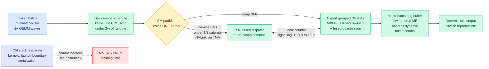

# Mixture-of-Kittens: Cursor's Open-Source MoE Training Megakernel for NVL72

**Source:** Cursor research blog, 2026-08-04 · [Post](https://cursor.com/blog/mixture-of-kittens) · [GitHub](https://github.com/cursor/mixture-of-kittens) · raw: [`raw/twitter/2026-08-04-evening.md`](../../raw/twitter/2026-08-04-evening.md)

**Authors:** Stuart Sul, Nash Brown, Henry Wildermuth, William Lin, Federico Cassano (Cursor)

**Cross-source confirmed via social:** announced by [@cursor_ai](https://x.com/cursor_ai/status/2084670806613737919), amplified by [@eliebakouch](https://x.com/eliebakouch) (HuggingFace) and [@stepango](https://x.com/stepango) (xAI) within the hour.

## TL;DR

Mixture-of-experts (MoE) training, where each token is routed through a small subset of specialized sub-networks instead of the whole model, spends most of its time not computing. It spends it moving tokens between GPUs. Cursor's own measurements put the MoE layer at **more than half of end-to-end training time**, and the binding constraint inside that layer is communication, not arithmetic. Mixture-of-Kittens (MoK) is a **megakernel**: instead of launching separate kernels for dispatch, expert GEMMs, and combine, and letting the CUDA stream serialize them at launch boundaries, it fuses all MoE communication and computation into one persistent kernel where instructions overlap at the streaming-multiprocessor (SM) task level. Some SMs are assigned to expert feed-forward computation, others to dispatch and combine, and the two groups hand off through a local counter rather than a global barrier. On one NVL72 rack (72 Blackwell GPUs in a single NVLink domain) at expert-parallel degree 64, the isolated MoE layer runs **up to 2.37x faster than the fastest public baseline** in MXFP8 forward. End to end on 512 GPUs it lifts throughput from 760.9 to 1,070.2 tokens/second/GPU, about **41%**, and Cursor reports the same 1.41x in its own production training across tens of thousands of GPUs. It is Apache-licensed and public.

The property that deserves as much attention as the speedup: **the kernel is bitwise deterministic.** The order of floating-point operations is fixed, so identical input produces identical output regardless of how the hardware happened to schedule the work.

---

---

## Key claims

- **Isolated MoE layer, one NVL72 rack, EP degree 64**, against NCCL+PyTorch, DeepEP+PyTorch, DeepEP+TransformerEngine and HybridEP+Megatron: MXFP8 forward **2.37x**, MXFP8 backward **1.78x**, BF16 forward **1.92x**, BF16 backward **1.58x**.
- **End to end on 512 GPUs across multiple racks: 760.9 to 1,070.2 tokens/second/GPU**, roughly 41%. In Cursor's production training the measured figure is **1.41x over their previous DeepEP-based stack**.
- **The communication-direction choice is the non-obvious contribution.** Instead of push-based all-to-all everywhere, MoK uses pull-based forward dispatch, push-based forward combine, pull-based backward reverse-combine, push-based backward reverse-dispatch. That asymmetry buys **up to 29% higher NVLink bandwidth utilization** and cuts signalling latency from about **103 microseconds to about 18**.
- **Fewer than a third of the SMs are needed to saturate NVLink** using TMA (Tensor Memory Accelerator) loads and stores, which is what makes the comp/comms SM split affordable rather than a zero-sum trade.
- **Bitwise determinism.** Fixed floating-point operation order means the same input yields the same output regardless of hardware scheduling or instruction issue order.
- **CPU-free scheduling.** A device-side schedule kernel consumes under 3% of MoE runtime and never talks to the host. Cursor notes this mattered specifically on GB300, where the integrated Grace CPUs are slow relative to the GPUs and streams kept catching up to CPU-side work. A macrobatch ring buffer of a few hundred megabytes absorbs dynamic per-expert token counts without a host synchronization.
- **MXFP8 is the default and the shared expert stays BF16.** Activation quantization is fused into the dispatch all-to-all, the expert-grouped GEMMs and the SwiGLU. Notably **no NVFP4 path here**, which @eliebakouch flagged publicly as the surprising omission given Blackwell's FP4 support.
- **Validated on real frontier model shapes**, not toy configs: Kimi K2.7 Code (384 experts, hidden 7168, intermediate 2048, top-k 8), GLM-5.2 (256/6144/2048/8), Qwen3.5-397B-A17B (512/4096/1024/10), DeepSeek-V4-Pro (384/7168/3072/6).

---

## How this relates to prior wiki pages

**It supplies the missing half of the SemiAnalysis Kimi K3 primer's MoE design equation.** The [08-04 primer](../llms-foundation-models/2026-08-04-semianalysis-kimi-k3-architecture-primer.md) derived the communication-to-computation time ratio as `(P*F)/(6*m*B)*(1-1/E)`, where the expert intermediate dimension `m` is the only model-configuration term, and used it to explain why Kimi K2 to K3 raised `m` to 3072 and why DeepSeek V4 Pro, MiniMax M3, MiMo V2.5 Pro and Inkling all did the same. That analysis takes the kernel as given and moves the *model* to hide communication behind computation. MoK moves the *kernel* instead. Both are attacking the same ratio from opposite sides, and MoK's DeepSeek-V4-Pro test shape uses exactly the `m = 3072` the primer highlighted. Nobody has asked how much of the architectural concession to communication becomes unnecessary once the kernel overlaps properly, and that is the interesting joint question.

**It is the training-side counterpart to the wiki's inference-side kernel thread.** [MXAttention (08-01)](2026-08-01-mxattention-mxfp4-attention-quantization.md) pushed attention to MXFP4 at inference. MoK pushes MoE training to MXFP8 with quantization fused into the collective itself. The shared lesson across both is that the win comes from **fusing the format conversion into an operation you were already paying for**, not from the format alone.

**Determinism is the sleeper result and connects to the measurement-crisis thread.** The [08-04 Global View](../daily-digest/2026-08/2026-08-04.md) argued the week's real theme is that the instruments are broken: Coherent Overlap (07-31) showed expert-subspace similarity cannot determine MoE redundancy, Eviction as Estimation (08-03) showed the KV-eviction benchmark suite cannot separate policies. Non-deterministic MoE kernels are an instrument problem of the same family. If two training runs with identical data and seeds do not produce identical weights, every ablation in MoE research carries an unmeasured noise floor, and nobody reports it. A bitwise-deterministic kernel makes MoE ablations falsifiable in a way they currently are not.

**It raises the stakes on the MoE-routing papers on this week's Kurate board.** Coherent Overlap (cs.LG #1 this week) and [VI-MoLE (cs.LG #5)](../ai-routing/2026-08-05-vi-mole-value-of-information-routing.md) both propose changing *which* experts fire. MoK changes what it costs to move tokens to whichever experts fire. Cheaper dispatch widens the space of routing policies that are affordable, including the less balanced ones that routing-quality research keeps wanting.

---

## Gaps

The 2.37x headline is the MXFP8 forward pass of an isolated layer at one expert-parallel degree on one rack. The number that transfers is the 1.41x end-to-end, and it is quoted against Cursor's own prior DeepEP stack rather than against a tuned HybridEP+Megatron baseline at the same scale. No accuracy or loss-curve comparison is published, so the claim that MXFP8 has "no observed numerical issues" is an assertion about Cursor's runs rather than a controlled study, and the shared expert being kept in BF16 suggests the boundary was found empirically. There is no ablation isolating how much of the gain comes from the megakernel fusion versus the pull/push direction choice versus the fused quantization, which are three separable ideas sold as one. NVL72 is a single NVLink domain, and nothing here addresses the cross-domain RDMA case that dominates clusters without full rack-scale NVLink. And a Blackwell-and-NVL72-specific kernel is a narrow target: the portability story to Hopper, to AMD, or to next-generation Rubin is unaddressed.

---

## Industrial implication

The barrier to training a frontier MoE model just dropped for everyone who is not Cursor, and the license is permissive. That is the stated goal and it is credible. The more specific consequence is about **who can now afford expert parallelism at high degree**: EP 64 within one rack was already the regime where communication ate the gains, and a 41% end-to-end lift changes the economics of the 256-to-512-expert configurations that every recent frontier model has converged on. Determinism has a second-order commercial effect worth naming: reproducible training runs make training failures debuggable and make regulatory or customer claims about a specific model artifact verifiable. Cursor also states plainly that agents automated much of the kernel work and let a very small team ship it, which is a data point on AI-assisted systems engineering at the hardest end of the difficulty range.

## Related pages

- [../llms-foundation-models/2026-08-04-semianalysis-kimi-k3-architecture-primer.md](../llms-foundation-models/2026-08-04-semianalysis-kimi-k3-architecture-primer.md)
- [2026-08-01-mxattention-mxfp4-attention-quantization.md](2026-08-01-mxattention-mxfp4-attention-quantization.md)
- [../llms-foundation-models/2026-08-05-llada-moe-v2-scaling-moe-diffusion-lms.md](../llms-foundation-models/2026-08-05-llada-moe-v2-scaling-moe-diffusion-lms.md)
- [../ai-routing/2026-08-05-vi-mole-value-of-information-routing.md](../ai-routing/2026-08-05-vi-mole-value-of-information-routing.md)
