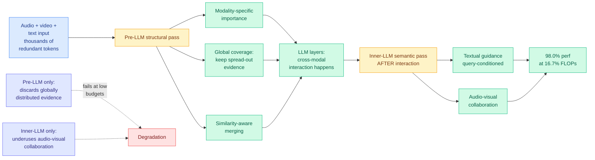

# OmniPack: Unified Token Compression for Efficient Omni-modal Large Language Models

**Source:** HuggingFace Daily Papers · [arXiv 2608.03812](https://arxiv.org/abs/2608.03812) · raw: [`raw/huggingface/2026-08-05-omnipack-unified-token-compression-for-efficient-omni-modal.md`](../../raw/huggingface/2026-08-05-omnipack-unified-token-compression-for-efficient-omni-modal.md)

## TL;DR

An omni-modal LLM (one model that takes audio and video and text together) pays for its generality in token count. A few seconds of video plus its audio track expands into thousands of tokens, most of them near-duplicates of their neighbours, and attention cost grows with the square of that. Token compression is the standard answer, and it comes in two flavours that fail in opposite ways. **Pre-LLM compression** prunes tokens before they enter the language model, which is cheap but blind: it does not know what the question is, so it discards evidence that is structurally important and globally spread out. **Inner-LLM compression** prunes inside the model where the query is visible, which is query-aware but late, and it typically treats audio and video separately instead of letting one inform the other. OmniPack's claim is that these are complementary rather than competing, and it runs both: a structural pass before the LLM using modality-specific importance, global coverage and similarity-aware merging, then a semantic pass inside the LLM after enough cross-modal interaction has happened, consolidating what survives using the text query as a guide and letting audio and video vote together. It is **training-free**, so it drops onto an existing checkpoint. On Qwen2.5-Omni-7B it keeps **98.0% of original performance at 16.7% of the FLOPs**, and still holds **92.9% at 6.8% of the FLOPs**.

---

---

## Key claims

- **The two compression stages fail at different things, so staging them beats choosing.** Pre-LLM compression cannot see the query; inner-LLM compression cannot undo tokens that were already discarded. OmniPack assigns each the job it can actually do: structure before, semantics after.
- **On Qwen2.5-Omni-7B: 98.0% of original performance at 16.7% of the FLOPs.** At the aggressive end, **92.9% at 6.8% of FLOPs**, which is roughly a 15x compute reduction for a 7-point accuracy cost.
- **Training-free.** No fine-tuning, no auxiliary model to train, no checkpoint modification. This is the property that decides whether a compression method gets deployed.
- **Best performance-efficiency trade-off across five benchmarks and three Omni-LLM backbones** at every retention ratio tested, which is a stronger claim than winning at one operating point.
- **"Global coverage" is the load-bearing term.** The specific failure it targets is evidence that matters but is thinly spread across the sequence rather than concentrated, which per-token importance scoring systematically underweights.

---

## How this relates to prior wiki pages

**This is the third paper in six days arguing that token compression must be decomposed by stage or by modality rather than applied uniformly.** [OmniScope (07-31)](2026-07-31-omniscope-modality-decoupled-token-compression.md) made the modality-decoupling argument: audio and video have different redundancy structures and a shared compression budget mis-serves both. OmniPack accepts that and adds the orthogonal axis, *when* in the forward pass you compress, showing that the pre-LLM and inner-LLM decision points are complementary rather than substitutes. Read together the two papers give a 2x2, and OmniPack occupies the cell that runs both stages. Neither cites the other.

**It extends the wiki's dominant 2026 efficiency principle to a new setting.** The [knowledge-distillation page](knowledge-distillation.md) tracks "selective supervision" as the through-line of the year: TIP (04-16) found under 10% of teacher tokens carry signal, and everything after it has been about which subset to keep. Token compression is the inference-time version of the same insight, and OmniPack's specific contribution is that **selection is not one decision, it is a pipeline of decisions at different points where different information is available.** That framing transfers directly back to distillation, where every method on the wiki makes its keep-or-drop call at exactly one place in the pipeline.

**The FLOPs framing has the same weakness the wiki flagged for KV cache.** The [Kimi K3 primer (08-04)](../llms-foundation-models/2026-08-04-semianalysis-kimi-k3-architecture-primer.md) argued that a nominal cache-size number is meaningless without prefill time, and proposed KV throughput because bandwidth, not FLOPs, is what actually binds in serving. A 6.8%-of-FLOPs result is subject to the same objection: if the compression passes are memory-bound or add sequential dependencies, wall-clock will not follow FLOPs down.

---

## Gaps

No wall-clock or throughput numbers, only FLOPs, which is exactly the substitution the Kimi K3 primer argued against three days ago. The compression passes themselves cost something (importance scoring, similarity computation for merging, a second consolidation inside the LLM) and that overhead is not accounted against the savings. Only one backbone is named in the abstract with a number attached; "three Omni-LLM backbones" and "five benchmarks" appear without a per-benchmark breakdown, so it is impossible to tell whether the win is uniform or carried by the benchmarks where redundancy is highest. Scale stops at 7B. And there is no ablation separating the pre-LLM pass from the inner-LLM pass, so the paper's central claim, that the two stages are complementary, is asserted by construction rather than demonstrated by an ablation showing each alone underperforms the pair.

---

## Industrial implication

Training-free plus 15x FLOPs reduction at single-digit accuracy cost is the profile that gets deployed, because it requires no retraining commitment and can be turned off per request. The immediate use is real-time audio-visual assistants, where the token budget rather than the model quality is what caps how much context a session can hold. The more interesting consequence is that **compression ratio becomes a per-request routing decision**: with a training-free method that has a smooth quality curve across retention ratios, you can pick the ratio from the query's difficulty rather than fixing it at deploy time. That is the omni-modal version of the cost-diverse model pool that LLM routing depends on, except the pool is one model at many compute points, and no routing paper on the wiki has treated compression ratio as the routed axis.

## Related pages

- [2026-07-31-omniscope-modality-decoupled-token-compression.md](2026-07-31-omniscope-modality-decoupled-token-compression.md)
- [kv-cache.md](kv-cache.md)
- [knowledge-distillation.md](knowledge-distillation.md)
- [../ai-routing/llm-routing.md](../ai-routing/llm-routing.md)
