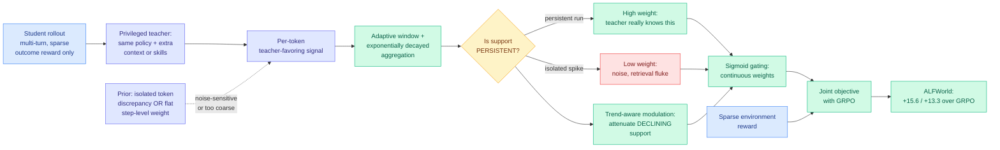

# PCSD: Persistent Consistency for Self-Distillation in Agentic Reinforcement Learning

**Source:** HuggingFace Daily Papers · [arXiv 2608.01837](https://arxiv.org/abs/2608.01837) · raw: [`raw/huggingface/2026-08-05-pcsd-persistent-consistency-for-self-distillation-in-agentic.md`](../../raw/huggingface/2026-08-05-pcsd-persistent-consistency-for-self-distillation-in-agentic.md)

**Authors:** Chunji Lv (Beijing Institute of Technology, Meituan), Yangguang Wei (Meituan), Junlin Liu (CAS Institute of Automation), Yang Gao (Meituan), Ming Liu (Meituan), Xinming Wang (CAS), Jinyang Wu (Tsinghua), Guoren Wang (BIT), Changsheng Li (BIT, corresponding)

## TL;DR

Training an LLM agent with reinforcement learning has a credit-assignment problem: a trajectory can run dozens of turns and hundreds of tokens and then receive one scalar reward at the end. On-policy self-distillation (OPSD) is the standard fix, and it works by making a privileged teacher, usually a frozen copy of the same policy given extra context the deployed model will not have, emit a dense per-token target over the student's own rollout. The catch, which the wiki has now seen named by four separate groups, is that a privileged teacher is not uniformly trustworthy. PCSD's specific contribution is a claim about **the shape of that unreliability in time**: teacher support for a given token is not an independent per-position event, it is locally autocorrelated. A teacher that genuinely knows something supports it across a run of consecutive positions; a teacher that is briefly confident because of a retrieval fluke supports one position and then stops. So PCSD derives its distillation weight from **the local persistence of teacher-favoring signal** rather than from a single-position discrepancy or a flat step-level weight. It uses adaptive windows with exponentially decayed aggregation to measure persistence, a trend-aware term to damp support that is locally declining, and a sigmoid gate to produce continuous weights, then optimizes that jointly with GRPO so sparse environmental reward and dense teacher guidance both apply. On ALFWorld it beats GRPO by **15.6 and 13.3 points** on two backbones and SDAR by 6.2 and 5.5, with **15.8 points over GRPO on an unseen ALFWorld split**, and no inference-time skills required.

---

---

## Key claims

- **Teacher reliability is temporally structured, not per-token independent.** This is the actual novelty and it is a claim about the data, not about the optimizer. Every prior selective-distillation method on the wiki scores positions one at a time; PCSD scores a position by its neighbourhood.
- **Two failure modes are named for prior work and both are granularity errors.** Isolated token-level discrepancies are noise-sensitive because one position carries too little evidence. A shared step-level weight is too coarse because reliability varies *within* a step. Persistence over an adaptive window sits between them.
- **Declining support is treated differently from low support.** The trend-aware modulation term attenuates positions where teacher support is present but falling, on the reasoning that a decaying signal is a teacher losing the thread rather than a teacher being wrong.
- **ALFWorld Overall best among all baselines on both backbones**: +15.6 and +13.3 over GRPO (Group Relative Policy Optimization, the RL algorithm that scores a response against a group of sampled siblings rather than a learned value model), +6.2 and +5.5 over SDAR.
- **+15.8 over GRPO on an unseen ALFWorld split**, which is the generalization number and matters more than the in-distribution one.
- **Competitive but not dominant on WebShop**, which the abstract states plainly rather than burying.
- **No inference-time skills.** The privileged context is a training-time device only, so deployment cost is unchanged.

---

## How this relates to prior wiki pages

**This is the fifth "privileged teacher" paper in four days, and the pattern the [08-04 digest](../daily-digest/2026-08/2026-08-04.md) declared a convention is now a crowded subfield with an internal argument.** The 08-04 Global View named four: MAPD (08-02, privileged branch reads a JSON protocol the deployed branch does not get), CriPO (08-03, two self-teachers that are the same policy under different prompts), [CRPO (08-04)](2026-08-04-crpo-contrastive-privileged-self-distillation.md) and [VAD (08-04)](2026-08-04-vad-visual-attribution-distillation.md). PCSD and [TurnSight (08-05)](2026-08-05-turnsight-turn-level-hindsight-distillation.md) make six and seven. The live question the digest identified, **which parts of a privileged teacher's signal are trustworthy**, now has four distinct answers and they are all different axes of the same object: CRPO filters by **position** using predictive entropy, VAD filters by **direction** using a counterfactual projection, PCSD filters by **time** using local persistence, TurnSight filters by **turn structure** using cross-horizon hindsight agreement. Nobody has run them against each other.

**PCSD and CRPO are from overlapping author groups and reach compatible conclusions from opposite starting points.** Junlin Liu is on both, and Meituan is on both. [CRPO](2026-08-04-crpo-contrastive-privileged-self-distillation.md) found that the teacher becomes overconfident exactly where the student is genuinely uncertain, which in agent tasks is immediately after a tool call returns, and it discards those positions. PCSD does not contradict this: an overconfidence spike right after tool output is precisely the kind of **isolated, non-persistent** signal PCSD's window would down-weight. So PCSD may be the more general mechanism, with CRPO's entropy heuristic as a special case that happens to catch the same positions in the tool-call setting. That is a testable claim and neither paper makes it.

**It sharpens the unresolved CRPO-versus-ReCo tension the 08-04 Looking Ahead flagged.** That prediction asked for a third paper reporting both a coverage metric and a supervision-reliability metric on the same agentic runs, because ReCo (Kurate cs.LG #19) upweights the same high-uncertainty positions CRPO discards. PCSD does not resolve it, because it reports neither Pass@k coverage nor a calibration metric. But it does reframe the dispute usefully: if reliability is a property of a *run* of positions rather than a position, then "upweight uncertain positions" and "discard unreliable positions" stop being contradictory instructions, because they are selecting on different supports.

**The selective-supervision line on the [knowledge-distillation page](knowledge-distillation.md) gains a temporal axis.** That page tracks the 2026 through-line from TIP (04-16, under 10% of teacher tokens carry signal) through TA-OPD, TrOPD, FiRe-OPD (two-level: hard-filter trajectories then soft-reweight tokens) and SG-OPD. Every one of those makes its keep-or-drop decision at a fixed granularity chosen in advance. PCSD's adaptive window makes the granularity itself learned per position, which is the natural next move and the first time anyone on this page has made it.

---

## Gaps

The persistence window is adaptive but the adaptation rule, the exponential decay rate, and the sigmoid gate's temperature are three hyperparameters and no sensitivity analysis is reported for any of them. That matters more than usual here because the entire method is a smoothing operator, and a smoother tuned too wide reduces to the flat step-level weight the paper criticizes while one tuned too narrow reduces to the isolated token discrepancy it also criticizes. The headline is ALFWorld, an embodied household-task benchmark with fairly regular action structure, which is a friendly setting for a temporal-persistence prior; WebShop, where the paper is only "competitive," has more heterogeneous turn structure and that contrast is the most informative result in the paper but goes unexamined. No ablation separates the three components (window aggregation, trend modulation, sigmoid gating). Two backbones, neither named in the abstract, and no scale study. And the comparison set is GRPO and SDAR, not the other privileged-teacher methods published in the same week.

---

## Industrial implication

Anyone running RL on agent trajectories today is either using a flat per-step weight or nothing, and PCSD is a reweighting over logits they already compute, so the integration cost is close to zero and the reported gain over plain GRPO is double digits. That is the practical read. The strategic read is less comfortable: seven papers in four days have converged on privileged self-distillation as the way to get dense supervision for agents, all of them reweighting the same teacher signal along different axes, and none of them evaluating against each other. That is the shape a field takes right before somebody publishes a unifying comparison that shows most of the variants are within noise of one another. The group with the most to gain from running that comparison is the one that has published three of the seven.

## Related pages

- [2026-08-04-crpo-contrastive-privileged-self-distillation.md](2026-08-04-crpo-contrastive-privileged-self-distillation.md)
- [2026-08-05-turnsight-turn-level-hindsight-distillation.md](2026-08-05-turnsight-turn-level-hindsight-distillation.md)
- [2026-08-04-vad-visual-attribution-distillation.md](2026-08-04-vad-visual-attribution-distillation.md)
- [2026-08-02-mapd-multi-agent-protocol-distillation.md](2026-08-02-mapd-multi-agent-protocol-distillation.md)
- [knowledge-distillation.md](knowledge-distillation.md)
