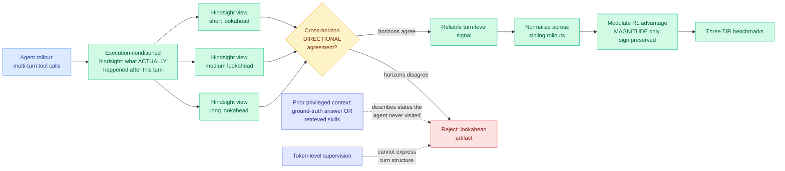

# TurnSight: Turn-Level Hindsight Self-Distillation for Tool-Integrated Reasoning

**Source:** HuggingFace Daily Papers · [arXiv 2608.04007](https://arxiv.org/abs/2608.04007) · [code](https://github.com/quchangle1/TurnSight) · raw: [`raw/huggingface/2026-08-05-turnsight-turn-level-hindsight-self-distillation-for-tool-in.md`](../../raw/huggingface/2026-08-05-turnsight-turn-level-hindsight-self-distillation-for-tool-in.md)

## TL;DR

Tool-Integrated Reasoning (TIR) is the setting where a model solves a problem by repeatedly calling tools and reasoning over what comes back. Training it with RL runs into the same sparse-reward wall every long-horizon agent hits: one reward at the end has to explain dozens of turns. On-policy self-distillation is the standard denser alternative, where a teacher branch of the same model gets privileged context and emits per-token targets. TurnSight makes two objections to how everyone else builds that privileged context. First, **where the context comes from**: existing methods derive it from the ground-truth answer or from a retrieved skill library, and neither describes the state the agent actually reached, so the teacher is being asked about a trajectory it is not really on. TurnSight instead derives supervision from **execution-conditioned hindsight**, meaning it looks at what actually happened after the turn in the agent's own rollout. Second, **what granularity supervision lives at**: token-level weighting cannot express the fact that a tool interaction is a unit, and the useful judgment is about the turn, not the token. So TurnSight builds multiple hindsight views at different lookahead horizons, keeps only the signal where those horizons agree on direction, normalizes it across sibling rollouts, and uses the result to **modulate RL advantages while preserving their sign**, which keeps the optimizer pointed where RL already wanted to go and only changes how hard it pushes.

---

---

## Key claims

- **Privileged context should come from execution, not from the answer.** This is the sharpest claim in the paper and it is a criticism of the whole privileged-teacher family. A teacher conditioned on the ground-truth answer knows something the trajectory does not contain, so its confidence is about the answer rather than about the agent's actual situation. Hindsight over the realized execution keeps the teacher inside the agent's own world.
- **Turn is the right unit for tool-integrated reasoning.** A tool call plus its result plus the reasoning over it is one decision. Token-level weighting distributes credit inside that unit, where there is no real variation to explain.
- **Cross-horizon directional agreement is the reliability filter.** Build several hindsight views with different lookahead lengths and keep only what they agree on the direction of. A signal that flips as you extend the horizon is an artifact of where you stopped looking.
- **Advantage modulation preserves the original optimization direction.** TurnSight scales RL advantages rather than replacing them, so a bad hindsight estimate degrades the step size and cannot invert the gradient. That is a deliberately conservative design and it is the right one for a signal this noisy.
- Effective across **three TIR benchmarks**, with code released.

---

## How this relates to prior wiki pages

**TurnSight is the seventh privileged-teacher paper in four days and the first to attack the privileged context itself rather than the weighting of its output.** The [08-04 digest](../daily-digest/2026-08/2026-08-04.md) named the pattern across MAPD (08-02), CriPO (08-03), [CRPO](2026-08-04-crpo-contrastive-privileged-self-distillation.md) and [VAD](2026-08-04-vad-visual-attribution-distillation.md), and [PCSD (08-05)](2026-08-05-pcsd-persistent-consistency-self-distillation.md) extended it this morning. All six of those accept the privileged context as given and argue about which parts of the resulting signal to trust: by position (CRPO, entropy), by direction (VAD, counterfactual projection), by time (PCSD, local persistence). TurnSight moves one level up and says **the standard privileged context is the wrong context**, because ground-truth-conditioned and skill-retrieval-conditioned teachers both describe states the agent never visited. If that is right, it partially undercuts the other six rather than complementing them, and no one has said so.

**It is the closest thing yet to a resolution of VAD's open question.** VAD (08-04) ran the same teacher twice, with visual evidence present and removed, and used the difference to define a signed direction in vocabulary space, then discarded the component of the teacher's correction that did not project onto it. The [VAD summary](2026-08-04-vad-visual-attribution-distillation.md) flagged the obvious next test: does the projection trick work when "evidence" is something other than an image crop? TurnSight's cross-horizon agreement is a different mechanism reaching the same goal, using multiple counterfactual views of the same signal and keeping only the consistent part, applied to execution traces rather than images. Two groups, two modalities, one principle: **a privileged signal is trustworthy to the extent that it survives perturbation of the privilege.**

**The turn-versus-token granularity argument matches a finding from the other side of the wiki.** [ScrambleToolBench (08-04)](../agentic-systems/2026-08-04-scrambletoolbench-behavioral-tool-discovery.md) found that agents discover tools fine and then fail to revise their map when it changes, and that increasing test-time reasoning amplifies brute-force search rather than enabling deductive recovery. Both papers point at the turn boundary as the place where agent decisions actually live and where current training signal is thinnest.

---

## Gaps

The abstract states effectiveness across three benchmarks without naming a single number, which for a paper making a strong claim against the dominant privileged-context recipe is a real omission. There is no direct comparison against a ground-truth-conditioned teacher on the same benchmarks, so the paper's central argument, that execution-conditioned hindsight beats answer-conditioned privilege, is motivated rather than measured. The number of hindsight horizons and their lengths are unstated hyperparameters, and cross-horizon agreement gets strictly more conservative as you add horizons, so the method has a knob that trades coverage for reliability with no reported curve. Hindsight requires the rollout to have completed, which means the supervision is not available online and the training loop has to buffer, and no cost accounting for that appears. And there is no ablation separating the three components (multi-horizon construction, agreement filtering, sibling normalization).

---

## Industrial implication

Advantage modulation that preserves sign is the property that makes this deployable: it cannot make a working RL run diverge, only make it converge faster or slower, which is a much easier thing to justify adding to a production post-training pipeline than a method that replaces the objective. The deeper implication is about where privileged information comes from in real systems. Every team doing agent post-training today builds its teacher by handing the model the answer, because the answer is what the dataset has. TurnSight's argument is that this systematically trains the model on a counterfactual it will never face, and the alternative, conditioning on the realized execution, requires nothing the rollout does not already contain. If the claim holds up under a direct comparison, it is a free change to a step nearly everyone is currently doing the expensive and wrong way.

## Related pages

- [2026-08-05-pcsd-persistent-consistency-self-distillation.md](2026-08-05-pcsd-persistent-consistency-self-distillation.md)
- [2026-08-04-crpo-contrastive-privileged-self-distillation.md](2026-08-04-crpo-contrastive-privileged-self-distillation.md)
- [2026-08-04-vad-visual-attribution-distillation.md](2026-08-04-vad-visual-attribution-distillation.md)
- [../agentic-systems/2026-08-04-scrambletoolbench-behavioral-tool-discovery.md](../agentic-systems/2026-08-04-scrambletoolbench-behavioral-tool-discovery.md)
- [knowledge-distillation.md](knowledge-distillation.md)
