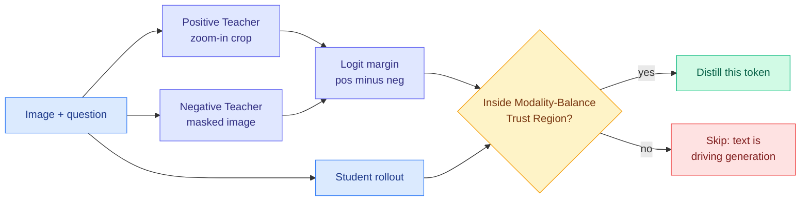

# OPD-V: Modality Balance as Privileged Information

**Source:** [arxiv 2608.05131](https://arxiv.org/abs/2608.05131) · [HuggingFace](https://huggingface.co/papers/2608.05131) · [raw](../../raw/huggingface/2026-08-06-opd-v-visual-on-policy-self-distillation-with-modality-balan.md)

## TL;DR

On-policy self-distillation for multimodal models works by handing a privileged copy of the same policy some extra information and using its token distributions as a target. OPD-V argues every existing version of this wastes the privilege, because of **modality imbalance**: when text dominates generation, the model is not integrating its visual input at all, so carefully constructed privileged information about the image goes unused. The diagnostic is elegant. Build a **Positive Teacher** by handing the policy a zoom-in crop of the relevant region, and a **Negative Teacher** by handing it a masked image. Those two exhibit opposite degrees of modality imbalance. Watching how their reasoning correctness and token logits diverge shows that **modality balance is itself the privileged information** worth distilling, not a precondition for distilling something else. OPD-V turns that into a selection rule: positive modality-balance logit margins define a **Modality-Balance Trust Region**, and only on-policy tokens inside it get a self-distillation target. Gains across 6 benchmarks, 4 backbones, and 5 post-training methods, **with training cost reduced**.

## How this relates to prior wiki pages

**This is the sixth filtering axis in the privileged-teacher cluster, and the second one added on 2026-08-06.** The [knowledge distillation concept page](knowledge-distillation.md) held four axes as of yesterday: position ([CRPO](2026-08-04-crpo-contrastive-privileged-self-distillation.md), entropy sort), direction ([VAD](2026-08-04-vad-visual-attribution-distillation.md), signed counterfactual evidence projection), time ([PCSD](2026-08-05-pcsd-persistent-consistency-self-distillation.md), persistence window), turn structure ([TurnSight](2026-08-05-turnsight-turn-level-hindsight-distillation.md), agreement across lookahead horizons). Today [SA-OPD](2026-08-06-sa-opd-input-groundedness-distillation.md) adds input-groundedness and OPD-V adds **modality balance**. Six axes, still zero head-to-head comparisons.

**Its diagnostic is a two-sided version of VAD's, and the comparison is instructive.** VAD runs the same teacher twice at each student prefix, once with the relevant visual evidence present and once with it removed, and uses the change in centered log-probabilities as a *signed* direction along the evidence. That is one perturbation and one direction. OPD-V uses **two constructed teachers at opposite extremes of the same axis** (zoom-in versus mask) and reads the margin between them. The signed-direction and the margin are close relatives, and the honest statement is that VAD's mechanism is finer (per-token direction, discards an unexplained residual) while OPD-V's is cheaper and produces a trust region instead of a reconstructed target. **Both are instances of the principle the concept page derived from TurnSight: a privileged signal is trustworthy to the extent that it survives perturbation of the privilege.** Three papers now instantiate it in vision alone.

**The modality-imbalance framing is the genuinely new contribution and it reframes the failure.** Prior visual OPD work treats poor visual grounding as a **capability** problem to be fixed by giving the teacher better visual conditioning. OPD-V treats it as an **allocation** problem: on many tokens the model is simply not reading the image, and no amount of improving the visual privilege helps on those tokens, because they are not visual tokens. That is why the selection rule beats better teacher construction, and it is the same structural move [RSTG (08-06)](2026-08-06-rstg-negative-group-teacher-guidance.md) makes on the prompt axis, restricting the expensive dense signal to the support where it can do work.

**Vision laziness has a second witness today.** [Physics of Multimodal Pretraining (08-06)](../llms-foundation-models/2026-08-06-physics-multimodal-pretraining.md) names **vision laziness** as its own finding: when modality integration is delayed to a late alignment stage, models fall back on language priors. OPD-V measures the post-training consequence of the same phenomenon. **One paper says the imbalance is created during pretraining by late unification; the other says it is what limits post-training. They are the same claim at two ends of the pipeline and neither cites the other.** That is a genuine cross-paper pattern rather than an alignment of vocabulary.

## Gaps

The zoom-in crop presumes you know which region is relevant, which is the same oracle-region assumption VAD needs and neither paper prices. "Reducing training cost" is claimed without a number, and the mechanism (skip tokens outside the trust region) makes the saving fully dependent on what fraction of tokens fall outside, which is not reported. Six benchmarks, four backbones and five post-training methods is broad coverage of the wrong axis: it establishes robustness across setups while still not comparing against any of the five sibling filtering axes.

## Links

- Concept page: [Knowledge Distillation](knowledge-distillation.md)
- Same-day siblings: [SA-OPD](2026-08-06-sa-opd-input-groundedness-distillation.md), [RSTG](2026-08-06-rstg-negative-group-teacher-guidance.md), [SPOT](2026-08-06-spot-sparse-probing-outcome-calibration.md), [Poly-OPD](2026-08-06-poly-opd-multi-teacher-pixel-bridge.md)
- Digest: [2026-08-06](../daily-digest/2026-08/2026-08-06.md)
