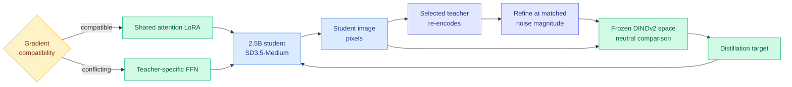

# Poly-OPD: Heterogeneous Multi-Teacher On-Policy Distillation via a Pixel Bridge

**Source:** [arxiv 2608.04349](https://arxiv.org/abs/2608.04349) · [HuggingFace](https://huggingface.co/papers/2608.04349) · [raw](../../raw/huggingface/2026-08-06-poly-opd-heterogeneous-multi-teacher-on-policy-distillation.md)

## TL;DR

Open text-to-image models have complementary strengths: one wins on preference-aligned aesthetics, another follows compositional instructions faithfully. You cannot combine them, because their autoencoders and noise schedules are incompatible, so there is no shared space in which to compare a teacher's opinion with a student's output. Poly-OPD consolidates several heterogeneous teachers into one compact flow-matching student by routing the entire exchange through **pixels and then through a frozen DINOv2 representation**, which both parties can reach and neither party owns. It adds a gradient-compatibility diagnostic that decides which adapters can be shared across teachers and which must stay teacher-specific, and a gap-aware curriculum that spends training where the student is still furthest behind. Distilling FLUX.1-dev and Z-Image into a 2.5B SD3.5-Medium student lifts GenEval from 67.3 to 73.3, **above both larger teachers**, and DrawBench HPSv3 from 9.34 to 11.35.

## The three mechanisms

**The pixel bridge.** Each student-generated image is re-encoded by a selected teacher's own encoder and refined from a noise level **matched by magnitude under that teacher's noise schedule** rather than by step index. The resulting target is then compared to the student's output in frozen DINOv2 space. Two incompatible latent spaces never touch; pixels are the handoff and a frozen vision representation is the metric.

**Gradient compatibility as an architecture decision.** Multi-teacher distillation normally suffers cross-teacher interference, where learning one teacher's aesthetic degrades another's compositional fidelity. Poly-OPD runs a diagnostic on gradient agreement and organises adapters accordingly: **attention LoRA modules are shared** across teachers because their gradients are compatible, **feed-forward adapters stay teacher-specific** because they are not. That produces a *switchable* student, one that can be asked to behave like either teacher, rather than an averaged compromise.

**Gap-aware curriculum.** Training concentrates on compositional categories where the student still trails the teacher, and shifts as each gap narrows. It is the standard curriculum idea, but here the gap is measured per category against a specific teacher rather than against a global loss.

## How this relates to prior wiki pages

**This is the ninth entry in the neutral-exchange-channel pattern and the first with more than one teacher.** The [knowledge distillation concept page](knowledge-distillation.md) tracks the channel climbing an abstraction ladder: [TESSY (04-18)](2026-04-18-tessy-teacher-student-sft.md) used hybrid token sequences, [Switch-KD (04-18)](2026-04-18-switch-kd-vision-language-distillation.md) a shared text probability space, [BPM (07-29)](2026-07-29-bpm-cross-tokenizer-opd.md) raw **bytes** (the unique lowest common substrate two tokenizers share, recovering the byte-prefix marginal exactly at over 99% of positions), [MAPD (08-02)](2026-08-02-mapd-multi-agent-protocol-distillation.md) a **JSON semantic schema**, and yesterday [Any-OPD (08-05)](2026-08-05-any-opd-heterogeneous-on-policy-distillation.md) took it to its logical endpoint, distilling between latent flow-matching families that "share nothing but pixels" by treating the teacher as a pure black-box sampler and comparing decoded outputs in a frozen model-agnostic vision representation.

Poly-OPD is Any-OPD plus a second teacher, published one day later, and the incremental claim is the interesting one. Any-OPD showed the channel can be entirely external to both parties. Poly-OPD shows that once the channel is external, **teacher count stops being architecturally constrained**, because nothing in the pipeline was ever coupled to a particular teacher's internals. The two papers also agree on the small correction with broad reach: align trajectories by **matched continuous noise level rather than step index**, which every prior schedule-based distillation method on this page gets wrong.

**The student beating both teachers is the load-bearing result and it needs a caveat.** GenEval 67.3 to 73.3 while distilling from two larger models is a genuine consolidation claim, and it is stronger than Any-OPD's single-teacher result (PickScore 0.846 to 0.884, HPSv3 9.12 to 10.97). But "surpassing both larger teachers" on a composite benchmark is exactly what you would expect from combining complementary strengths even without any transfer mechanism working well, so the number that would isolate the contribution is per-category performance against the teacher that leads that category, and it is not reported in the abstract.

**The gradient-compatibility diagnostic is the transferable idea, and it is not about images.** Deciding which parameters can be shared across supervision sources by measuring gradient agreement is a general answer to a general problem, and the specific finding, that **attention is shareable and feed-forward is not**, lines up with [Physics of Multimodal Pretraining (08-06)](../llms-foundation-models/2026-08-06-physics-multimodal-pretraining.md) reaching the same architectural conclusion from an entirely different direction: shared attention and normalization with modality-specific feed-forward layers is what promotes synergy rather than competition. **Two papers on the same day, one on multi-teacher distillation and one on multimodal pretraining, independently arriving at share-attention-split-FFN.** Neither cites the other and neither knows it has a second witness.

**Policy note the concept page already carries.** The page observes that BPM removed the tokenizer constraint, CAST removed the neural-teacher constraint, and MAPD removed the logit constraint, so "a policy aimed at industrial-scale distillation is aimed at a technique that just stopped requiring industrial scale." Poly-OPD removes the single-teacher constraint with nothing but sampling access to each teacher, which extends the same argument: you can now consolidate several closed frontier models into one small open student using only their outputs.

## Gaps

No ablation isolates the pixel bridge from the DINOv2 metric, and either alone might carry most of the gain. The gradient-compatibility diagnostic is used to make one architectural choice and then frozen, so it is unclear whether compatibility drifts during training, which it plausibly does as adapters specialise. Two teachers is not many, and the interference argument predicts the shared-attention decision degrades as teacher count rises. And the whole result is on text-to-image flow models, where a frozen perceptual metric like DINOv2 exists; the language analogue of DINOv2 space is exactly what the eight prior neutral-channel papers have been failing to find.

## Links

- Concept page: [Knowledge Distillation](knowledge-distillation.md)
- Direct predecessor: [Any-OPD (08-05)](2026-08-05-any-opd-heterogeneous-on-policy-distillation.md)
- Independent witness for share-attention-split-FFN: [Physics of Multimodal Pretraining](../llms-foundation-models/2026-08-06-physics-multimodal-pretraining.md)
- Digest: [2026-08-06](../daily-digest/2026-08/2026-08-06.md)
