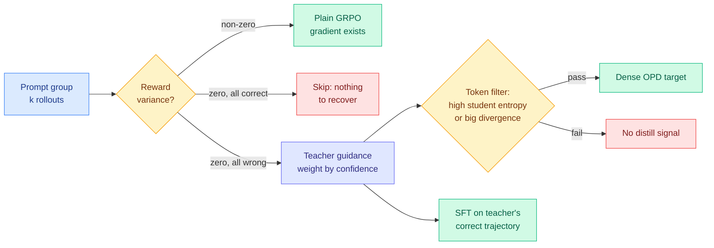

# RSTG: Recovering Learning Signals from Negative RL Groups via Adaptive Teacher Guidance

**Source:** [arxiv 2608.00782](https://arxiv.org/abs/2608.00782) · [HuggingFace](https://huggingface.co/papers/2608.00782) · [raw](../../raw/huggingface/2026-08-06-distill-where-you-fail-recovering-learning-signals-of-negati.md)
**Authors:** Zhuowen Han, Renren Jin, Deyi Xiong (TJUNLP Lab, Tianjin University); Jinwei Xiao, Zhengxi Lu, Zhiyuan Yao, Yuxin Liu, Hongyan Hao, Yueqing Sun, Yu Yang, Qi Gu, Xunliang Cai (Meituan Longcat)

## TL;DR

GRPO (Group Relative Policy Optimization, the standard reinforcement-learning-with-verifiable-rewards recipe where a group of sampled answers is scored against each other) loses its gradient entirely when every answer in a group gets the same reward. If the model fails all of them, it learns nothing from having failed. On-policy distillation looks like the obvious patch because it supplies dense per-token teacher signal where the reward is silent, but the naive combination degrades performance. RSTG diagnoses three separate reasons why, then applies distillation surgically: **only on negative zero-variance prompts** (the ones where RL has no gradient at all), weighted per sample by the teacher's own confidence, and inside those prompts only on tokens with **high student entropy or large teacher-student divergence**. It adds supervised fine-tuning on teacher-generated correct trajectories to inject positive gradient where RL produces none. Result: +4.02% on math and +3.05% on code over naive GRPO+OPD.

## The three failure causes, which are the actual contribution

The +4% is the least interesting part. The diagnosis is the part worth keeping:

1. **Not all samples benefit from distillation.** Teacher guidance quality varies with how proficient the teacher is on that specific sample, so a uniform distillation weight is averaging a good signal with a bad one.
2. **Fitting the teacher too fast destroys exploration.** OPD pulls the student toward the teacher's distribution, and RL's entire upside is the possibility of exceeding the teacher. Premature convergence forecloses it.
3. **OPD's advantages are asymmetric.** Student-generated tokens usually receive low probability from the teacher, so token-level advantages come out predominantly negative. The signal therefore **suppresses** rather than guides. This is the sharpest of the three and it is a general property of OPD-on-RL, not a quirk of this setup.

RSTG's answers map one to one. Cause 1 gets per-sample teacher-confidence weighting. Cause 2 gets support restriction: distillation fires only on negative zero-variance prompts, which are by definition prompts where RL is contributing zero exploration pressure, so there is nothing to crowd out. Cause 3 gets the token filter plus the SFT-on-teacher-correct-trajectories term, which supplies positive gradient directly instead of hoping the asymmetric advantage produces some.

## How this relates to prior wiki pages

**This partially resolves the CRPO-versus-ReCo conflict the wiki has been holding open since 08-04, and it resolves it the way the concept page guessed.** [CRPO (08-04)](2026-08-04-crpo-contrastive-privileged-self-distillation.md) sorts positions by predictive entropy and contrasts a subset of the high-entropy ones away as exposure-bias artifacts, on the finding that a privileged self-teacher becomes overconfident exactly where the student is genuinely uncertain. [ReCo (08-04)](../llms-foundation-models/2026-08-04-reco-grpo-distributional-concentration.md) prescribes the opposite on the same statistic: it replaces GRPO's token-level importance ratio with a variance-based ratio that **upweights** non-saturated decision points where alternative tokens remain plausible, precisely to stop GRPO concentrating on responses the base model already emits confidently. The [08-04 Looking Ahead](../daily-digest/2026-08/2026-08-04.md) asked for a third paper reporting both a coverage metric and a supervision-reliability metric on the same runs, within 60 days.

RSTG is that third paper, arriving in two days rather than sixty, and it does not report both metrics. What it does instead is better: it **separates the supports**, which is the reconciliation the [knowledge distillation page](knowledge-distillation.md) hypothesised ("ReCo protects exploration coverage against a base-model prior while CRPO protects supervision reliability against a confidently wrong teacher, in which case an agentic post-training recipe needs both signals plus a way to tell the two kinds of uncertainty apart"). RSTG's way of telling them apart is structural rather than statistical: on a zero-variance negative prompt there is no exploration to protect, because the group already agreed and was already wrong, so you can safely spend the dense reliable-signal machinery there. On prompts with reward variance, leave RL alone. That is a partial resolution, not a full one, because it sidesteps the question of what high entropy means rather than answering it.

**Its token filter is on the ReCo side of that same statistic, which is worth noticing.** RSTG distils on tokens with **high student entropy** or large teacher-student divergence. CRPO contrasts high-entropy positions away. They are compatible only because RSTG is inside the zero-variance-negative support and CRPO is in the general agentic-rollout support, which is exactly the support-separation argument above. If someone runs CRPO's entropy sort inside RSTG's negative-group support and it still helps, the support explanation is wrong.

**It is a fourth instance of "restrict where the expensive signal fires," this time on the prompt axis.** [TIP (04-16)](2026-04-16-tip-token-importance-on-policy-distillation.md) cut waste on the token axis, finding under 10% of teacher tokens carry signal. [ReOPD (08-03)](2026-08-03-reopd-prefix-replay-distillation.md) cut it on the environment axis, with zero tool calls during student training and at least 4x faster rollouts. [Relay-OPD (07-29)](2026-07-29-relay-opd-trajectory-relayed-distillation.md) cut it on the trajectory axis, halving training trajectory length. RSTG cuts it on the **prompt** axis: most prompts get no teacher call at all. Nobody has priced the teacher-call savings, which is odd, because it is the one number a practitioner combining GRPO with a frontier-model teacher would want first.

**It also sharpens the [rl-for-llms](../llms-foundation-models/rl-for-llms.md) page's zero-variance problem.** The standard fixes for zero-variance groups are curriculum filtering (drop those prompts) or dynamic sampling (resample until variance appears). RSTG's move is the opposite: keep the prompt precisely because it is uniformly failed, and treat uniform failure as the signal that a teacher is needed here.

## Gaps

The gains are reported against naive GRPO+OPD rather than against the strong single-method baselines, so the headline compares a fixed combination to a tuned one. There is no cost accounting for the teacher calls, the SFT term, or the confidence scoring, which matters because the whole argument is about spending a scarce dense signal well. The exploration claim, that restricting distillation to zero-variance negatives preserves RL's ability to exceed the teacher, is argued structurally but not measured: no Pass@k-at-large-k number appears, which is the specific metric the 08-04 prediction asked for and the only one that would settle whether exploration actually survived.

## Links

- Concept pages: [Knowledge Distillation](knowledge-distillation.md), [RL for LLMs](../llms-foundation-models/rl-for-llms.md)
- Same-day siblings: [SA-OPD](2026-08-06-sa-opd-input-groundedness-distillation.md), [SPOT](2026-08-06-spot-sparse-probing-outcome-calibration.md), [OPD-V](2026-08-06-opd-v-modality-balance-self-distillation.md)
- Digest: [2026-08-06](../daily-digest/2026-08/2026-08-06.md)
