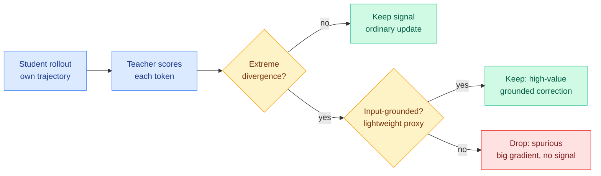

# SA-OPD: Spurious-Signal-Aware On-Policy Distillation

**Source:** [arxiv 2608.03632](https://arxiv.org/abs/2608.03632) · [HuggingFace](https://huggingface.co/papers/2608.03632) · [raw](../../raw/huggingface/2026-08-06-when-teachers-mislead-spurious-signal-aware-on-policy-distil.md)
**Also:** Kurate cs.AI #11 (ai_rating 5.5/10, tier 1). **Cross-source confirmed (HF + Kurate)**
**Authors:** Yinuo Jiang, Yongjie Ye, Zhou Tao, Xiang Zhuang, Qiang Zhang, Huajun Chen, Tiankai Li (Zhejiang University, ByteDance, Shanghai AI Lab)

## TL;DR

Every selective on-policy distillation method to date decides whether to trust a teacher's token-level signal by asking how confident, informative, or learnable that signal is. SA-OPD says all three questions miss the failure that matters: a language model's token judgment can be driven by input-agnostic language priors, formatting habits, or stereotyped reasoning templates rather than by the actual input. Those signals produce large gradients and carry almost no task-improving direction. The paper names them **spurious signals**, builds a lightweight proxy for whether a signal actually depends on the input, and filters only the tokens that are simultaneously **low in input-groundedness and extreme in distillation divergence**. That conjunction is the whole design: extreme divergence alone is what every prior method chases as high-value signal, and SA-OPD's claim is that the extreme-divergence tail is exactly where ungrounded supervision hides. It beats vanilla OPD and competitive selective baselines across both LLM and vision-language-model settings.

## What it actually does

On-policy distillation (OPD) means the student generates its own trajectory and the teacher supplies a dense per-token target on that trajectory, so the training states match the states the student will actually visit at deployment. The dense signal is the point and also the problem, because a vocabulary-sized distribution per token is a lot of supervision to accept uncritically.

The prior generation of selective methods (TIP on token importance, Token Teachability, Entropy-Aware OPD, FiRe-OPD on filter-then-reweight) all share an assumption the authors state plainly: **once a teacher signal clears a confidence, informativeness, or learnability bar, its judgment is treated as reliable.** SA-OPD's objection is that reliability by those measures is orthogonal to whether the judgment is about the input at all. A teacher that has seen a million chain-of-thought traces has strong, confident, low-entropy preferences about how a derivation should be phrased, and those preferences are about the corpus, not about this problem.

The mechanism has two parts. First, an **input-groundedness proxy** estimates whether a token-level distillation signal genuinely depends on the input. Second, the filter fires only on the **conjunction**: low groundedness AND extreme divergence. Tokens with extreme divergence but good groundedness survive, because those are the genuinely valuable corrections. Tokens with low groundedness but ordinary divergence survive too, because a weakly grounded signal with a small gradient does little harm. What gets removed is the high-impact ungrounded update.

## Key findings

- **Input-groundedness is established as a distinct supervision-selection dimension**, orthogonal to teacher confidence, teacher-student divergence, and local learnability. That is the paper's stated contribution and it is the durable one.
- Spurious signals are characterised as **optimization-relevant but weakly input-grounded**: they move the loss without moving the capability.
- The filter is a conjunction, not a threshold on either axis alone. Filtering on divergence alone throws away the best signal; filtering on groundedness alone leaves the harmless cases in.
- Consistent gains over vanilla OPD and over competitive selective methods, in **both LLM and VLM settings**, which matters because the vision case is where the ungrounded-prior failure was first measured.

## How this relates to prior wiki pages

**This is the fifth filtering axis in the privileged-teacher cluster, and it generalises the sharpest existing mechanism from vision to text.** The [knowledge distillation concept page](knowledge-distillation.md) currently tracks four axes, none of which evaluates against any other: [CRPO (08-04)](2026-08-04-crpo-contrastive-privileged-self-distillation.md) filters by **position**, sorting by predictive entropy on the finding that a privileged self-teacher spikes into overconfidence right after a tool call returns; [VAD (08-04)](2026-08-04-vad-visual-attribution-distillation.md) filters by **direction**, projecting the teacher's correction onto a signed counterfactual visual-evidence axis and discarding the unexplained residual; [PCSD (08-05)](2026-08-05-pcsd-persistent-consistency-self-distillation.md) filters by **time**, weighting by how persistently teacher-favouring signal holds across an adaptive window; [TurnSight (08-05)](2026-08-05-turnsight-turn-level-hindsight-distillation.md) filters by **turn structure**, keeping only what multiple lookahead horizons agree on. SA-OPD adds **input-groundedness**, and it is the closest sibling of VAD by construction: both ask whether a teacher signal survives perturbing the thing the signal is supposed to be about. VAD perturbs an image crop. SA-OPD perturbs input dependence in general, which is the version that runs on pure text.

**It also confirms the principle the concept page derived from TurnSight rather than from any single paper.** That page states it as: *a privileged signal is trustworthy to the extent that it survives perturbation of the privilege.* SA-OPD is the first paper on this beat to make that its central mechanism for the general LLM case rather than for a specific modality or a specific horizon.

**It gives the third collapse mode a text-domain detector.** The page records three ways OPD fails. The [Extrapolation Cliff (05-14)](2026-05-14-extrapolation-cliff-on-policy-distillation.md) is a capability-gap threshold above which OPD collapses because the student is too far below the teacher. The **prefix trap** from [ReOPD (08-03)](2026-08-03-reopd-prefix-replay-distillation.md) is the multi-turn fact that student occupancy and teacher reliability move in opposite directions. **Source contamination** is the newest: the teacher is competent, on-distribution, and its target still carries signal from a channel you never meant to transfer. Until today only VAD had a per-position detector for it, and only for visual evidence. SA-OPD is the second, and it is modality-general.

**Tension worth holding open.** The token-weighting thread that runs from [TIP (04-16)](2026-04-16-tip-token-importance-on-policy-distillation.md) (under 10% of teacher tokens carry signal) through [LongAct (04-18)](2026-04-18-longact-saliency-sparse-rl.md), [Relay-OPD (07-29)](2026-07-29-relay-opd-trajectory-relayed-distillation.md) and [CoRT (07-30)](2026-07-30-cort-counterfactual-replay-token-credit.md) mostly **upweights** high-divergence positions as the informative ones. SA-OPD says a subset of that same tail is the most damaging supervision in the batch. Both can be true if groundedness is the hidden variable that separates them, which is precisely SA-OPD's claim, and it is testable on the existing rollouts of any of those four papers. Nobody has run it.

## Gaps

The input-groundedness proxy is described as lightweight but the paper does not establish that its cheapness leaves the signal intact, and a proxy for input dependence is exactly the kind of quantity that degrades quietly. There is no head-to-head against CRPO, VAD, PCSD, or TurnSight, so five axes now exist with zero cross-comparisons, which is the gap the [08-05 digest](../daily-digest/2026-08/2026-08-05.md) predicted would either close or reveal the cluster as producing variants. And no ablation reports what fraction of tokens the conjunction actually removes, which is the number that would tell you whether this is a rare-event filter or a broad reweighting wearing a filter's clothes.

## Links

- Concept page: [Knowledge Distillation](knowledge-distillation.md)
- Same-day siblings: [OPD-V](2026-08-06-opd-v-modality-balance-self-distillation.md), [SPOT](2026-08-06-spot-sparse-probing-outcome-calibration.md), [RSTG](2026-08-06-rstg-negative-group-teacher-guidance.md), [Poly-OPD](2026-08-06-poly-opd-multi-teacher-pixel-bridge.md)
- Digest: [2026-08-06](../daily-digest/2026-08/2026-08-06.md)
