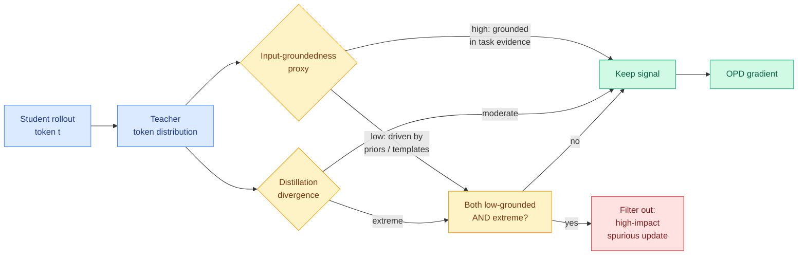

# SA-OPD: Spurious-Signal-Aware On-Policy Distillation

**Source:** HuggingFace Daily Papers 2026-08-06 · Kurate cs.AI #11 (ai_rating 5.5/10, tier 1) — **cross-source confirmed (HF + Kurate)**
**Paper:** [arxiv 2608.03632](https://arxiv.org/abs/2608.03632)
**Raw:** [raw/huggingface/2026-08-06-when-teachers-mislead-spurious-signal-aware-on-policy-distil.md](../../raw/huggingface/2026-08-06-when-teachers-mislead-spurious-signal-aware-on-policy-distil.md)
**Authors:** Yinuo Jiang, Yongjie Ye, Zhou Tao, Xiang Zhuang, Qiang Zhang, Huajun Chen, Tiankai Li (Zhejiang University, ByteDance, Shanghai AI Laboratory)

## TL;DR

Every selective on-policy distillation method to date asks *how much* to trust a teacher's token-level signal and answers with a property of the signal itself: is it confident, is it informative, is it learnable. SA-OPD asks a different question. It asks whether the signal is **about the input at all**. A language model's per-token judgment can be driven by input-agnostic language priors, formatting habits, or stereotyped reasoning templates rather than by the task evidence, and those judgments can produce very large gradients while pointing nowhere useful. SA-OPD names this class **spurious signals in OPD**, builds a lightweight proxy for input-groundedness, and filters only the tokens that are simultaneously low-grounded and extreme in distillation divergence. It beats vanilla OPD and competitive selective methods across both LLM and vision-language settings.

## Diagram

## What the paper actually claims

On-policy distillation (OPD, where the student generates its own rollouts and a teacher supervises them token by token) has spent four months being refined by selection. The refinements all share a premise: once a teacher signal clears some bar (confidence, informativeness, learnability), the signal is trustworthy and the only remaining question is weighting. SA-OPD attacks the premise directly. Large pre-trained models produce token-level outputs that are partly a function of the input and partly a function of things that have nothing to do with the input: the language prior over what usually follows a given phrase, formatting conventions like where a bullet goes, and stereotyped reasoning scaffolds the model has learned to emit regardless of the problem.

Those input-agnostic components are not merely noise. They are **optimization-relevant**, meaning they produce real gradient magnitude, and because they are stable across inputs they can be large and consistent. A token whose teacher target is driven mostly by "models usually write 'Therefore,' here" will produce a confident, low-entropy, high-divergence signal that passes every existing filter and contributes nothing task-improving.

The mechanism has two parts. First, a **lightweight input-groundedness proxy** that estimates whether a given token-level distillation signal actually depends on the input. Second, a conjunctive filter: SA-OPD removes only tokens that are simultaneously low in input-groundedness *and* extreme in distillation divergence. The conjunction matters. Low-groundedness alone would discard a large share of harmless boilerplate that is cheap to fit and does no damage; extreme divergence alone is the standard selective-OPD criterion and is exactly what several prior methods *upweight*. The intersection isolates the specific failure the paper cares about: a large update in a direction the input did not justify.

Results are reported across both LLM and VLM (vision-language model) settings, consistently beating vanilla OPD and competitive selective baselines. The framing claim the authors want on the record is broader than the numbers: **input-groundedness is a distinct dimension for OPD supervision selection**, orthogonal to confidence and learnability.

## How this relates to prior wiki pages

**This is the fifth filtering axis in the privileged-teacher cluster, and the cluster's own 08-05 open question is now more pressing rather than less.** The [08-05 digest](../daily-digest/2026-08/2026-08-05.md) predicted that this cluster needs a unifying head-to-head comparison within 60 days or the axes should be treated as within-noise variants. That prediction is now under more strain, not less. The four axes as of 08-05 were: [CRPO (08-04)](2026-08-04-crpo-contrastive-privileged-self-distillation.md) filters by **position**, sorting by predictive entropy because a privileged teacher goes overconfident right where the student is genuinely uncertain; [VAD (08-04)](2026-08-04-vad-visual-attribution-distillation.md) filters by **direction**, projecting the teacher's correction onto a counterfactual visual-evidence axis and discarding the residual; [PCSD (08-05)](2026-08-05-pcsd-persistent-consistency-self-distillation.md) filters by **time**, using the local persistence of teacher-favoring signal on the claim that reliability is autocorrelated; [TurnSight (08-05)](2026-08-05-turnsight-turn-level-hindsight-distillation.md) filters by **turn structure**, keeping only what multiple lookahead horizons agree on. SA-OPD adds **input-groundedness**. Five axes, and still not one paper in the cluster evaluates against another.

**But SA-OPD is closer to VAD than to the rest, and neither cites the other.** VAD's mechanism is: run the teacher twice, once with the visual evidence present and once with it removed, and treat the change in centered log-probabilities as a signed evidence direction. SA-OPD's input-groundedness proxy is the same instinct generalized past vision, asking whether the signal depends on the input at all rather than on a specific visual crop. The [knowledge-distillation concept page](knowledge-distillation.md) already stated the underlying principle from TurnSight: **a privileged signal is trustworthy to the extent that it survives perturbation of the privilege.** SA-OPD is the cleanest instance yet, because the perturbation it implies is perturbation of the *input*, which every task has, rather than of an image crop or a lookahead horizon, which only some tasks have. That makes it the most portable member of the family.

**It is also the second paper on this page to decompose the target rather than reweight it.** The [08-04 entry](knowledge-distillation.md) drew the distinction: [TIP (04-16)](2026-04-16-tip-token-importance-on-policy-distillation.md) found under 10% of teacher tokens carry signal, [LongAct (04-18)](2026-04-18-longact-saliency-sparse-rl.md) weighted by activation magnitude, [Relay-OPD (07-29)](2026-07-29-relay-opd-trajectory-relayed-distillation.md) by continuation divergence, and [CoRT (07-30)](2026-07-30-cort-counterfactual-replay-token-credit.md) by counterfactual likelihood, and all four **reweight** a target they accept. VAD **decomposes** the target and throws part of it away. SA-OPD sits between the two: it does not decompose the target into components, but it does classify part of the signal as wrong-in-kind rather than merely low-value, and drops it entirely. Reweighting says this token matters less; SA-OPD says this token's large gradient is an artifact.

**Direct tension with ReCo, unresolved.** [ReCo (08-04)](../llms-foundation-models/2026-08-04-reco-grpo-distributional-concentration.md) argues GRPO's importance ratio wrongly scales gradients toward already-likely tokens and fixes it with a variance-based ratio that *upweights* non-saturated decision points. Input-agnostic language priors are precisely the mechanism that makes a token already-likely. If SA-OPD is right that low-grounded high-divergence signals should be filtered, and ReCo is right that low-variance already-likely positions are being over-served, the two agree about the disease and disagree about which end of the distribution carries it. Nobody has run both on the same rollouts.

**The industry counterpart landed the same week and is worth naming.** ByteDance is on this paper's author list, and on 08-05 The Information reported that ByteDance founder Zhang Yiming [told the Seed team the company will not use distillation as a shortcut](../ai-industry/2026-08-06-bytedance-rules-out-distillation.md) to catch domestic rivals, partly because of the company's history with the US government over TikTok. Those are not contradictory, and the distinction is the interesting part: what Zhang ruled out is copying a rival frontier model's outputs as a competitive shortcut. What ByteDance Seed is publishing is how to make your *own* teacher's supervision less misleading. The technique is the same family; the provenance of the teacher is the whole argument.

## Gaps

The paper does not say how expensive the input-groundedness proxy is, and "lightweight" is doing load-bearing work: if estimating groundedness requires a second teacher forward pass per token, as VAD's counterfactual does, the cost story changes materially for long rollouts. There is no ablation isolating the conjunction, so it is not shown that filtering on low-groundedness alone, or on extreme divergence alone, is worse than the intersection. And the results are reported as consistent improvements without a scale study, so whether the spurious-signal share grows or shrinks as the teacher gets larger is open, which matters because the language-prior component plausibly gets *stronger* with scale.

## Links

- Concept page: [knowledge-distillation.md](knowledge-distillation.md)
- Same-day cluster: [RSTG](2026-08-06-rstg-negative-group-teacher-guidance.md), [Poly-OPD](2026-08-06-poly-opd-heterogeneous-multi-teacher.md), [OPD-V](2026-08-06-opd-v-modality-balance-self-distillation.md), [SKILL-KD](2026-08-06-skill-kd-contrastive-skill-distillation.md)
- Digest: [2026-08-06](../daily-digest/2026-08/2026-08-06.md)
