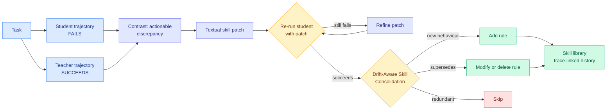

# SKILL-KD: Contrastive Skill Distillation for LLM Agents

**Source:** HuggingFace Daily Papers 2026-08-06
**Paper:** [arxiv 2607.28048](https://arxiv.org/abs/2607.28048)
**Raw:** [raw/huggingface/2026-08-06-skill-kd-contrastive-skill-distillation-for-llm-agents.md](../../raw/huggingface/2026-08-06-skill-kd-contrastive-skill-distillation-for-llm-agents.md)

## TL;DR

Skill libraries for agents are usually built from successes: summarize what worked, store it, retrieve it later. SKILL-KD argues that is the wrong source when the student is weaker than the teacher. A student's failed trajectory often does not contain enough evidence to infer what it was missing, and a teacher's successful trajectory is too implicit to internalize as a reusable rule. So SKILL-KD builds the skill from the **difference between the two**: given a student failure and a teacher success on the same task, distil their actionable discrepancy into a textual **skill patch**, then verify it by re-running the student, and refine it if the student still fails. To stop repeated patching from corrupting the library, it keeps trace-linked edit histories and runs **Drift-Aware Skill Consolidation**, deciding per patch whether to add a rule, modify one, delete one, or skip. Consistent gains on five agent benchmarks across two student settings, with the student model **frozen** throughout.

## Diagram

## What the paper actually claims

Existing skill acquisition treats skills as experience summaries, memory entries, or distillations of successful demonstrations. SKILL-KD names the mismatch this creates for a weaker student: when the student fails because it lacks task knowledge or an operational strategy, **its own failed trajectory does not contain the missing behaviour**, so self-reflection has nothing to work with. Meanwhile the teacher's trajectory shows the right actions but not the reasoning that selected them, so it is too implicit to convert into a reusable rule.

The contribution is to treat the skill as an **explicit distillation medium between agents of different capability**, and to construct it contrastively rather than by summarization. The patch is text, so nothing about the student's weights changes, which is why the paper's setting is a **frozen student**. The verification loop is the part that separates this from prompt engineering: a patch is not accepted because it looks sensible, it is accepted because re-running the student with it turns a failure into a success, and it is iteratively refined when it does not.

**Drift-Aware Skill Consolidation** is the maintenance half and the more novel one. Repeatedly appending local fixes to a skill library causes drift, where later rules contradict earlier ones and the library slowly degrades. SKILL-KD maintains trace-linked edit histories and makes an explicit decision per patch: add, modify, delete, or skip. That is a **lifecycle** operation, not a storage operation.

Results are reported across five agent benchmarks and two student settings, consistently beating fixed-model adaptation baselines.

## How this relates to prior wiki pages

**The natural-language skill patch is the tenth entry in the neutral-exchange-channel pattern, and it is the most abstract yet.** The [knowledge-distillation concept page](knowledge-distillation.md) has tracked the intermediate layer climbing the abstraction stack: [TESSY (04-18)](2026-04-18-tessy-teacher-student-sft.md) used hybrid token sequences, [Switch-KD (04-18)](2026-04-18-switch-kd-vision-language-distillation.md) a shared text probability space, [BPM (07-29)](2026-07-29-bpm-cross-tokenizer-opd.md) used **bytes** (the lowest common substrate two tokenizers share, recovering the byte-prefix marginal exactly at over 99% of positions), [MAPD (08-02)](2026-08-02-mapd-multi-agent-protocol-distillation.md) a JSON task-plan-facts protocol, and [Any-OPD (08-05)](2026-08-05-any-opd-heterogeneous-on-policy-distillation.md) plus today's [Poly-OPD](2026-08-06-poly-opd-multi-teacher-pixel-bridge.md) a frozen vision representation external to both parties. SKILL-KD's channel is a **prose rule**. That completes the arc the page identified on 08-02: the neutral layer has moved from a lossless re-encoding of the teacher's output to an interpretation of it, and prose is the limit case, an interpretation with no formal guarantee at all. The page's own caveat applies with full force, that a fixed schema is a bet and there is no unique lowest common substrate for reasoning.

**It is also the first entry on this page where distillation changes no weights.** Every prior method here writes into the student's parameters. SKILL-KD writes into the student's context. That connects it directly to the [copyable-context safety trilemma (08-03)](../responsible-ai/2026-08-03-copyable-context-safety-trilemma.md), and it sits on the wrong side of it: a capability that lives in text is a capability that can be copied, exfiltrated, or injected. [ROPD (08-04)](../responsible-ai/2026-08-04-ropd-routing-safety-realignment.md) was noted as sitting on the *right* side by construction because it repairs weights. SKILL-KD is the mirror image, and the risk is not hypothetical: [SkillJack (08-05)](../responsible-ai/2026-08-05-skilljack-persistent-skill-backdoors.md) measured detection falling from 98.5% on a poisoned trajectory to 11.4% on the skill extracted from it. **SKILL-KD's pipeline extracts skills from trajectories, which is exactly the transformation that laundered the backdoor.** The verification loop is a partial defence, since a patch must actually make the student succeed, but succeeding at the task and carrying a payload are not mutually exclusive.

**Drift-Aware Skill Consolidation answers a gap the wiki named two days earlier.** [SkillBench/PastBench (08-05)](../agentic-systems/2026-08-05-do-agents-learn-from-experience-skillbench-pastbench.md) found agents largely fail to abstract reusable skills from past experience, and [ScrambleToolBench (08-04)](../agentic-systems/2026-08-04-scrambletoolbench-behavioral-tool-discovery.md) concluded that the missing operation is **invalidation rather than storage or retrieval**. Consolidation's delete-or-modify branch is precisely an invalidation operation, arriving two days after the gap was stated. That is worth flagging as a fast turn on an open question, though the paper reaches it from library-hygiene motivations rather than from the drift-detection problem those benchmarks pose.

**And today's [Skill Entropy](../llms-foundation-models/2026-08-06-skill-entropy-cross-skill-reasoning.md) complicates the whole premise.** That paper's finding is that accuracy degrades with the difficulty of *switching between* skills, not with the difficulty of individual skills. If that holds, a library of per-skill patches improves the parts that were not the bottleneck. Same day, same word, orthogonal decompositions, no cross-reference.

## Gaps

The verification loop requires running the student to convergence on each patch, and the paper does not price that: if a patch needs several refinement rounds and each round is a full agent rollout, skill acquisition may cost more than fine-tuning would. The consolidation policy that decides add-versus-modify-versus-delete is the most valuable component and the abstract does not say what drives the decision. There is also no evidence on library scaling, so whether consolidation keeps the library coherent at hundreds of rules or merely at dozens is unknown, and that is the regime where drift actually bites.

## Links

- Concept pages: [knowledge-distillation.md](knowledge-distillation.md), [self-evolving-agents.md](../agentic-systems/self-evolving-agents.md)
- Digest: [2026-08-06](../daily-digest/2026-08/2026-08-06.md)
