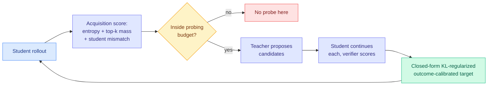

# SPOT: Sparse Probing and Outcome Calibration for On-Policy Distillation

**Source:** [arxiv 2608.04419](https://arxiv.org/abs/2608.04419)
**Kurate cs.LG #16** (ai_rating 5.5/10, tier 1, published 2026-08-05). **Absent from today's HuggingFace board** — LLM-rated, community-unrated.

## TL;DR

Standard on-policy distillation trains the student against reverse KL to the teacher, which systematically starves plausible alternative continuations of probability. SPOT attacks that with two coupled decisions it names explicitly: **where to probe** and **what to distill**. Teacher entropy alone cannot answer either, because entropy does not say whether uncertainty is concentrated on a few live candidates or smeared over a long tail, nor whether the student already covers those candidates. And local teacher probability is not a good predictor of whether a continuation actually succeeds downstream. So SPOT runs an acquisition-exploration-exploitation loop. **Acquisition** scores each position by combining normalized teacher entropy, the probability mass captured by a small top-k set, and student-teacher mismatch, then spends a limited probing budget on the top-scoring positions. **Exploration** takes the teacher's proposed candidates at those positions and evaluates them by running verifier-scored student continuations. **Exploitation** turns those outcomes into a closed-form KL-regularized target that favours candidates with better realized outcomes while staying anchored to the teacher.

## How this relates to prior wiki pages

**Seventh filtering axis, and the only one today whose selection signal is a realized downstream outcome rather than a property of the teacher's distribution.** All six of the other axes on the [knowledge distillation page](knowledge-distillation.md) read something off the teacher or the student at the position in question: entropy ([CRPO](2026-08-04-crpo-contrastive-privileged-self-distillation.md)), counterfactual evidence direction ([VAD](2026-08-04-vad-visual-attribution-distillation.md)), persistence across a window ([PCSD](2026-08-05-pcsd-persistent-consistency-self-distillation.md)), agreement across lookahead horizons ([TurnSight](2026-08-05-turnsight-turn-level-hindsight-distillation.md)), input-groundedness ([SA-OPD](2026-08-06-sa-opd-input-groundedness-distillation.md)), modality balance ([OPD-V](2026-08-06-opd-v-modality-balance-self-distillation.md)). SPOT actually **runs the continuation and scores it**. That makes it the most expensive of the seven and the only one whose target is calibrated against ground truth rather than against a proxy for trustworthiness.

**Its coverage argument is the ReCo argument, arriving through the distillation door.** SPOT's stated motivation is that reverse KL "can assign insufficient probability to other plausible continuations," which is a coverage complaint. [ReCo (08-04)](../llms-foundation-models/2026-08-04-reco-grpo-distributional-concentration.md) made the same complaint about GRPO concentrating on responses the base model already emits confidently, and fixed it by upweighting non-saturated decision points. SPOT's acquisition score explicitly includes **top-k probability mass**, which is a direct measure of whether uncertainty is concentrated or dispersed. That is a better instrument than raw entropy for exactly the question the [08-04 Looking Ahead](../daily-digest/2026-08/2026-08-04.md) said was unresolved between CRPO and ReCo, namely what high entropy means. **SPOT is the first paper on this beat to separate the two kinds of uncertainty with a computable statistic** rather than by restricting the support, which is [RSTG's](2026-08-06-rstg-negative-group-teacher-guidance.md) route to the same reconciliation today.

**It is also the closest thing yet to the unified reliability estimator this page has called missing since 06-18**, but it fails the same test [Relay-OPD (07-29)](2026-07-29-relay-opd-trajectory-relayed-distillation.md) was praised for passing: SPOT's exploration step needs a **verifier**, so it runs only in verifiable domains. Relay-OPD's contribution was a label-free trigger (on failed prefixes the teacher redirects while the student ploughs on) precisely because every prior estimator on this page needs supervision to fire, which is why the whole line is stuck in math and code. SPOT is stuck there too, and more expensively.

**Why it is worth tracking despite the modest LLM rating.** SPOT is the only paper in today's seven-paper cluster that changes what the target *is* using evidence about whether the candidate works, rather than deciding how much to trust a target it accepts. VAD is the only prior paper that decomposed a target rather than reweighting it. SPOT goes further and rebuilds the target from outcomes. If the privileged-teacher cluster resolves into anything durable, an outcome-calibrated target is a more plausible endpoint than a seventh trust heuristic.

## Gaps

The probing budget makes the whole method a compute-quality tradeoff and no wall-clock or teacher-call accounting appears in the abstract. Verifier dependence limits it to math and code, which is the same ceiling the reliability-estimator line has been stuck under for two months. And the acquisition score has three terms combined without an ablation, so it is unknown whether top-k mass, the genuinely new component, is carrying the result or riding along.

## Links

- Concept page: [Knowledge Distillation](knowledge-distillation.md)
- Same-day siblings: [SA-OPD](2026-08-06-sa-opd-input-groundedness-distillation.md), [RSTG](2026-08-06-rstg-negative-group-teacher-guidance.md), [OPD-V](2026-08-06-opd-v-modality-balance-self-distillation.md), [Poly-OPD](2026-08-06-poly-opd-multi-teacher-pixel-bridge.md)
- Digest: [2026-08-06](../daily-digest/2026-08/2026-08-06.md)
