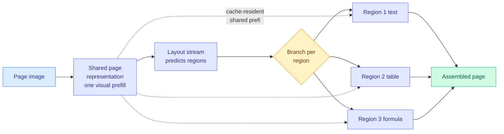

# PaDoc: Layout-Grounded Parallel Decoding for Document Parsing

**Source:** [arxiv 2608.06146](https://arxiv.org/abs/2608.06146) · [code](https://github.com/Longin-Yu/Padoc)
**HuggingFace Daily Papers, 2026-08-07.** No alphaxiv overview available yet; this page is written from the abstract plus the serving numbers it reports.

## TL;DR

An end-to-end document parser today turns a whole page into one autoregressive token stream, so the number of decoding steps grows with the total content on the page even though the paragraphs, tables and formulas on it have nothing to do with each other. The alternative, crop-based two-stage parsing, does expose that parallelism but pays a fresh visual prefill for every crop and loses full-page context in the process. PaDoc keeps the single model and the full page, and changes only the dependency structure: it predicts the layout first, then treats that layout as a **branching structure over one shared page representation**, so the layout stream and each region's content stream advance at the same time. The decoding depth stops being the length of the whole page and becomes the length of the **longest single layout-to-content path**. Two mechanisms make that runnable inside one multimodal LLM. Packed variable-length **ancestor attention** lets each branch see its ancestors under ordinary next-token training, so no special training regime is needed. **Masked parallel decoding** then emits the branches as concurrent requests that the vLLM backend serves with cache-resident shared-prefix reuse, meaning every branch reads the same page KV cache (the stored attention keys and values for the page image) instead of recomputing it.

## What it reports

On OmniDocBench Full, layout F1 of 91.1 and an overall score of 94.24, which is top-tier among end-to-end parsers, with the best Text Edit distance (0.038) and the best formula CDM (95.59) in its class. The number that matters more for this wiki is the serving result: on a 384-page subset on a single A800, PaDoc is the fastest end-to-end parser at **all five concurrency levels tested**, improving valid-page throughput by **67.4 to 118%** and cutting **P95 latency by 39.2 to 54.9%** against a sequential supervised-fine-tuned baseline on the same backbone. Same weights class, same GPU, same backend. The gain is structural, not a better model.

## How this relates to prior wiki pages

**It is the document-parsing instance of the parallel-decoding argument the wiki has been tracking on the diffusion side, and it is the first one to actually publish throughput.** The [08-05 Looking Ahead](../daily-digest/2026-08/2026-08-05.md) set a 90-day test: LLaDA MoE v2 and AURORA-LM both argued diffusion language models were inheriting the wrong autoregressive defaults, and both reported quality with **no throughput number at all**, even though parallel decoding is the entire reason those architectures exist. PaDoc is not a diffusion model and does not resolve that prediction, but it demonstrates the thing those papers assert: when the dependency structure genuinely permits parallel emission, the win shows up as throughput and tail latency on a real serving stack, and it is large. **A parallel-decoding paper that cannot produce this table has not made its case.**

**Its actual saving is a KV-cache saving wearing a decoding label.** The reason crop-based two-stage parsers are slow is repeated visual prefill: every crop re-encodes image tokens the model already encoded. PaDoc's shared-prefix reuse is the same insight the [KV cache page](kv-cache.md) records from the prefix-caching line, applied at the level of a document's regions rather than a conversation's turns. It also sits directly against the [08-04 finding that agentic serving is prefill-bound at roughly 142k tokens in against 444 out](../daily-digest/2026-08/2026-08-04.md): a workload dominated by prefill is exactly the workload where re-prefilling per crop is the dominant cost, and exactly where one shared page cache pays for itself.

**It answers a cost problem that industry named on the same day.** Simon Willison surfaced a 404 Media report in which Accenture's own internal data shows that **converting PDFs into markdown is one of the largest token consumers in the company**, and that the consumption is driven by non-engineers rather than engineers. PaDoc is a 67 to 118% throughput improvement on precisely that operation. The research and the cost complaint arrived the same morning with no knowledge of each other.

## Gaps

Everything rests on the **region-sufficiency assumption**: that a region's content is fully determined by the page prefix plus its own layout ancestors. Documents where one region genuinely depends on another's decoded content (a table whose caption resolves an abbreviation, a footnote reference, a continued table spanning a column break) violate it, and the paper reports no measurement of how often that happens or what it costs when it does. The serving numbers are a single A800 with a single backend (vLLM); nothing is reported for multi-GPU or for a backend without cache-resident shared-prefix reuse, which is the mechanism doing most of the work. And the baseline is a same-backbone sequential SFT model rather than a tuned two-stage crop parser, which is the system PaDoc's framing actually argues against.

## Links

- Concept page: [KV Cache](kv-cache.md)
- Raw: [raw/huggingface/2026-08-07-padoc-layout-grounded-parallel-decoding-for-document-parsing.md](../../raw/huggingface/2026-08-07-padoc-layout-grounded-parallel-decoding-for-document-parsing.md)
- Digest: [2026-08-07](../daily-digest/2026-08/2026-08-07.md)
