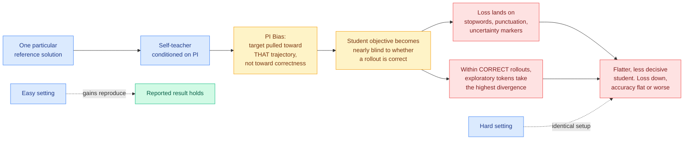

# Privileged, but Biased: How PI-Conditioned Teachers Break Self-Distillation

**Source:** Kurate cs.AI #18 (ai_rating 6.5/10, tier 1), absent from HuggingFace · [arXiv 2608.04794](https://arxiv.org/abs/2608.04794) · [raw](../../raw/kurate/2026-08-10-cs-ai.md)
**Authors:** Sarthak Harne, Chinmay Karkar, Yash Pandya, Ahmed Awadallah, Akshay Nambi (Microsoft Research)
**Topic:** on-policy distillation, privileged information, negative results

## TL;DR

This is the negative result the privileged-distillation cluster has needed for a week. Self-distillation with a privileged teacher, meaning the same model handed the reference solution and asked to score a student that never sees it, reproduces its published gains on easy tasks and then **teaches nothing at all on hard ones**. Across question answering, math, coding and multi-turn agentic tool use, across model sizes, reasoning modes, forms of privileged information, and under both the SDPO and OPSD recipes, the per-token loss falls steadily while validation accuracy stays flat or degrades. The paper traces the whole failure to one causal chain and quantifies its first link with a **PI Bias Score**.

## Key findings

- **Loss goes down, accuracy does not follow.** The per-token distillation loss is a well-behaved optimization target that is decoupled from task success. Any paper in this cluster reporting only loss curves has reported nothing.
- **PI Bias is measurable.** Having seen one specific reference solution, the teacher's per-token target is pulled toward *that trajectory* rather than toward correctness in general. The PI Bias Score puts a number on how far.
- **The loss concentrates on the wrong tokens.** Most of the student's divergence penalty falls on stopwords, punctuation and uncertainty markers, the tokens that do not determine the answer.
- **It actively penalizes reasoning.** Inside rollouts that are *correct*, the exploratory tokens carry the highest divergence, so the objective punishes exactly the hesitation that multi-step reasoning requires. The resulting student is flatter and less decisive.
- **The gains were a difficulty artifact.** SDPO's published numbers reproduce in SDPO's easy setting. The identical setup on harder tasks does not.
- **Scope is broad.** Four task families, multiple model sizes, multiple reasoning modes, multiple forms of privileged information, two recipes. This is not a single-config failure.

## How this relates to prior wiki pages

**This is the head-to-head-style falsifier that [knowledge-distillation.md](knowledge-distillation.md) has been asking for since 08-05.** That page counted seven privileged-teacher papers in four days, then seven on-policy distillation papers in one day, and closed with the observation that "none of the four evaluates against any of the others" and the [08-05 Looking Ahead](../daily-digest/2026-08/2026-08-05.md) prediction that the cluster would either produce a comparison or reveal itself as generating variants. It resolved toward variants. This paper resolves it from the other side: it does not compare the variants, it attacks the shared premise underneath all of them.

**It reframes the entire seven-axis taxonomy on that page as damage control rather than method design.** Every one of the seven filters (CRPO by position, VAD by direction, PCSD by time, TurnSight by turn structure, SA-OPD by input-groundedness, OPD-V by modality balance, SPOT by realized outcome) exists because the privileged teacher's signal is untrustworthy. This paper says the untrustworthiness has a single named cause, PI bias, and that as a lone objective the whole family optimizes something decoupled from task success. **The filters may be patching a target that should not be matched.**

**It confirms and generalizes [SA-OPD (08-06)](2026-08-06-sa-opd-input-groundedness-distillation.md).** SA-OPD found that a teacher's extreme-divergence tokens are frequently driven by language priors, formatting conventions and stereotyped templates rather than by the input, and filtered them. This paper finds the same concentration on low-information tokens and reaches the stronger conclusion: it is not noise to filter, it is where the objective's mass actually is. **Two papers, same observation, opposite recommendation.** SA-OPD says filter and continue. This says the objective is decoupled and needs a reward term.

**It validates the concept page's own split.** The page flagged that six of the seven methods *accept the teacher's target and decide how much to trust it*, while VAD *decomposes* it and SPOT *rebuilds* it from evidence about whether the candidate works, and predicted that "reweighting a wrong target converges to a wrong place more slowly, while reconstructing it converges somewhere else." This paper is the argument that the target is wrong. **The two reconstruction methods are the only ones this result does not obviously indict.**

**It sharpens the [TurnSight (08-05)](2026-08-05-turnsight-turn-level-hindsight-distillation.md) dissent.** TurnSight argued the standard privileged context is the wrong context because it derives from the ground-truth answer rather than the state the agent reached. This paper's PI bias is that claim with a measurement attached: conditioning on one reference solution biases the target toward that trajectory. TurnSight's dissent was correct and is now quantified.

## Gaps

The paper diagnoses rather than fixes. It shows self-distillation fails **as a lone objective, with no reward term**, which leaves open the case that the cluster mostly actually runs: distillation combined with RL. [RSTG (08-06)](2026-08-06-rstg-negative-group-teacher-guidance.md) distils only on negative zero-variance prompts inside GRPO, precisely where there is no reward gradient left, and reports +4.02% math and +3.05% code. That configuration is not tested here and is not obviously covered by the argument. The PI Bias Score is introduced without external validation against an independent difficulty measure, so it is unclear whether it tracks bias or tracks task hardness.

## Industrial implication

Anyone who chose privileged self-distillation over RL with verifiable rewards on the grounds that it is cheaper should re-run their evaluation at their actual task difficulty, not the difficulty the source paper used, and should check accuracy rather than loss. On hard tasks the compute saving is real and the capability gain is not. The practical read: keep the verifiable-reward term, treat distillation as a variance-reduction add-on inside it rather than a replacement for it.

## Links

- [Knowledge Distillation concept page](knowledge-distillation.md)
- [SA-OPD (08-06)](2026-08-06-sa-opd-input-groundedness-distillation.md)
- [SPOT (08-06)](2026-08-06-spot-sparse-probing-outcome-calibration.md)
- [TurnSight (08-05)](2026-08-05-turnsight-turn-level-hindsight-distillation.md)
- [SMRC-SD (08-10)](../ai-routing/2026-08-10-smrc-sd-state-matched-routing.md)
- [Daily digest 2026-08-10](../daily-digest/2026-08/2026-08-10.md)
