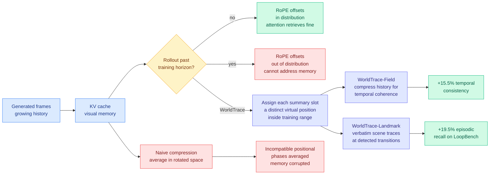

# WorldTrace: Addressable Memory for Video World Models

**Source:** HuggingFace Daily Papers 2026-08-10 · [arXiv 2608.07408](https://arxiv.org/abs/2608.07408) · [raw](../../raw/huggingface/2026-08-10-addressable-memory-for-video-world-models.md)
**Topic:** KV cache, cache compression, positional encoding, long-horizon generation

## TL;DR

Interactive video world models carry their visual history in a KV cache (the key-value store that keeps previous attention computations so they are not recomputed every step). WorldTrace shows that once a rollout runs past the training horizon, the model cannot reliably *address* what is in that cache at all, because the temporal RoPE (rotary positional embedding, the scheme that encodes token position by rotating query and key vectors by a position-dependent angle) offsets fall outside the range the model ever saw during training. Compressing the cache naively makes it worse, because averaging entries in RoPE-rotated space blends together incompatible positional phases. The fix is training-free: give every compressed summary slot a distinct **virtual position** drawn from the in-distribution range, so the compressed cache remains addressable. Temporal consistency improves 15.5% and episodic recall 19.5% on a new LoopBench, with no retraining.

## Key findings

- **The failure is addressing, not capacity.** The content is still in the cache. The model cannot retrieve it because the query-key rotation angle for a far-past entry corresponds to a relative offset never seen in training. This separates two things the KV-cache literature routinely conflates: *what you keep* and *whether you can still look it up*.
- **RoPE-space compression is arithmetically unsound.** Averaging or merging KV entries after the rotation has been applied mixes entries whose phases differ, so the merged vector points somewhere neither original pointed. Every cache-merging method that operates post-rotation inherits this.
- **Virtual positions are the whole trick.** Each compressed summary slot gets its own in-distribution position index rather than inheriting the (out-of-range) positions of the frames it summarizes. Position becomes an addressing handle you assign rather than a timestamp you record.
- **Two compression policies, two different jobs.** WorldTrace-Field compresses continuous history and buys temporal coherence (+15.5%). WorldTrace-Landmark stores verbatim traces at detected scene transitions and buys episodic recall (+19.5%). Coherence and recall are separate budgets.
- **LoopBench is the right test.** Leave a scene, take a long detour, come back. Ask whether the compressed cache can reconstruct it. Most long-context video benchmarks never require returning to a specific earlier state.
- **Training-free.** No retraining, no fine-tuning. It is a serving-time change.

## How this relates to prior wiki pages

**Extends, and partly reframes, [kv-cache.md](kv-cache.md).** That page's current state, from [SemiAnalysis on Kimi K3 (08-04)](../llms-foundation-models/2026-08-04-semianalysis-kimi-k3-architecture-primer.md), argued that cache *size* is not a standalone property and proposed KV throughput as the honest metric. WorldTrace adds a third axis that neither size nor throughput captures: **addressability**. A cache can be small, fast to fill, and functionally unreachable.

**Confirms the measurement-validity thread the page has been running.** [Eviction as Estimation (08-03)](2026-08-03-eviction-as-estimation-rmm.md) found that KV-eviction ablations do not measure the quantity they are trusted for. WorldTrace is the same shape one level down: compression-ratio results computed in RoPE-rotated space are measuring a corrupted object, so the reported ratio is not the ratio.

**Fills a gap that [Raven (08-04)](../ai-routing/2026-08-04-raven-sparse-memory-routing.md) opened.** Raven keeps a fixed set of memory slots and routes which subset to write, and held recall at 16x its training context length. Raven's slots are learned; WorldTrace's slots are assigned. Both are arguing that memory positions should be *allocated* rather than inherited from the token stream, from opposite directions (architecture versus serving-time patch). Neither cites the other.

**Contradicts the convenient assumption in sliding-window and streaming caches.** Those methods evict by position on the belief that position ordering is what attention uses. WorldTrace shows position is also the *lookup key*, so evicting by position destroys the index at the same time it frees the memory.

## Gaps

Reported on video world models only. Whether text long-context models show the same addressability collapse past their training horizon, independent of the well-studied length-extrapolation loss degradation, is untested and is the obvious next experiment. The virtual-position assignment policy is hand-designed; there is no ablation on how many slots or which positions are optimal. And LoopBench is authored by the same group, so the +19.5% is a self-reported gain on a self-designed benchmark.

## Industrial implication

If the addressability claim generalizes to text, every production long-context serving stack that compresses or offloads KV after rotation is silently corrupting the compressed tier, and the fix is a few lines of position bookkeeping rather than a new architecture. That is unusually cheap for a Tier-1 efficiency result. For video and world-model products specifically, this is the difference between a demo that holds for a minute and a session that holds for an hour, at unchanged memory budget.

## Links

- [KV Cache concept page](kv-cache.md)
- [Raven: sparse memory routing (08-04)](../ai-routing/2026-08-04-raven-sparse-memory-routing.md)
- [Eviction as Estimation (08-03)](2026-08-03-eviction-as-estimation-rmm.md)
- [Daily digest 2026-08-10](../daily-digest/2026-08/2026-08-10.md)
