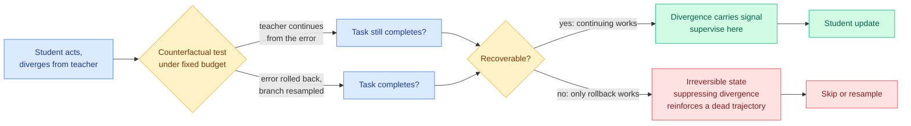

# Not Every Divergence Should Be Suppressed: Counterfactual Recoverability in On-Policy Distillation

**Source:** Kurate cs.LG #15 (tier 1, ai_rating 5.5/10), absent from HuggingFace · [arXiv 2608.04408](https://arxiv.org/abs/2608.04408)
**Raw:** [raw/kurate/2026-08-11-cs-lg.md](../../raw/kurate/2026-08-11-cs-lg.md)
**Date:** 2026-08-11 (published 2026-08-05)
**Authors:** De Jiang, Zhengyang Zhang, Kehong Yuan, Shaohua Ma (Tsinghua University)

## TL;DR

Every gating rule this wiki has tracked on [knowledge-distillation.md](knowledge-distillation.md) fires on some measure of teacher-student **disagreement**. This paper's objection is that disagreement is the wrong variable, because it says only that the student and teacher prefer different actions. It does not say whether the student's error can still be fixed. The proposed replacement is **counterfactual recoverability**, an explicitly causal quantity: under a fixed remaining budget, is the teacher more likely to finish the task if it *continues from the student's error*, or if the error is *rolled back and the branch resampled*? Errors where continuing still works are recoverable and their divergence carries usable signal. Errors where only rollback works are irreversible, and suppressing that divergence just trains the student to imitate a doomed trajectory. This is the **ninth filtering axis** on the on-policy distillation cluster, and it is the first one whose decision variable is an outcome under intervention rather than a statistic of the current step.

## What it claims

1. **Divergence-based rules treat all errors uniformly and that is their defect.** Step-wise On-policy Distillation reweights step-level guidance by teacher-student policy divergence; curriculum turn-level guidance schedules when and how often the teacher intervenes across turns. Both read an observable disagreement signal and neither asks whether the trajectory is salvageable.

2. **The consequence is a two-sided error.** Suppressing divergence on a *recoverable* error discards supervision that would have helped. Suppressing divergence on an *irreversible* error is worse: it actively reinforces a trajectory that cannot reach the goal, so the student learns to be confidently wrong along a dead path.

3. **Recoverability is decidable by a counterfactual rollout, not by inspection.** The test compares two completions under a matched budget: teacher-continues-from-error against error-rolled-back-and-resampled. That is an outcome-grounded assessment, which is why it can distinguish two errors that look identical in divergence.

## How this relates to prior wiki pages

**It is the ninth axis on a cluster this wiki has been counting since 08-04, and the [08-10 Looking Ahead](../daily-digest/2026-08/2026-08-10.md) explicitly predicted a ninth axis as the outcome that would confirm the cluster generates variants rather than comparisons.** The eight prior axes, all catalogued on [knowledge-distillation.md](knowledge-distillation.md): position ([CRPO (08-04)](2026-08-04-crpo-contrastive-privileged-self-distillation.md), sort by predictive entropy on the finding that a privileged self-teacher spikes into overconfidence right after a tool call returns), direction ([VAD (08-04)](2026-08-04-vad-visual-attribution-distillation.md), project the correction onto a signed counterfactual visual-evidence axis and discard the residual), time ([PCSD (08-05)](2026-08-05-pcsd-persistent-consistency-self-distillation.md), weight by how persistently teacher-favouring signal holds), turn structure ([TurnSight (08-05)](2026-08-05-turnsight-turn-level-hindsight-distillation.md), keep only what multiple lookahead horizons agree on), input-groundedness ([SA-OPD (08-06)](2026-08-06-sa-opd-input-groundedness-distillation.md), drop tokens that are weakly input-dependent and extreme in divergence), modality balance ([OPD-V (08-06)](2026-08-06-opd-v-modality-balance-self-distillation.md)), realized outcome ([SPOT (08-06 / 08-11)](2026-08-06-spot-sparse-probing-outcome-calibration.md), probe a budgeted set of positions and rebuild the target from verifier-scored student continuations), and state match ([SMRC-SD (08-10)](../ai-routing/2026-08-10-smrc-sd-state-matched-routing.md), distil only at turns where the reference trajectory covers the state the agent actually reached). **Nine axes, still no head-to-head comparison between any two of them.**

**But it is not merely a ninth variant, because it lands on the two-versus-seven split this page has called load-bearing.** [knowledge-distillation.md](knowledge-distillation.md) separated methods that *accept* the teacher's target and decide how much to trust it from methods that *rebuild* the target from evidence about whether a candidate works. Counterfactual Recoverability is on the rebuilding side with [SPOT](2026-08-06-spot-sparse-probing-outcome-calibration.md) and [VAD](2026-08-04-vad-visual-attribution-distillation.md). That matters because [Privileged, but Biased (08-10)](2026-08-10-privileged-but-biased-self-distillation.md), the falsifier that reproduced self-distillation's gains on easy tasks and found nothing learned on hard ones, indicts the seven accept-and-reweight methods far more directly than the rebuild methods.

**It is the closest thing yet to the unified reliability estimator this wiki has flagged as missing since 06-18.** TA-OPD's teachability, TrOPD's trust region, SG-OPD's sign-consistency, and Quality-Aware OPSD's can-this-prefix-still-reach-the-answer gate are four task-specific estimators of one latent quantity. Quality-Aware OPSD's version, for a GUI coordinate task, reduces to ground-truth-box membership, which is decidable only because the task has coordinates. **Counterfactual recoverability is the same question ("can this prefix still reach the answer?") answered by rollout instead of by task structure, which is what makes it general.** The cost is that it is expensive: each decision needs two matched completions.

**It composes with [Relay-OPD (07-29)](2026-07-29-relay-opd-trajectory-relayed-distillation.md) almost exactly, and neither cites the other.** Relay-OPD's trigger is that on failed prefixes the teacher redirects while the student ploughs on, a label-free continuation asymmetry, and it responds by handing control to the teacher for a short budgeted leg. That is the *cheap approximation* of the counterfactual this paper computes explicitly. Relay-OPD asks "do they diverge on continuation?"; this asks "does continuation still succeed?" Same object, one measured and one inferred.

**It also gives [ReOPD (08-03)](2026-08-03-reopd-prefix-replay-distillation.md)'s prefix trap a decision rule.** ReOPD named the multi-turn fact that student occupancy and teacher reliability move in opposite directions, and handled it bluntly with a step-decaying sampling schedule that just prefers earlier, lower-shift prefixes. Recoverability replaces the schedule heuristic with a per-prefix test.

## Gaps

- **Cost is unpriced and it is the whole objection.** Two matched teacher completions per divergence decision is expensive, and this wiki's standing complaint across [TIP (04-16)](2026-04-16-tip-token-importance-on-policy-distillation.md), Relay-OPD, ReOPD and RSTG is that **nobody in the selection literature prices the teacher-call saving against the teacher-call cost of doing the selection**. A method whose gate costs more teacher calls than the supervision it saves is not an efficiency method.
- **No comparison against the eight sibling axes.** Same defect as every other paper in the cluster.
- **Recoverability is defined relative to a fixed budget, so it is a property of the budget as much as of the state.** An error that is irreversible at 10 remaining steps may be recoverable at 50. The paper does not report sensitivity to that parameter, which determines whether the label is stable.
- **It needs a teacher willing to roll back and resample, which means environment resets.** [ReOPD (08-03)](2026-08-03-reopd-prefix-replay-distillation.md)'s whole contribution was zero tool calls during student training by replaying pre-collected trajectories. A counterfactual rollout in a stateful environment is exactly the thing ReOPD was avoiding.

## Industrial implication

For anyone pairing GRPO with a frontier-model teacher, the practical version of this result is a triage rule: before spending a teacher call on a divergence, ask whether the trajectory is still winnable. That is cheap to approximate with a single short teacher continuation and a verifier, which is Relay-OPD's trigger, and it is expensive to compute exactly. Expect the deployed form to be the approximation, not the counterfactual.

## Related

- [knowledge-distillation.md](knowledge-distillation.md) concept page
- [SPOT (08-06)](2026-08-06-spot-sparse-probing-outcome-calibration.md), [Privileged, but Biased (08-10)](2026-08-10-privileged-but-biased-self-distillation.md), [Relay-OPD (07-29)](2026-07-29-relay-opd-trajectory-relayed-distillation.md), [ReOPD (08-03)](2026-08-03-reopd-prefix-replay-distillation.md)
