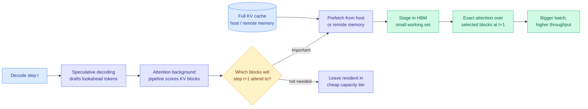

# OasisKV: Scaling In-Decode KV Cache Beyond HBM with Lookahead Sparse Prefetching

**Source:** HuggingFace Daily Papers · [arXiv 2608.08097](https://arxiv.org/abs/2608.08097)
**Raw:** [raw/huggingface/2026-08-11-oasiskv-scaling-in-decode-kv-cache-beyond-hbm-with-lookahead.md](../../raw/huggingface/2026-08-11-oasiskv-scaling-in-decode-kv-cache-beyond-hbm-with-lookahead.md)
**Date:** 2026-08-11

## TL;DR

OasisKV stops treating HBM (high-bandwidth memory, the fast memory soldered next to the GPU die) as the place the KV cache has to live. It keeps the full key-value cache in a cheaper, larger tier such as host DRAM or remote memory, and holds only the small set of KV entries that the next decode step will actually attend to in HBM. The mechanism that makes this work is the reuse of a component the serving stack already has for a different purpose: the **draft tokens produced by speculative decoding are used as a lookahead probe** to predict which KV blocks the model is about to need, so those blocks can be prefetched one step ahead of use. Built on vLLM: accuracy within 0.7 points of full attention at a 2,048-token KV budget, **1.69x** throughput over dense vLLM on reasoning workloads at 0.1 points of accuracy loss, up to **2.1x** on multi-GPU long-context serving, and about **2x** dense throughput under prefill-decode disaggregation while admitting each request with **6.5 to 9.7x less KV** and holding **2.2 to 2.6x less** decode-node host memory than full KV transfer.

## What it claims

1. **The binding constraint in LLM serving is memory, not compute, and specifically HBM capacity.** As long-context and long-form reasoning workloads grow, the KV cache dominates both memory footprint and memory traffic during decode. HBM capacity is the scarce, expensive resource that caps batch size, and batch size caps system throughput.

2. **Decode-time attention is naturally sparse, so full residency is waste.** Only a small subset of stored KV entries meaningfully contributes to any given decode step's attention output. The rest occupy HBM without earning it.

3. **Future important tokens are predictable, and the predictor is already in the stack.** Speculative decoding drafts a short lookahead sequence to be verified later. OasisKV's observation is that those draft tokens are an accurate probe of which KV blocks the *real* next steps will consult. An attention background pipeline scores blocks against the lookahead, and the winners are prefetched and staged in HBM before the step that needs them.

4. **The prediction is accurate enough that the accuracy cost is near zero.** Within 0.7 points of full attention at a 2,048-token KV budget, and 0.1 points of loss at the 1.69x throughput operating point.

## How this relates to prior wiki pages

**It is the first paper on [kv-cache.md](kv-cache.md) whose primary move is tiering rather than shrinking.** Nearly every method this wiki has logged manages the cache *inside* HBM: [LOCKS (07-29)](2026-07-29-locks-page-local-key-summaries.md) attends about 2% of tokens by estimating per-page attention mass from a page-local spectral summary without reading any candidate keys, [MSA (06-12)](2026-06-12-minimax-sparse-attention-msa.md) selects KV blocks per GQA group then attends exactly, [VaSE (06-03)](2026-06-03-vase-value-aware-stochastic-kv-eviction.md) evicts stochastically while guarding large-magnitude value states, and [Conf-KV (05-30)](2026-05-30-conf-kv-confidence-aware-eviction.md) sets a per-step budget from the model's own confidence. All of them decide **what to discard**. OasisKV decides **where things live**, and discards nothing. That difference matters for correctness: a selection error in an eviction method is permanent, while a selection error here is a stall, because the block is still sitting in the capacity tier and can be fetched.

**It supplies the missing implementation of a tiering policy this wiki has listed as an open problem since 06-07.** The [agentic AI memory hierarchy survey (06-07)](../hardware/2026-06-07-agentic-ai-memory-hierarchy.md) argued that as context grows the dominant memory traffic shifts from weights to KV cache, making cache management the binding hardware constraint. The [07-25 SemiAnalysis AMD piece](../hardware/2026-07-25-semianalysis-amd-cuda-moat.md) reported AMD's MoRI roadmap targeting a tiered distributed KV cache (HBM → DRAM → NVMe) with scheduler co-design, and [memory-hierarchy.md](../hardware/memory-hierarchy.md) has carried KV-aware tiering as a not-yet-shipped serving feature. OasisKV is the algorithm that makes the tier boundary cheap to cross, because it hides the fetch latency behind a prediction rather than paying it on demand.

**It is the second paper in eight days to use speculative decoding for something other than generating tokens faster.** [Via-SD (06-12)](../ai-routing/2026-06-12-via-sd-intra-model-routing-speculative-decoding.md) used the draft model as an intra-model router. OasisKV uses the draft as a *memory access predictor*. The general shape is that a cheap approximate forward pass is a usable oracle for any decision the expensive pass is about to make, and cache residency is one more such decision.

**It confirms and extends [FlashMemory-LSA (06-09)](2026-06-09-flashmemory-ds-v4-lookahead-sparse-attention.md), the closest prior work, and does it without a trained component.** LSA trained a Neural Memory Indexer as a backbone-free dual-encoder to predict which KV chunks future queries would need, dropping the average physical KV footprint to 13.5% of full context with +0.6% average accuracy. That is the same idea, predicted future demand, with a *learned* predictor. OasisKV gets the prediction for free from the drafter the serving stack already runs. If both hold up, the interesting comparison nobody has run is whether a trained indexer beats a speculative drafter at the same prefetch budget, because one costs training and the other costs draft compute you were already spending.

**The prefill-decode disaggregation numbers directly attack a cost this wiki priced on 07-25.** The [SemiAnalysis AMD piece](../hardware/2026-07-25-semianalysis-amd-cuda-moat.md) measured an 8,192-token DeepSeek-R1 FP8-KV prefill moving roughly 290MB of KV over RDMA between prefill and decode nodes. OasisKV admits each request with 6.5 to 9.7x less KV, which is a direct cut to that wire cost, and holds 2.2 to 2.6x less decode-node host memory than full KV transfer.

## Gaps

- **The sparsity claim is asserted for decode and not characterized by workload.** [Eviction as Estimation (08-03)](2026-08-03-eviction-as-estimation-rmm.md) established that the gains of a cache-management method depend heavily on whether reuse is endogenous and time-separated, which describes agent traces and describes almost no benchmark in common use. OasisKV reports reasoning and long-context serving. Whether the lookahead prediction holds on agentic traces, where the model's own earlier output determines what it consults much later, is untested and is exactly the workload the [AgentX measurements (07-25)](../hardware/2026-07-25-semianalysis-amd-cuda-moat.md) showed dominates real serving at a median 140K input tokens per turn.
- **Speculative decoding is not universally available.** The [Kimi K3 primer (08-04)](../llms-foundation-models/2026-08-04-semianalysis-kimi-k3-architecture-primer.md) reported that DSpark speculative decoding does not work with pipeline parallelism, so any model too large to fit one node loses speculation entirely, and with it OasisKV's predictor. The paper does not report a fallback path.
- **No accounting for what happens when the prediction misses.** A wrong prefetch is a synchronous fetch from host or remote memory on the critical path. The reported averages do not show the tail, and the tail is what a latency SLO is written against.
- **Interaction with prefix caching is unreported.** The Kimi K3 measurements showed prefix-cache hit rate collapsing below 10% once concurrency exceeds the KV budget. OasisKV raises the effective KV budget dramatically, which should *help* that cliff, but the paper does not measure hit rate under its own tiering.

## Industrial implication

If the lookahead prediction survives agentic traces, this changes the unit of GPU purchasing. Today HBM capacity per card determines how many concurrent long-context requests a node can admit, which is why the [Kimi K3 analysis (08-04)](../llms-foundation-models/2026-08-04-semianalysis-kimi-k3-architecture-primer.md) found throughput climbing with batch size only until concurrency exceeded 8 on B300. Decoupling full-cache storage from HBM makes host DRAM and CXL-attached or remote memory into usable KV tiers, which are an order of magnitude cheaper per gigabyte. Expect this to appear first in vLLM and SGLang as an offload backend rather than as a new model architecture, since it needs no retraining, and expect the serving vendors to pair it with the RDMA KV transport work already shipping for disaggregation.

## Related

- [kv-cache.md](kv-cache.md) concept page
- [memory-hierarchy.md](../hardware/memory-hierarchy.md) concept page
- [LOCKS (07-29)](2026-07-29-locks-page-local-key-summaries.md), [FlashMemory-LSA (06-09)](2026-06-09-flashmemory-ds-v4-lookahead-sparse-attention.md), [Eviction as Estimation (08-03)](2026-08-03-eviction-as-estimation-rmm.md)
- [TileRT persistent decode kernel (08-11)](../hardware/2026-08-11-tilert-persistent-kernel-interactivity.md), the same-day latency-side attack on the same serving stack
