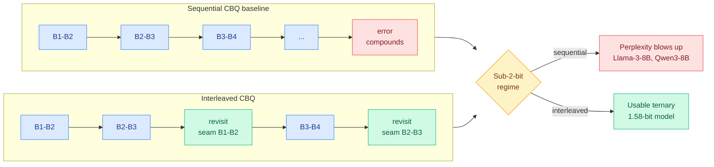

# From Sweep to Seam: interleaved cross-block post-training quantization

**Source:** Kurate cs.AI weekly leaderboard #19, tier 1, absent from HuggingFace · [arXiv 2608.09595](https://arxiv.org/abs/2608.09595) · [raw](../../raw/kurate/2026-08-12-cs-ai.md)

**Authors:** Achille Jacquemond (Fujitsu), Yuma Ichikawa (Fujitsu / RIKEN Center for AIP), Akira Sakai (Fujitsu / Tokai University).

**TL;DR.** Post-training quantization of a large model cannot be optimized globally, because the whole model does not fit on one accelerator, so in practice it is done block by block. Everyone has been improving *what happens inside* the block: better objectives, better weight representations, better error compensation. This paper changes **when and in what order** the blocks are processed, and reports that the schedule alone is what stands between a usable sub-two-bit model and a broken one. Under a left-to-right sweep of adjacent block pairs, each pair is optimized once and early errors are never revisited, so error compounds with depth. At 1.58-bit ternary quantization that compounding is catastrophic: the paper reports the sequential baseline producing very high perplexity on Llama-3-8B and Qwen3-8B. Interleaved Cross-Block Quantization revisits block interfaces instead of sweeping past them.

---

---

## The mechanism

**Quantization** here means replacing a model's full-precision weights with a much coarser numeric representation so the model needs less memory and less bandwidth to serve. **Post-training quantization** does this after training is finished, with no retraining, which is what makes it practical and also what makes it fragile.

The relevant baseline is **Cross-Block Quantization**, which improved on per-layer methods like GPTQ and AWQ by considering dependencies across several transformer blocks during reconstruction instead of quantizing each in isolation. The paper simplifies CBQ to a fixed two-block weight-only reconstruction objective and calls it **Sequential CBQ**, then makes its contribution purely at the schedule level.

The problem it names precisely: in a left-to-right sweep over adjacent block pairs, a pair is optimized once. An error introduced in block 2 is then baked into the input distribution that blocks 3 onward are fit against, and nothing ever comes back to correct it. The student's activation stream drifts away from the full-precision teacher's, and the drift accumulates with depth. In moderate-precision regimes this is tolerable. At 1.58-bit ternary it is not, because the per-block error is large enough that compounding dominates.

**ICBQ interleaves refinement passes back over the seams** between already-quantized block pairs, so critical interfaces are revisited and depth-wise error buildup is actively suppressed rather than merely accounted for. The name is the argument: a sweep passes over each joint once, a seam gets stitched.

## How this relates to what the wiki already knows

**This is a schedule-level result, and the wiki has been accumulating a case that schedules and orderings are systematically undervalued in efficiency work.** [MXAttention (08-01)](2026-08-01-mxattention-mxfp4-attention-quantization.md) pushed attention itself into MXFP4, and [VQ-VLA (08-03)](2026-08-03-vqvla-motion-aware-quantization.md) made quantization motion-aware for vision-language-action models. Both change the representation. ICBQ changes nothing about the representation and recovers a model that the same representation otherwise destroys, which is a strong claim about where the remaining headroom is in PTQ. It also means the gain is **orthogonal to and composable with** the objective-level improvements it cites, QEP's explicit error compensation, LoaQ's output-matching factors, LPCD's relaxed submodule objectives, and with the sub-two-bit weight families OneBit, BitNet, DBF and MDBF.

**It is the only Tier 1 efficiency paper on today's board, and it did not come from HuggingFace.** The 2026-08-12 HuggingFace batch was agentic and benchmark-heavy with no routing, KV cache, compression or GPU entry. This paper sits at Kurate cs.AI **#19** with an ai_rating of 5.0/10, which is mid-pack, and Kurate's tournament had not run this week (every entry at the 1200 baseline with 0% win rate), so the ranking carries little information. That combination, absent from HuggingFace and unranked by Kurate, is exactly the hole this wiki's cross-source rule exists to catch: a directly relevant compression result that neither popularity nor quality signal surfaced.

**The interesting connection is to the memory-tiering result from yesterday.** [OasisKV (08-11)](2026-08-11-oasiskv-lookahead-sparse-prefetching.md) argued that the way to get KV cache capacity is to **move** the cache to cheaper memory rather than shrink it, because a prefetch miss is a stall while an eviction is a permanent loss. ICBQ is on the other branch, shrinking the weights as aggressively as possible, and it makes the shrink-side branch safer in the same spirit: the failure it fixes is an *irreversible* one, an error written into the schedule that no later step can undo. Both papers are ultimately about making an efficiency technique's failure mode recoverable rather than permanent. That is a better organizing frame for this page than the shrink-versus-move split alone.

**Sub-two-bit matters commercially right now, which is unusual for a quantization schedule paper.** The [Semiconductor Newsletter's week 32](../hardware/2026-08-12-semiconductor-week-32.md) records **OLIX raising $312 million at a $3.3 billion valuation for an HBM-free AI inference architecture**, and Sandisk and SK hynix publishing the first open **HBF** (High Bandwidth Flash) specification for inference memory. An HBM-free or flash-backed inference stack has far less fast memory to work with, which is precisely the regime where ternary weights stop being an academic exercise. Research that makes 1.58-bit reliable and capital that is betting against HBM are pointed at the same deployment.

## Gaps

- **The paper's own baseline is a simplification it introduced.** "Sequential CBQ" is a fixed two-block weight-only reduction of CBQ, not CBQ as published, so the reported blow-up is against a weakened version of the prior method. The comparison against full CBQ is the one that decides how large the contribution is.
- **Weight-only.** No activation quantization, so this does not yet speak to the weight-activation setting SmoothQuant and its successors target, which is where most serving-throughput gains live.
- **Cost of the extra passes is the obvious question and the abstract does not answer it.** Interleaved revisiting means more reconstruction compute than a single sweep, and PTQ's whole appeal is being cheap relative to quantization-aware training. If the revisit schedule pushes calibration cost toward QAT territory, the method's positioning changes.
- **Two 8B models.** No evidence at the scales where block-wise PTQ is not merely convenient but mandatory, which is the setting the paper's own motivation invokes.

## Related

- [kv-cache.md](kv-cache.md) · [knowledge-distillation.md](knowledge-distillation.md)
- [MXAttention (08-01)](2026-08-01-mxattention-mxfp4-attention-quantization.md) · [VQ-VLA (08-03)](2026-08-03-vqvla-motion-aware-quantization.md)
- [OasisKV (08-11)](2026-08-11-oasiskv-lookahead-sparse-prefetching.md)
- [Semiconductor week 32 (08-12)](../hardware/2026-08-12-semiconductor-week-32.md)
- [Daily digest 2026-08-12](../daily-digest/2026-08/2026-08-12.md)
