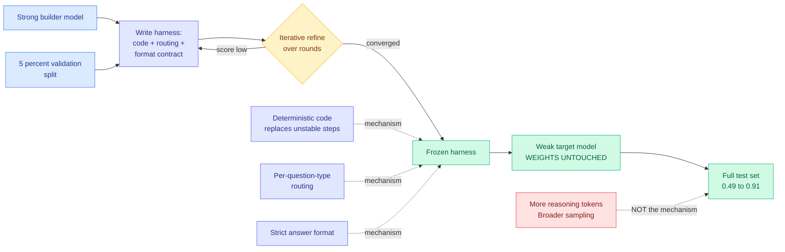

# AI4AI at Test-Time: Strong-to-Weak Capability Transfer via Harnesses

**Source:** [arXiv 2608.12307](https://arxiv.org/abs/2608.12307) · [HuggingFace](https://huggingface.co/papers/2608.12307) · [raw](../../raw/huggingface/2026-08-13-ai4ai-at-test-time-strong-to-weak-capability-transfer-via-ha.md)

## TL;DR

Every distillation method this wiki has tracked in 2026 moves capability from a strong model to a weak one by **changing the weak model's weights**: teacher forcing, on-policy distillation, hidden-state matching, token filtering. AI4AI asks whether the transfer can happen with the student frozen and nothing trained at all. A strong **builder** model is given a task family and 5% of the data as a validation set, and it writes an inference-time **harness** for a weaker **target** model, iterating over multiple rounds against that held-out 5%. The finalized harness is then frozen and run on the full test set. Across four Theory-of-Mind benchmarks (tasks requiring a model to reason about what another agent believes, knows, or intends), average target performance goes from **0.49 to 0.91**. No gradient step is taken on the target model at any point.

The mechanism analysis is the part worth reading twice. The gains do **not** come from the target model reasoning more or sampling more broadly, which is what you would expect if the harness were just a better prompt. They come from three concrete moves: **offloading unstable reasoning steps into deterministic code**, **benchmark-specific routing** (dispatching different question types down different paths), and **strict answer-format enforcement**. In other words, the builder is not teaching the target to think better. It is removing the places where the target's thinking was allowed to leak.

---

---

## Key findings

- **Average target performance 0.49 → 0.91** across four Theory-of-Mind benchmarks, with zero parameter updates to the target.
- **Builder reasoning effort improves harness quality monotonically.** Spend more inference compute on the model *writing* the harness and you get a better harness. This is a clean compute-allocation result: the budget moved from training the student to thinking about the scaffold.
- **Weaker targets receive the largest gains.** The harness substitutes for capability the target lacks, so there is more to substitute for when the target is weaker.
- **Platform effects are modest relative to builder capability.** Which agent framework the harness runs in matters much less than how strong the model writing it is.
- **The three named mechanisms are all forms of removing model discretion**, not adding model effort. Deterministic code, routing, and format enforcement each take a decision away from the target.

## How this relates to prior wiki pages

**This extends the on-policy distillation cluster by removing its central assumption.** Since 08-03 this wiki has tracked roughly a dozen papers refining *which tokens or trajectories a student should be trained on*: [ReOPD (08-03)](2026-08-03-reopd-prefix-replay-distillation.md) replays teacher prefixes, [CRPO (08-04)](2026-08-04-crpo-contrastive-privileged-self-distillation.md) sorts privileged-teacher supervision by predictive entropy, [Any-OPD (08-05)](2026-08-05-any-opd-heterogeneous-on-policy-distillation.md) handles heterogeneous teacher-student pairs, and [Privileged-but-Biased (08-10)](2026-08-10-privileged-but-biased-self-distillation.md) showed privileged teachers inject their own bias into the student. Every one of them assumes the transfer medium is a gradient. AI4AI proposes a different medium entirely: **the transfer artifact is a program, not a parameter update**. The two are not competing so much as operating on different cost curves, and nobody has yet measured them against each other on the same task.

**It is the strongest evidence yet for the core claim of [Agent Harness Engineering](../agentic-systems/agent-harness-engineering.md).** That concept page's spine is omarsar0's measurement that harness choice swings cost-per-success 5x to 30x on a fixed model ([arXiv 2608.01347](https://arxiv.org/abs/2608.01347)). AI4AI supplies the capability-side twin of that cost-side result: harness choice swings *accuracy* by roughly 2x on a fixed model. Together they say the harness is a first-class axis on both dimensions the field optimizes.

**It answers the open question [Scaling the Harness (05-27)](../agentic-systems/2026-05-27-scaling-the-harness.md) posed but could not test.** That position paper argued system scaling rather than model scaling is the next bottleneck and called for harness-level benchmarks. AI4AI is the first result to put a controlled number on the substitution rate between the two: how much model capability a well-built harness is worth.

**It is a mirror image of [SKILL-KD (08-06)](../agentic-systems/2026-08-06-skill-kd-contrastive-skill-distillation.md),** which also transferred capability to a *frozen* student, by contrasting a student failure trajectory against a teacher success on the same task and distilling the discrepancy into a textual skill patch. SKILL-KD's artifact is a written rule the student reads; AI4AI's is executable structure the student runs inside. Both landed on the same insight from different angles: **when you cannot touch the weights, put the capability in the scaffold.** SKILL-KD is the natural-language version, AI4AI the deterministic-code version, and AI4AI's own analysis argues the deterministic version is where the gains actually come from.

**Tension with [SkillZip (08-12)](../agentic-systems/2026-08-12-skillzip-skill-compression.md) and [ALTK-Evolve (08-12)](../agentic-systems/2026-08-12-altk-evolve-selective-context-delivery.md).** Yesterday's board argued the agent's accumulated context is a recurring bill and the fix is to send less of it. AI4AI's harness is exactly such an artifact: written once, then injected on every inference forever. It reports no token accounting at all, which means the headline 0.49 → 0.91 is stated without its price.

## Gaps in the study

The most important omission is **cost**. A method whose entire claim is "you do not need to train" has to be compared against training on a common axis, and there is no dollar or token accounting anywhere: not for the builder's multi-round refinement, not for the harness's per-inference overhead, not against the cost of simply fine-tuning the target. Without that, "cheaper than distillation" is an assumption, not a result.

Second, **the benchmarks are the wrong shape for the claim.** Four Theory-of-Mind benchmarks are exactly the setting where deterministic code and format enforcement do the most work, because ToM tasks have structured question types and constrained answer spaces. The paper's own mechanism analysis says the gains come from routing per question type and enforcing answer format, which is close to saying the harness learned the benchmark. That is a real capability transfer if the routing generalizes and something closer to benchmark fitting if it does not, and the 5%-validation-set protocol does not distinguish them.

Third, **there is no held-out task family.** The builder refines against a split of the same benchmark it is then evaluated on. The honest test is a harness built on benchmark A and run on benchmark B.

## Industrial implication

If this holds up outside Theory-of-Mind, the practical read is blunt: **before paying to fine-tune a small model, pay a frontier model to write its scaffold, and measure both.** The economics are not close. A distillation run is a training job with data collection, a GPU reservation, and an artifact you have to re-run whenever the base model updates. A harness is a text file that a strong model produces in an afternoon and that survives a base-model swap. The regime where this matters most is the one the paper measures best: weak targets get the biggest lift, which is exactly the small-open-model serving tier where the cost pressure lives.

The caution is that a harness is a maintenance liability the moment it encodes routing rules, and this wiki has the receipt. [SkillJack (08-05)](../responsible-ai/2026-08-05-skilljack-persistent-skill-backdoors.md) measured detection of a poisoned agent artifact collapsing from 98.5% on the source trajectory to 11.4% on the extracted skill. A harness written by one model and run by another is that same abstraction step, with the added property that the thing being abstracted is executable.

**Research angle.** The single highest-value follow-up is the substitution curve: for a fixed budget, how many dollars of builder inference buy the same target-model accuracy as one dollar of fine-tuning, and where do the two curves cross? AI4AI establishes that the substitution exists. Nobody has priced it. The second question is whether harness transfer composes with weight transfer or whether they compete for the same headroom, which is directly testable by running AI4AI's harness on top of an already-distilled target.

---

**Related:** [Agent Harness Engineering](../agentic-systems/agent-harness-engineering.md) · [Knowledge Distillation](knowledge-distillation.md) · [SKILL-KD](../agentic-systems/2026-08-06-skill-kd-contrastive-skill-distillation.md) · [Scaling the Harness](../agentic-systems/2026-05-27-scaling-the-harness.md) · [Digest 2026-08-13](../daily-digest/2026-08/2026-08-13.md)
