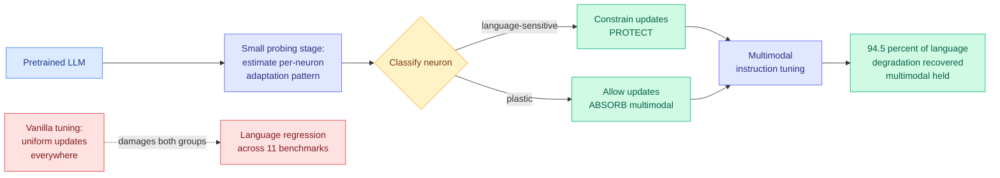

# NeuPAT: Neuron-aware Plasticity Allocation Tuning for Language-Preserving MLLMs

**Source:** [arXiv 2608.08107](https://arxiv.org/abs/2608.08107) · [HuggingFace](https://huggingface.co/papers/2608.08107) · [raw](../../raw/huggingface/2026-08-13-neupat-neuron-aware-plasticity-allocation-tuning-for-languag.md)

## TL;DR

Bolting vision onto a pretrained language model works, and it quietly damages the language model underneath. This is well known and usually treated as an acceptable tax. NeuPAT asks where in the network the damage actually happens, and finds that it is not spread evenly.

The observation is that **neurons in a pretrained LLM have heterogeneous plasticity during multimodal learning**. Some are load-bearing for language and get overwritten when the multimodal instruction-tuning gradient flows through them. Others are far more willing to absorb new multimodal knowledge without costing anything. Vanilla fine-tuning treats all of them identically, which is why it damages the first group to teach the second.

NeuPAT runs a **small probing stage** to estimate each neuron's adaptation pattern, then allocates a per-neuron update constraint during instruction tuning: protect the language-sensitive neurons, push the multimodal adaptation through the plastic ones. It is architecture-agnostic and light, which matters because the entire pitch is that it costs less than the alternative of retraining or of accepting the regression.

The result: **94.5% of the language capability lost to vanilla tuning is recovered across 11 language benchmarks, with multimodal performance held comparable.** The interesting part is that both numbers move the right way at once, which means vanilla tuning was not making a real tradeoff. It was damaging language capability for nothing.

---

---

## Key findings

- **94.5% recovery of language capability degradation** across 11 language benchmarks, with multimodal performance comparable to vanilla tuning.
- **Neuron plasticity during multimodal learning is heterogeneous and measurable.** This is the empirical claim the method rests on, and it is the part that generalizes beyond this paper.
- **The probing stage is small-scale**, which is what makes the method a practical wrapper rather than a second training run.
- **Architecture-agnostic**, demonstrated across diverse LLM families rather than one backbone.

## How this relates to prior wiki pages

**It is the fourth distinct level at which the field has now located the same claim: uniform updates are wasteful.** This wiki has tracked that claim moving down the stack all year. [TIP (04-16)](2026-04-16-tip-token-importance-on-policy-distillation.md) put it at the **token** level, finding most teacher-generated tokens carry no learning signal and roughly 10% suffice. [LongAct (04-18)](2026-04-18-longact-saliency-sparse-rl.md) put it at the **activation** level, using high-magnitude KV activations to steer sparse reinforcement-learning updates rather than updating everywhere. [SPOT (08-06)](2026-08-06-spot-sparse-probing-outcome-calibration.md) put it at the **probe** level. NeuPAT puts it at the **parameter** level: which individual neurons should be allowed to move at all. Four levels, one finding. That is well past this wiki's three-paper threshold for naming a pattern, and the pattern is that **selectivity is the free lunch nobody was taking**.

**It is the fine-grained answer to a coarse-grained problem [ROPD (08-04)](../responsible-ai/2026-08-04-ropd-routing-safety-realignment.md) raised.** ROPD found that routing-level changes silently degrade safety alignment elsewhere in the model, which is the same shape of failure: a targeted improvement bleeding into an unrelated capability. NeuPAT's mechanism, per-parameter update budgets derived from a probe, is a candidate general answer to that whole failure class and not just to multimodal expansion.

**It sits opposite [AI4AI (08-13)](2026-08-13-ai4ai-test-time-harness-transfer.md) on the same day.** AI4AI transfers capability to a frozen model by writing a scaffold and never touching weights at all. NeuPAT touches weights but decides very carefully which ones. Both are answers to "how do you add capability without breaking what is already there," and they represent the two ends of the intervention spectrum on a single board.

## Gaps in the study

**No cost accounting for the probing stage.** "Small-scale" is doing a lot of work in a paper whose selling point is being lightweight. Without a number, the comparison against simply doing LoRA-style constrained tuning is not established.

**No comparison against the obvious cheap baseline.** Freezing a fixed fraction of the network, or using a static importance heuristic like weight magnitude, would test whether the *probe* is what earns the 94.5% or whether any reasonable protection scheme gets most of the way there.

**94.5% recovery is not 100%,** and the paper does not characterize what falls in the residual 5.5%. If the unrecovered capability is concentrated in a coherent skill rather than spread thinly, that is a very different result.

**Only multimodal expansion is tested.** The heterogeneous-plasticity observation should apply to any capability grafting, including tool use and domain adaptation, and none of those are tried.

## Industrial implication

Anyone shipping a vision-language model built on a pretrained text backbone is currently paying a language regression they may not be measuring, because multimodal evaluations do not surface it. The immediately usable action is not adopting NeuPAT. It is **running the 11-benchmark language check on your own multimodally-tuned model** to find out how large your regression is, which is a one-afternoon experiment. If the regression is real, the method is a cheap wrapper.

The medium-term read is that per-parameter update budgeting is likely to show up as a standard option in fine-tuning libraries within two quarters, because the same machinery serves catastrophic forgetting, safety-alignment preservation, and domain adaptation, and those are three separate reasons to want it.

---

**Related:** [Knowledge Distillation](knowledge-distillation.md) · [AI4AI at Test-Time](2026-08-13-ai4ai-test-time-harness-transfer.md) · [Digest 2026-08-13](../daily-digest/2026-08/2026-08-13.md)
