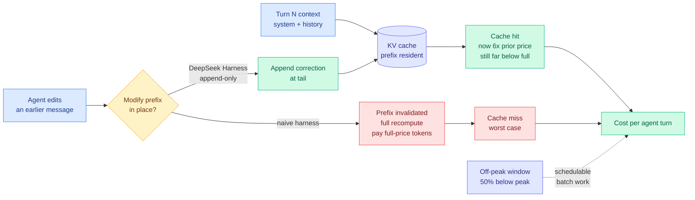

# DeepSeek Harness v0.1 and the price of a cache hit

**Source:** [The Decoder](https://the-decoder.com/deepseek-launches-an-improved-v4-pro-model-raises-api-prices-and-makes-its-agent-software-open-source/) · [@deepseek_ai announcement](https://x.com/deepseek_ai/status/2087887408440164663) · [@eliebakouch teardown](https://x.com/eliebakouch/status/2087904176357437820) · [DeepSeek Harness repo](https://github.com/deepseek-ai/deepseek-harness) · raw: [rss](../../raw/rss/2026-08-13-the-decoder-deepseek-ships-improved-v4-pro-open-sources-its-agent-s.md) · [twitter](../../raw/twitter/2026-08-13-evening.md)

## TL;DR

DeepSeek did three things on 2026-08-13 that only make sense read together. It moved **V4-Pro** out of preview with open weights under MIT and a flexible reasoning-effort dial (low / high / max). It **open-sourced its agent harness**, DeepSeek Harness v0.1, also MIT, built on a meta-framework called Cordis whose organizing idea is that *everything is a plugin*: models, tools, skills, sessions, sandboxes, filesystems, loops, orchestration, and UI are all swappable. And it **raised API prices, with cache-hit tokens jumping to roughly six times their previous cost**, alongside a new peak/off-peak split where off-peak rates are 50% below peak (effective 16:00 UTC, 2026-08-16).

The third item is the one this wiki cares about, and the first two are the response to it. A cache hit is what you pay when a request's prompt prefix is already resident in the KV cache (the store of previously computed attention keys and values that lets a model skip recomputing tokens it has already seen). Agent workloads are the heaviest cache-hit consumers in existence, because an agent loop re-sends a growing conversation prefix on every single turn. Repricing cache hits 6x is therefore not a general price rise. It is a **targeted tax on agent loops**, and it lands the same day DeepSeek ships a harness whose central engineering commitment, per Hugging Face's Elie Bakouch reading the code, is **first-class KV-cache-aware design: the harness never alters previously written history**. When something in the conversation changes, it does not edit the prefix. It appends a statement at the end describing the modification.

That is a compiler-level insight applied to agent state. Editing the prefix invalidates every cached token after the edit point and forces a full recompute. Appending preserves the prefix and keeps the cache hit. DeepSeek raised the price of the thing its own harness is engineered never to lose.

---

---

## Key claims

- **Cache-hit tokens repriced to about 6x their prior cost**, described by The Decoder as the single biggest increase in the transition. The workloads hit hardest are agent loops that repeatedly read the same files.
- **Peak / off-peak pricing arrives, with off-peak 50% below peak**, from 16:00 UTC on 2026-08-16. This makes time-of-day a first-class scheduling variable for anyone running batch agent work against DeepSeek.
- **DeepSeek Harness v0.1 is MIT-licensed and plugin-everything.** Cordis, the underlying meta-framework, treats models, tools, skills, sessions, sandboxes, filesystems, loops, orchestration, and UI as interchangeable plugins. It ships several default modes, which are really different harnesses: code mode with programmatic tool calling in TypeScript, bash+edit (the mode typically used in evals), and a standard read/write-tool mode.
- **Append-only history is the KV-cache discipline.** Per Bakouch's teardown, the harness guarantees the prefix is never mutated; modifications are expressed as appended statements. He expects other harnesses to adopt the same convention.
- **The harness was itself largely built by agents.** Bakouch estimates at least ~20% of commits and PRs came from Codex worktrees, and notes the real figure is probably higher since he counted only worktree or named-branch signals.
- **V4-Pro has a reasoning-effort dial** (low for simple tasks, high for daily agent workflows, max for complex tasks) plus native OpenAI Responses API support. Reception was mixed: Vals AI's leaderboard ranked it second overall while some users were disappointed, per [The Information](https://www.theinformation.com/briefings/deepseek-releases-flagship-v4-pro-model-challenge-kimi-k3).

## How this relates to prior wiki pages

**This is the first time the wiki has seen a provider price the KV cache as a lever rather than a discount.** Every KV-cache entry on the [kv-cache concept page](kv-cache.md) up to now has treated the cache as a technical resource to be compressed, quantized, evicted, or recomputed more cleverly. [KV-Packet (04-17)](2026-04-17-kv-packet-recomputation-free-kv-cache.md) removed recomputation cost by making cache state portable. [TurboQuant (04-22)](2026-04-22-turbo-quant-kv-cache-quantization.md) attacked the memory footprint. DeepSeek's move reframes the same object as a **billing surface**. Prefix stability stops being a latency optimization and becomes a line item, which changes who cares about it: not the kernel engineer, the finance owner.

**It confirms the harness-as-cost-lever thesis from the wrong direction, which makes it stronger.** The [harness engineering concept page](../agentic-systems/agent-harness-engineering.md) records that cost-per-success swings 5x to 30x across harnesses on a fixed model (omarsar0, arXiv 2608.01347, 08-13). That measurement was made by varying harnesses against fixed prices. DeepSeek varies the *prices* against a fixed harness design and produces the same conclusion: the harness is where agent cost is decided. A harness that mutates history now costs multiples more on the same model, same task, same tokens generated. This is the cleanest available demonstration that harness design is an inference-efficiency topic and not merely an agent-design topic.

**It is a concrete instance of the "third wave treats the harness as the product boundary" claim** from Ken Huang's [Harness Engineering essay (08-13)](../agentic-systems/2026-08-14-ken-huang-harness-engineering-patterns.md). A frontier-adjacent lab open-sourcing its harness under MIT while keeping the model as the paid product is that boundary drawn in public.

**And it sharpens the [Grok 4.6 step-efficiency (08-13)](../ai-industry/2026-08-13-grok-4-6-step-efficiency.md) result.** That entry recorded an industry release cutting agent tasks from 103 steps to 53 at 60% lower price, with the saving attributed to fewer steps. DeepSeek's repricing says the per-step cost structure is also moving, and moving against long loops specifically. Two providers, two weeks, both making step count the dominant cost term.

## Gaps

The 6x figure comes from The Decoder's reading of the pricing page, not from a published rate card in the raw sources here, so the exact before-and-after per-million-token numbers should be confirmed against DeepSeek's API docs before anyone builds a cost model on it. The off-peak discount also complicates the story: a 6x cache-hit increase partially offset by a 50% off-peak window nets out very differently for an interactive agent (cannot shift its load) than for a batch pipeline (can). Nobody has published that arithmetic.

More substantively, the append-only discipline has an unmeasured cost of its own. If corrections accumulate at the tail rather than replacing stale content, the context grows monotonically and carries contradictory statements the model must reconcile. That is a plausible accuracy tax paid to preserve a cache hit, and it is exactly the trade the [Illusion of Visual Tool-Use (08-13)](../agentic-systems/2026-08-13-illusion-of-visual-tool-use.md) methodology could test by corrupting the appended correction and checking whether behavior moves. No such measurement exists yet.

## Industrial implication

Two things follow within a quarter. First, **prefix stability becomes a documented property of agent frameworks**, the way streaming support or tool-call schemas are today, because buyers can now compute what it costs them. Bakouch's expectation that other harnesses will adopt append-only history is a prediction about convergence, and it is cheap enough to implement that it will probably be right. Second, **peak/off-peak pricing spreads**, because it lets a provider capture willingness-to-pay from interactive traffic while keeping utilization high on batch traffic, and agent workloads split unusually cleanly into those two classes. The second-order effect is a new routing dimension: not just which model, but which *hour*. The [LLMRouter](../ai-routing/2026-08-14-llmrouter-unified-routing-infrastructure.md) formulation of routing as a sequential decision over context encoders, model encoders, scoring functions and decision rules has no time-of-day term in it, and it will need one.

## Related pages

- [KV cache](kv-cache.md)
- [Agent harness engineering (loop, harness, graph)](../agentic-systems/agent-harness-engineering.md)
- [Ken Huang: Harness Engineering design patterns (08-14)](../agentic-systems/2026-08-14-ken-huang-harness-engineering-patterns.md)
- [LLMRouter: unified routing infrastructure (08-14)](../ai-routing/2026-08-14-llmrouter-unified-routing-infrastructure.md)
- [Token price is not task cost: the AlphaSense study (08-14)](../ai-industry/2026-08-14-alphasense-token-price-vs-task-cost.md)
- [Grok 4.6 step efficiency (08-13)](../ai-industry/2026-08-13-grok-4-6-step-efficiency.md)
