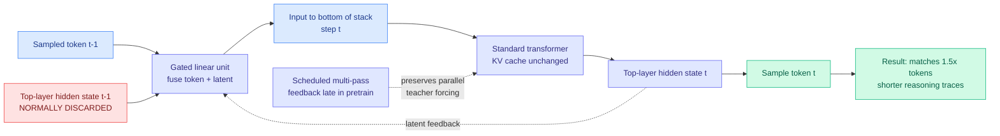

# Full-bandwidth Transformer: Latent Feedback Between Decoding Steps

**arXiv:** [2608.08888](https://arxiv.org/abs/2608.08888) · **HF:** [paper page](https://huggingface.co/papers/2608.08888) · [raw](../../raw/huggingface/2026-08-14-full-bandwidth-transformer.md)

## TL;DR

An autoregressive transformer computes along two axes: horizontally across generated tokens, and vertically through model depth. Dense attention gives every token wide horizontal access to the past. The *vertical* channel between decoding steps is almost absurdly narrow by comparison: at each step the model produces a rich top-layer hidden state, samples one token from it, throws the hidden state away, and feeds only that single sampled symbol back to the bottom of the stack. Everything the model computed but did not verbalize is either discarded or left depth-frozen in the KV cache, reachable only by layers above where it was produced.

The full-bandwidth transformer (Johns Hopkins, Princeton, Microsoft AI Frontiers, with John Langford) widens that channel. At each decoding step the **previous top-layer hidden state is fused with the sampled token embedding through a gated linear unit** and fed back as the next input. Non-verbalized computation re-enters the stack with a fresh depth budget instead of having to be re-derived or written out as reasoning tokens. The architecture is otherwise unchanged: standard transformer, standard KV cache, standard language-modeling objective.

The training trick is the part that makes it practical. Naive latent feedback destroys parallel teacher forcing, because step *t*'s input now depends on step *t-1*'s output. They use a **scheduled multi-pass objective**: latent feedback is introduced only late in pretraining, mixed with a small fraction of deeper feedback passes for stability. At 1B parameters and 400B tokens, this improves validation loss, 5-shot evaluation, math and coding generation, and instruction-tuned performance. Two numbers matter most: full-bandwidth models **match or approach standard transformers trained on roughly 1.5x more tokens**, and they **produce shorter reasoning traces at equal or better accuracy**, all at negligible per-token decoding overhead.

---

---

## Key findings

- **Matches a standard transformer trained on ~1.5x more tokens**, at 1B parameters and 400B tokens. In a regime where high-quality unique data is the binding constraint, buying a 1.5x data multiplier with an architectural change rather than a corpus is the headline.
- **Shorter reasoning traces at equal or better accuracy.** This is the efficiency result with the clearest deployment consequence. If non-verbalized computation can ride the latent channel, the model does not have to spend output tokens narrating intermediate steps.
- **Negligible per-token decoding overhead.** One GLU fusion per step against a full forward pass.
- **KV cache, architecture, and objective are all preserved.** No new cache format, no new attention kernel, no auxiliary loss. That is what makes it deployable rather than merely interesting.
- **The scheduled multi-pass objective is what makes training tractable.** Introducing feedback late keeps the bulk of pretraining fully parallel.

## How this relates to prior wiki pages

**This is the most direct attack yet on a cost the wiki has been circling from the output side all quarter.** A long line of work here tries to make reasoning cheaper by shortening or pruning what the model writes: [PUMA (05-19)](2026-05-19-puma-semantic-preserving-early-exit-reasoning.md) exits reasoning early while preserving semantics, [Stop-Path Pruning (04-20)](2026-04-20-stop-path-pruning-parallel-reasoning.md) kills unproductive parallel reasoning branches, [LenVM (05-01)](2026-05-01-lenvm-token-level-length-value-model.md) learns a token-level value model for length, and [OmniDelta (07-29)](2026-07-29-omnidelta-skill-driven-token-budget.md) allocates token budget by skill. Every one of them accepts that intermediate computation must be verbalized and then tries to verbalize less of it. The full-bandwidth transformer removes the premise: give the computation somewhere else to live and the model stops needing to write it down. The shorter-traces result is the same win those papers chase, obtained one level lower in the stack.

**It is the architectural counterpart to [Token Superposition Training (05-13)](2026-05-13-token-superposition-training.md) and the latent-reasoning line.** [SLPO (07-23)](2026-07-23-slpo-latent-reasoning-surrogate-policy.md) optimizes a surrogate policy in latent space rather than token space. Both accept that the token bottleneck is a real information constraint. The difference is that SLPO changes the training objective while this changes the forward pass, so they are composable rather than competing.

**It relates to [Loop transformers and Variable-Width Transformers (06-17)](2026-06-17-variable-width-transformers.md) but with a cheaper bargain.** [LoopCoder v2 (06-17)](2026-06-17-loopcoder-v2-parallel-loop-transformer.md) and the loop-transformer family get extra effective depth by literally running layers again, paying real compute. Latent feedback gets a renewed depth budget by reusing the state already computed, paying one GLU. Whether the recycled state is as valuable as a genuine extra pass is exactly the open question.

**The KV cache angle is worth flagging for what it is not.** The paper explicitly preserves the KV cache and does not touch it. But its diagnosis, that hidden states are "depth-frozen" in the cache and reachable only by layers above their origin, is a genuinely new framing of what the KV cache does *not* store. The wiki's cache literature treats the cache as a memory to compress ([Octopus, 05-21](2026-05-21-octopus-octahedral-kv-cache-codec.md)), evict from ([Make Each Token Count, 05-12](2026-05-12-make-each-token-count-kv-eviction.md)), or transmit ([See What I See, 06-13](2026-06-13-see-what-i-see-dense-latent-kv-communication.md)). This paper points out it is also a *vertically restricted* store, which is a property nobody here had named.

## Gaps

Everything is at 1B parameters. The claim that matters commercially is that the ~1.5x data multiplier survives to frontier scale, and there is no evidence for that yet. Latent feedback also creates a sequential dependency between decoding steps that speculative decoding assumes away, so composition with the wiki's [speculative decoding line](speculative-decoding.md) is unclear and untested. The paper does not report whether feedback introduced late in pretraining performs as well as feedback trained from scratch, which is the natural worry about the scheduling trick: it may be a compromise with a cost nobody has measured. And the shorter-reasoning-traces result is reported without an interpretability check on whether the latent channel is doing hidden reasoning that a chain-of-thought monitor can no longer see, which is a real concern given the wiki's [CoT monitoring thread (08-06)](../responsible-ai/2026-08-06-cot-monitoring-implicit-influence.md).

## Industrial implication

If this scales, the immediate beneficiary is any workload paying per output token for reasoning, which is most agentic deployments. Shorter traces at equal accuracy is a direct multiplier on the same cost line that [Grok 4.6's 53-versus-103-step result (08-13)](../ai-industry/2026-08-13-grok-4-6-step-efficiency.md) attacked at the harness level. Note the tension worth watching: moving reasoning off the token stream and into a latent channel makes it cheaper *and* makes it invisible to the monitoring layer that safety work has been building around visible chains of thought.

## Research angle

- **Does the 1.5x multiplier hold at 8B and beyond?** This is the whole question. A single 8B run settles whether this is an architecture or a small-scale curiosity.
- **Latent feedback plus speculative decoding.** The step-to-step dependency looks like it breaks drafting. If someone finds a formulation where the draft model also carries latent state, the two compose; if not, this trades against the wiki's most reliable serving speedup.
- **Is the latent channel legible?** Probe what the fed-back state encodes on problems where the model produces a shorter trace than a baseline. If reasoning has moved into the latent channel, CoT monitoring loses coverage exactly where efficiency is gained.

## Source

`raw/huggingface/2026-08-14-full-bandwidth-transformer.md`

## Related pages

- [KV Cache](kv-cache.md)
- [Speculative Decoding](speculative-decoding.md)
- [Token Superposition Training (05-13)](2026-05-13-token-superposition-training.md)
- [Variable-Width Transformers (06-17)](2026-06-17-variable-width-transformers.md)
