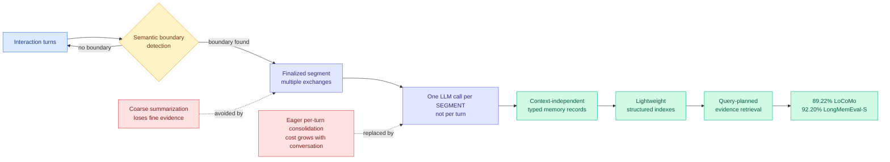

# LycheeMemory V2: Long-Term Agent Memory via Semantic Segment-Level Consolidation

**arXiv:** [2608.12990](https://arxiv.org/abs/2608.12990) · **HF:** [paper page](https://huggingface.co/papers/2608.12990) · [raw](../../raw/huggingface/2026-08-14-lycheememory-v2-efficient-long-term-memory-for-llm-agents-vi.md)

## TL;DR

Most agent memory systems use **eager consolidation**: after every single interaction turn, they call an LLM to extract, summarize, or update stored memories. That is a clean design and an expensive one, because memory construction cost grows with the length of the conversation and every turn pays a model call whether or not it carried anything worth remembering. The usual escape is coarse summarization, which is cheaper but throws away fine-grained evidence, or pushing the work to query time via bigger retrieval contexts and multi-hop reasoning, which just moves the bill.

LycheeMemory V2 changes the **granularity of consolidation** rather than the amount. Instead of consolidating every turn, it batches multiple exchanges into **segments** and encodes each finalized segment into context-independent typed memory records. Segment boundaries come from **semantic boundary detection**, not a fixed window, which is what preserves coherent event-level and temporal structure that fixed-size batching would cut through. The records are then organized with lightweight structured indexes supporting query-planned evidence retrieval.

The result is a rare one in this literature: better accuracy *and* much lower cost, with no query-time penalty. Using GPT-4.1-Mini it reaches **89.22% on LoCoMo** and **92.20% on LongMemEval-S**, both state of the art, while cutting construction tokens by **86.0% on LoCoMo and 75.9% on LongMemEval-S** versus A-Mem, without increasing query-time token usage.

---

---

## Key findings

- **86.0% fewer construction tokens on LoCoMo, 75.9% fewer on LongMemEval-S**, against A-Mem. Memory construction is the dominant recurring cost in long-horizon agents and this is close to an order of magnitude off it.
- **State of the art on both benchmarks anyway**: 89.22% LoCoMo, 92.20% LongMemEval-S. The cost reduction is not bought with accuracy.
- **Query-time token usage does not increase.** This is the claim that separates it from the coarse-summarization baseline, which typically saves at construction and pays at retrieval.
- **Semantic boundary detection beats fixed-window batching** on preserving event-level and temporal evidence. The batching alone gets you the cost saving; the semantic boundaries are what keep the accuracy.
- **The framing claim:** the accuracy-cost tradeoff in agent memory depends not only on *what* is retained but on **the granularity at which it is consolidated**. That is a genuinely new axis in this literature.

## How this relates to prior wiki pages

**Granularity-as-the-lever is now a recurring pattern across three different efficiency subfields, and this is the third instance in as many weeks.** Yesterday's digest named the first two: quantization found that **block order** mattered more than the choice of quantizer ([ICBQ, 08-12](2026-08-12-icbq-interleaved-cross-block-quantization.md), which interleaves quantization across blocks rather than improving the per-block operator), and on-policy distillation found that **prompt ordering by reliability** during training beat operator changes (ReOrder-OPD, 08-13). The 08-13 digest flagged this as "schedule, not operator" and predicted a third subfield would show the same shape. LycheeMemory V2 is that third instance, arriving one day later: memory construction improves not by writing a better extractor but by changing *when* extraction fires. Three subfields, same lever. The pattern threshold this wiki uses is three, and it is now crossed.

**It extends the agent-memory cost thread directly.** [δ-mem (05-13)](2026-05-13-delta-mem-online-memory.md) added a compact online associative state to a frozen backbone, [Delta Memory / online memory](2026-05-13-delta-mem-online-memory.md) and [Latent Memory (06-10)](2026-06-10-latent-memory-one-token-evidence.md) compressed evidence toward single-token representations, and [MemHarness (07-31)](../agentic-systems/2026-07-31-memharness-reconstruct-not-replay.md) argued memory should reconstruct rather than replay. Those all optimize the *representation*. LycheeMemory optimizes the *schedule of writes* into the representation, which is orthogonal and composable with all of them.

**It also lands on the same economic surface DeepSeek repriced today.** [DeepSeek's Harness v0.1 release (08-14)](../ai-industry/2026-08-14-deepseek-harness-v01-cache-repricing.md) raised cache-hit prices six-fold, which penalizes exactly the workload pattern that eager per-turn consolidation produces: many small repeated model calls over largely overlapping context. A construction-token reduction of 86% is worth substantially more today than it was a week ago, and that is a coincidence of timing that makes the paper more valuable than its abstract suggests.

## Gaps

All headline numbers use GPT-4.1-Mini, a small and cheap model. Semantic boundary detection is the load-bearing component and boundary quality plausibly degrades with a weaker detector, so the result may not transfer downward to fully local deployment, which is where an 86% construction-cost saving would matter most. The paper does not report sensitivity to segment size, so it is unclear how much of the gain is batching (which any fixed-window scheme gets) versus semantic boundaries (the actual contribution). LoCoMo and LongMemEval-S are both conversational; whether segment boundaries are as detectable in tool-call and code-edit traces, where agentic memory actually gets used, is untested.

## Industrial implication

Every production agent framework with a memory layer currently consolidates eagerly, because it is the obvious implementation. This says that choice costs roughly 4-7x in construction tokens for no accuracy benefit. It is a scheduling change, not a rewrite, so it is the kind of result that shows up in LangChain-class memory modules within a quarter. The bigger consequence: as cache-hit pricing rises across providers, the cost of chatty per-turn memory writes rises with it, and batching becomes an economic necessity rather than an optimization.

## Research angle

- **Isolate batching from semantics.** Fixed-window batching at matched segment size versus semantic boundary detection. If most of the gain is batching, this is a much simpler result than it appears; if it is the boundaries, semantic segmentation becomes a component worth investing in.
- **Does the "schedule, not operator" pattern have a fourth instance?** Three subfields (quantization block order, distillation prompt order, memory consolidation timing) now show that scheduling beats operator design. KV eviction timing is the obvious fourth candidate and the wiki's eviction literature has almost exclusively studied policy, not cadence.
- **Segment boundaries in non-conversational traces.** Tool-call sequences have natural boundaries too (task completion, error recovery). Whether the same detector transfers is a cheap experiment with a large deployment payoff.

## Source

`raw/huggingface/2026-08-14-lycheememory-v2-efficient-long-term-memory-for-llm-agents-vi.md`

## Related pages

- [KV Cache](kv-cache.md)
- [δ-mem: online memory (05-13)](2026-05-13-delta-mem-online-memory.md)
- [MemHarness (07-31)](../agentic-systems/2026-07-31-memharness-reconstruct-not-replay.md)
- [Agent Harness Engineering](../agentic-systems/agent-harness-engineering.md)
