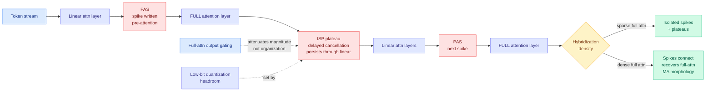

# Massive Activations in Hybrid Linear Attention LLMs: Pre-Attention Spikes and Inter-Spike Plateaus

**arXiv:** [2608.12149](https://arxiv.org/abs/2608.12149) · **HF:** [paper page](https://huggingface.co/papers/2608.12149) · **Code:** [StartluxLabs/Massive-Activations-HLA](https://github.com/StartluxLabs/Massive-Activations-HLA) · [raw](../../raw/huggingface/2026-08-14-massive-activations-in-hybrid-linear-attention-large-languag.md)

## TL;DR

Massive activations (MAs) are the sparse, enormous entries in a model's hidden state that sit several orders of magnitude above everything around them. They are the single biggest obstacle to low-bit quantization, because one outlier forces the whole tensor's scale factor to accommodate it and wastes precision on every other value. Everything the field knows about them was measured on full-attention transformers. Hybrid linear attention (HLA) models, which interleave cheap linear-attention layers with a few expensive full-attention layers, are now everywhere (Qwen3-Next, Qwen3.5, Kimi Linear, Kimi K3, Zamba, Nemotron-H) and nobody had characterized their activation dynamics.

This paper (Startlux, Tsinghua, HKU, and others) does it, and finds the morphology is not noise but **architecture-aligned**. Two shapes recur. **Pre-attention spikes (PAS):** massive activations spike immediately before every full-attention layer, reliably. **Inter-spike plateaus (ISP):** the spike does not decay away, it persists *through* the intervening linear-attention layers as an elevated plateau. As you make the hybrid denser in full attention, successive spikes connect through their plateaus until you recover the smooth, stable MA profile of a pure full-attention model. The organization holds across five linear-attention architectures, six hybridization ratios, five data domains, and open models from **1.2B to 397B**.

The mechanism they propose is a **write-sink-cancel lifecycle governed by cancellation timing**. A PAS is written, absorbed, then cancelled locally and quickly. An ISP is the same process with *delayed* cancellation, so the value stays elevated across the linear layers that follow. At the full-attention limit, delayed cancellation everywhere reproduces the classic full-attention picture. Controlled pretraining of GDN-based hybrids up to 1.3B shows both morphologies emerge early and respond **asymmetrically to gating**: full-attention output gating strongly attenuates their absolute magnitude without changing the layerwise organization, while removing GDN gates amplifies them only modestly.

---

---

## Key findings

- **Massive activations spike immediately before full-attention layers, consistently.** The position of the spike is predictable from the architecture, not from the data. That is a scheduling fact a quantizer can exploit directly.
- **Spikes persist through linear-attention layers as plateaus (ISP).** The elevated region is not one layer wide. Any per-layer quantization scale chosen on the assumption that outliers are local will be wrong across the plateau span.
- **Denser full attention connects the spikes and recovers the full-attention MA profile.** This gives a continuous knob between the two regimes rather than two disconnected pictures, and it means hybridization ratio is an activation-distribution decision, not only a compute decision.
- **The organization recurs across 5 linear-attention architectures, 6 hybridization configs, 5 data domains, and 1.2B to 397B models.** This is unusually broad evidence for a mechanistic claim.
- **Gating responds asymmetrically.** Full-attention output gating strongly attenuates MA magnitude but leaves the layerwise organization intact. Removing GDN gates amplifies only modestly. So gating is a magnitude control, not a structural one, and you cannot gate your way out of the morphology.
- **Both morphologies emerge early in pretraining.** They are not a late-training artifact, which means they can be measured on a partially-trained checkpoint.

## How this relates to prior wiki pages

**This is the third entry in the wiki's massive-activation thread and the first to attack the architecture that actually ships now.** [Massive Activations and the ME-Layer (05-13)](../responsible-ai/2026-05-13-massive-activations-me-layer.md) established the structural cause of outlier activations and made the key argument that the activation troubling quantization is doing real computational work, so it cannot simply be suppressed. [Measuring Maximum Activations in Open LLMs (05-19)](2026-05-19-max-activations-open-llms.md) then took the census: global maxima span nearly four orders of magnitude at comparable parameter counts, MoE checkpoints show 14-23x lower peaks than matched dense ones, and the residual stream carries the global maximum in 22 of 24 checkpoints. That paper's operational recommendation was to measure family-specific maxima before choosing quantization scales.

Today's paper supplies the piece both of those were missing: **where in the layer stack to look, and why**. The 05-19 census told you magnitudes vary enormously by family but treated the layer index as something to scan. PAS says the spike location is determined by where the full-attention layers sit, which for an HLA model is public architectural information. A quantizer no longer has to search for the outlier layers, it can read them off the config.

**It sharpens a claim the wiki has been making since 05-19 about MoE headroom.** That paper found MoE checkpoints have much lower activation peaks and argued MoE-native quantizers could afford roughly one extra bit of aggression. Today's result implies the same style of argument for hybrids but in the opposite direction: hybrid models concentrate their outliers at *predictable* positions rather than reducing them, so the win is scheduling, not headroom. Two different architectural escapes from the same problem, and they compose.

**It gives [LongAct (04-18)](2026-04-18-longact-saliency-sparse-rl.md) a structural explanation.** LongAct found that high-magnitude activations in Q/K vectors mark the positions where attention is doing real work, and restricted RL gradient updates to just those weights for roughly 8% gain on LongBench v2. If PAS says those saliency peaks sit immediately before full-attention layers by construction, then LongAct's saliency profiling on a hybrid model could be replaced with an architectural lookup. That is a direct, cheap follow-up.

**Open tension with the interpretability line.** The 05-13 ME-Layer paper argued MAs carry function. This paper's write-sink-cancel account says the value is *cancelled* shortly after being written, which reads more like a transient control signal than a stored representation. These are not obviously incompatible, but nobody has reconciled them, and the difference matters: a control signal can be replaced with a cheaper mechanism, a stored representation cannot.

## Gaps

Controlled pretraining runs top out at 1.3B, so the causal claims (gating asymmetry, early emergence) are small-scale, while the 397B evidence is observational on existing checkpoints. The paper characterizes the morphology thoroughly but does not report a quantization experiment showing that a PAS-aware or ISP-aware scale assignment beats a family-calibrated baseline. That experiment is the one that would convert this from a mechanistic study into a deployment recipe, and its absence is the main thing standing between this paper and immediate practical use.

## Industrial implication

Every serving stack running Qwen3.5, Kimi K3, Nemotron-H, or any other hybrid is quantizing under assumptions imported from dense LLaMA-era models. If spike position is architecturally determined, the correct move is per-layer-class quantization scales keyed to the hybridization pattern: one scale policy for full-attention-adjacent layers, another for the plateau region, a third for the rest. That is a config change, not a research program, and it should show up in llama.cpp and vLLM within a quarter of someone running the missing ablation.

## Research angle

- **The missing ablation.** PAS/ISP-aware quantization scales versus family-calibrated flat scales, at matched bits. If the structural information is worth even half a bit, this is the highest-value cheap experiment in the area right now.
- **Hybridization ratio as a quantization-friendliness knob.** The paper shows density controls whether spikes stay isolated or connect. Nobody has asked what hybridization ratio minimizes low-bit reconstruction error at fixed quality, which turns an architecture hyperparameter into a joint compute-and-precision decision.
- **Reconcile the lifecycle with the ME-Layer function claim.** If MAs are cancelled shortly after being written, are they carrying information or scheduling attention? An intervention study that suppresses PAS specifically, without touching ISP, would separate the two.

## Source

`raw/huggingface/2026-08-14-massive-activations-in-hybrid-linear-attention-large-languag.md`

## Related pages

- [KV Cache](kv-cache.md)
- [Measuring Maximum Activations in Open LLMs (05-19)](2026-05-19-max-activations-open-llms.md)
- [Massive Activations and the ME-Layer (05-13)](../responsible-ai/2026-05-13-massive-activations-me-layer.md)
- [LongAct (04-18)](2026-04-18-longact-saliency-sparse-rl.md)
