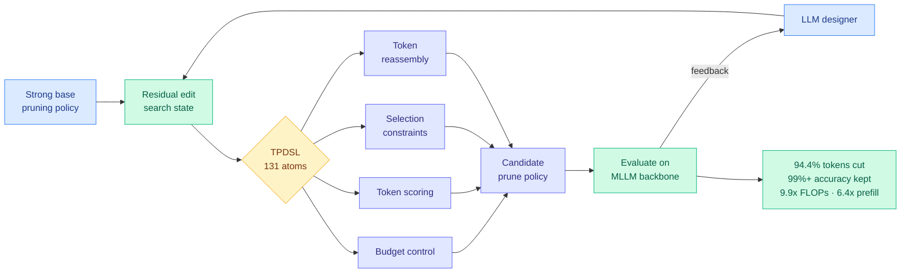

# AutoPrune: An AI4AI Framework for Visual Token Pruning

**arXiv:** [2608.07193](https://arxiv.org/abs/2608.07193)
**Authors:** Zhen Liu (Xi'an Jiaotong), Wenli Huang (Ningbo Univ. of Technology), Wei Song (North China Univ. of Technology), Yuhan Liu (MiLM Plus, Xiaomi), Zhiqin Yang (HKUST), Jingwen Fu (Zhongguancun Academy)
**Raw source:** [raw/huggingface/2026-08-16-an-ai4ai-framework-for-visual-token-pruning.md](../../raw/huggingface/2026-08-16-an-ai4ai-framework-for-visual-token-pruning.md)
**Topic:** token pruning, inference cost, prefill latency, LLM-designed algorithms

## TL;DR

A vision-language model turns one image into hundreds or thousands of visual tokens, and those tokens dominate inference cost. Pruning them is a solved-ish problem in the sense that dozens of heuristics exist, and an unsolved problem in the sense that picking and tuning the right heuristic for a new model, budget, and objective is expert trial and error. AutoPrune hands that design job to an LLM. The trick that makes it work is not the LLM, it is the **search-state representation**: a Token Pruning Domain-Specific Language (TPDSL) of **131 reusable atoms**, where each candidate state is expressed as a **residual modification of a strong base policy** rather than a program written from nothing. Across 14 multimodal benchmarks and three backbones, removing **94.4% of visual tokens** preserves **more than 99% of full-token performance**, at **9.9x fewer FLOPs** and **6.4x lower prefill latency**. Training-free.

## Diagram

## What the paper actually claims

The generic version of this idea, "let an LLM write the algorithm," has been tried in neural architecture search, heuristic generation, and program synthesis for mathematical discovery. It usually fails on specialised, constraint-heavy problems for a boring reason: the search space is enormous, and a general code generator spends its budget rediscovering mechanisms that already exist or emitting programs that violate tensor shapes, index bounds, budget constraints, or numerical stability.

AutoPrune's claim is that the fix is representational, not a better model. Two design choices carry the result.

**The DSL constrains what can be written.** TPDSL's 131 atoms cover the four things a pruning policy has to do: allocate a token budget, score tokens, apply selection constraints, and reassemble what survives. An LLM composing atoms cannot emit a shape-invalid policy, so every candidate is executable and the search never burns budget on syntax.

**The residual formulation constrains where the search looks.** A search state is not a policy; it is a *diff against a known-strong base policy*. This is the load-bearing choice. It shrinks the space to the neighbourhood of something that already works, and it points the LLM's attention at the components most consequential for performance rather than at re-deriving the parts of the base policy that were never the bottleneck.

The framework is **training-free**. No gradient touches the backbone. The output is a discovered pruning program, which is a much cheaper artifact to ship than a fine-tuned checkpoint.

## Key numbers

- **94.4% of visual tokens removed** while preserving **>99% of full-token performance**.
- **9.9x FLOPs reduction**, **6.4x prefill latency reduction**.
- Validated on **14 multimodal benchmarks** and **three MLLM backbones**, with transferability across them claimed.
- **131 atoms** in TPDSL, spanning budget control, scoring, selection constraints, and reassembly.

## How this relates to prior wiki pages

**This is the second instance in four days of the same architectural bet, and the pattern now deserves a name.** [AI4AI at Test-Time (08-13)](2026-08-13-ai4ai-test-time-harness-transfer.md) showed a strong builder model writing an inference-time harness for a weaker target model, lifting average Theory-of-Mind performance from 0.49 to 0.91 without touching the target's weights. AutoPrune does the structurally identical thing one layer down: a strong model writes an inference-time *policy* for a weaker system, and the weights are never touched. In both cases the artifact carrying the improvement is **a program, not a gradient**, and in both cases the authors report that the quality of the writing model is what scales the result. [Knowledge Distillation](knowledge-distillation.md) already opens with the claim that the transfer medium stopped being a gradient. AutoPrune is the second data point, and the first one in the efficiency stack proper.

**Extends visual token routing.** [DPVR (06-10)](../ai-routing/2026-06-10-dpvr-vision-token-routing.md) routed vision tokens by learned policy. AutoPrune does not learn a routing policy, it *searches for the program that implements one*, and it does so per backbone and per budget. That is a different level of the stack and the two compose in principle.

**Relation to compression generally.** 94.4% removal at >99% retention is an aggressive number and it should be read carefully: this is *visual token* pruning at the MLLM input boundary, where redundancy is genuinely extreme, not weight or KV compression where the equivalent ratios are nowhere near achievable.

## Gaps

The headline retention figure is an average over 14 benchmarks, and pruning failures in multimodal models are famously long-tailed: the tasks that need the 5.6% of tokens you dropped are exactly the fine-grained-perception tasks. That is worth pairing with [Moonshot's PerceptionBench (08-15)](https://the-decoder.com/new-benchmark-confirms-ai-models-still-perform-poorly-at-visual-perception/), which found no frontier model exceeds 60% on pure visual perception and that many apparent reasoning errors originate at the image-reading stage. If perception is already the weak link, an aggressive input-side prune is the last place you want an unreported tail. The paper also reports no cost for the search itself, which is the same omission the harness literature keeps making.

## Industrial implication

Serving multimodal models is prefill-bound, and 6.4x on prefill is the number that changes deployment maths for image-heavy agent traffic. More strategically: if a DSL plus residual search reliably beats expert-tuned heuristics, the same recipe applies to KV eviction policies, quantization schedules, and speculative-decoding draft policies, all of which are currently hand-designed heuristic families with well-defined atoms. That generalisation is the real bet here, and nobody has run it yet.

## Related pages

- [Knowledge Distillation](knowledge-distillation.md)
- [AI4AI at Test-Time (08-13)](2026-08-13-ai4ai-test-time-harness-transfer.md)
- [DPVR: vision token routing (06-10)](../ai-routing/2026-06-10-dpvr-vision-token-routing.md)
- [Test-Time Compute Allocation](test-time-compute-allocation.md)
