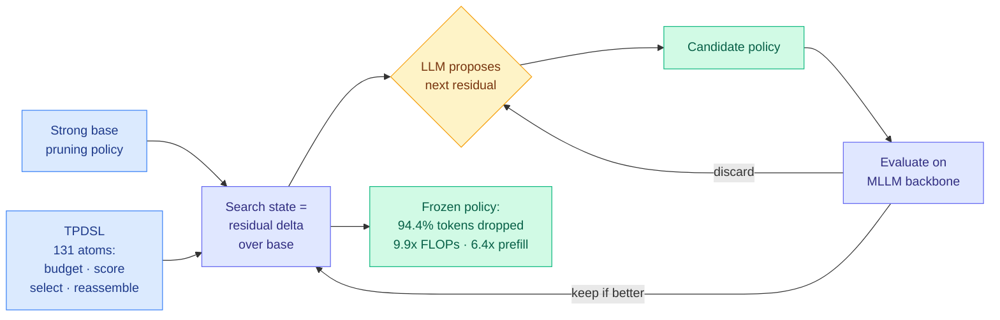

# AutoPrune: An AI4AI Framework for Visual Token Pruning

**Source:** HuggingFace Daily Papers · arXiv [2608.07193](https://arxiv.org/abs/2608.07193)
**Raw:** [raw/huggingface/2026-08-16-an-ai4ai-framework-for-visual-token-pruning.md](../../raw/huggingface/2026-08-16-an-ai4ai-framework-for-visual-token-pruning.md)
**Topic:** compression, visual token pruning, inference efficiency

## TL;DR

Multimodal models spend most of their inference budget on image tokens, and the field prunes those tokens with hand-written heuristics that a human researcher tuned by trial and error. AutoPrune asks a language model to write the pruning policy instead. The trick that makes it work is not "prompt an LLM harder" but a purpose-built representation: a Token Pruning Domain-Specific Language (TPDSL) of 131 reusable atoms covering budget control, token scoring, selection constraints, and token reassembly, where every candidate policy is expressed as a **residual modification of an already-strong base policy** rather than as a program written from nothing. That residual framing collapses the search space and points the model at the components that actually move the metric. On 14 multimodal benchmarks across three backbones, dropping **94.4% of visual tokens** preserves **more than 99%** of full-token performance while cutting **FLOPs 9.9x** and **prefill latency 6.4x**. The whole thing is training-free.

## Architecture

## Key findings

- **94.4% visual-token removal, >99% of full-token performance retained.** The compression ratio is the headline, but the retention number is what makes it credible: prior pruning work usually trades a visible point or two of accuracy for this kind of ratio.
- **9.9x FLOP reduction and 6.4x prefill-latency reduction.** The two numbers differ because prefill is not purely FLOP-bound; memory movement and kernel launch overhead do not shrink with token count at the same rate.
- **Training-free.** No fine-tuning of the backbone, no learned scorer to train. The output is a policy, not a weight update.
- **Transfers across three MLLM backbones and 14 benchmarks.** Transferability is the claim that distinguishes a search result from an overfit-to-one-model artifact.
- **The residual formulation is the load-bearing design choice.** Representing each search state as a delta over a strong base policy is what lets a general-purpose LLM contribute to a specialized task. Given a blank slate and 131 atoms, the search space is intractable; given a working policy and "change one thing," it is navigable.

## Relation to prior wiki pages

**This is the second AI4AI paper in three days, and the two are the same idea applied at different layers.** [AI4AI at Test-Time (08-13)](2026-08-13-ai4ai-test-time-harness-transfer.md) (2608.12307) had a strong *builder* model write an inference-time harness for a weaker *target* model, lifting average Theory-of-Mind benchmark performance from 0.49 to 0.91 with the target's weights never touched. AutoPrune has an LLM write an inference-time *pruning policy* for a multimodal backbone, with the backbone's weights never touched. Both replace a gradient with a program. Both are training-free. Both refine against a small held-out signal and then freeze. **Two papers, three days apart, no mutual citation, same substitution: the artifact that carries capability is a program, not a parameter update.** The [knowledge-distillation page](knowledge-distillation.md) opened this thread on 08-13; AutoPrune is its second member and the first one where the artifact is a compression policy rather than a reasoning scaffold.

**It also inherits the same missing number.** AI4AI at Test-Time reported no cost accounting at all: not for the builder's refinement rounds, not for per-inference overhead, not against a fine-tuning baseline. AutoPrune reports the *inference* savings in exquisite detail (FLOPs, prefill latency, token count) and says nothing about the **search** cost: how many LLM calls the policy design took, on what model, at what price. For a training-free method the search cost is the entire capital expenditure, and it is amortized across every inference thereafter, so it is genuinely cheap in the limit. But nobody has published the break-even.

**Against the hand-crafted pruning line.** The paper's own framing, that pruning objectives, budgets, and architectures have diversified faster than humans can hand-tune policies for them, is the compression-side version of the argument [Scaling the Harness (05-27)](../agentic-systems/2026-05-27-scaling-the-harness.md) made for agent systems: the design space outgrew manual search. When two subfields independently reach "the space is too big for a person," the shared answer being "let a model search it" is not a coincidence.

## Gaps

The search cost is unreported, as above. The 94.4% figure is presumably a tuned operating point rather than a knee in a curve, and no pruning-ratio-versus-accuracy curve is described in the abstract. And the atoms in TPDSL were designed by humans, so the framework moves the manual effort from policy design to language design rather than eliminating it. Whether TPDSL generalizes to a pruning objective its 131 atoms were not written with in mind is the test that would distinguish an automated designer from a well-parameterized search.

## Related pages

- [knowledge-distillation.md](knowledge-distillation.md)
- [2026-08-13-ai4ai-test-time-harness-transfer.md](2026-08-13-ai4ai-test-time-harness-transfer.md)
- [kv-cache.md](kv-cache.md)
- [../agentic-systems/agent-harness-engineering.md](../agentic-systems/agent-harness-engineering.md)
