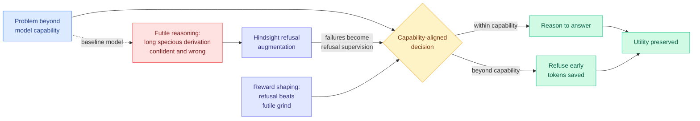

# CaRL: Knowing When to Quit — Diagnosing and Training LLMs to Abort Futile Reasoning

**Source:** HuggingFace Daily Papers · arXiv [2607.29211](https://arxiv.org/abs/2607.29211) · [code](https://github.com/icip-cas/Knowing-When-to-Quit)
**Raw:** [raw/huggingface/2026-08-16-knowing-when-to-quit-diagnosing-and-training-llms-to-abort-f.md](../../raw/huggingface/2026-08-16-knowing-when-to-quit-diagnosing-and-training-llms-to-abort-f.md)
**Topic:** inference cost, reasoning efficiency, calibration

## TL;DR

When a reasoning model is handed a problem beyond its capability, it does not stop. It produces a long, expensive, confident-looking derivation that is wrong. The paper names this **futile reasoning** and reports two findings about it: capability overreach is **universal** across the models tested, and the miscalibration between what a model can do and what it attempts is **systematic** rather than noisy. The dominant failure mode is **specious reasoning**, output that looks valid and contains subtle errors, and it gets worse as tasks get harder. CaRL (Capability-aligned Reinforcement Learning) fixes the behaviour with two levers: reward shaping that pays the model to refuse rather than to grind, and **hindsight refusal augmentation** that converts observed failures into refusal training data. Futile reasoning drops substantially and task performance is preserved across difficulty levels.

## Diagram

## Why this is an efficiency paper as much as a safety paper

Read the abstract twice and it says two different things. The safety reading is that specious derivations mislead users, which is true and is how the paper frames itself. The efficiency reading is that a reasoning model spends its most expensive tokens precisely on the queries where those tokens buy nothing, and the harder the query, the worse the ratio. That is a compute-allocation pathology with a measurable cost, and the fix is a policy change rather than a serving change.

The two levers are worth separating. **Reward shaping** makes refusal competitive with attempting, which is the standard move and the one that risks a model that refuses too much. **Hindsight refusal augmentation** is the interesting half: it mines the model's own failures and relabels them as instances where refusal was the correct action. That is free supervision from data the training run already generated, and it is the mechanism that lets the paper claim utility is preserved rather than traded away, because the refusal boundary is learned from where the model actually fails rather than from a hand-set difficulty threshold.

## Relation to prior wiki pages

**This is the stopping half of a question [Gambit (08-16)](2026-08-16-gambit-thought-level-beam-search.md) answers from the spending side.** Gambit, today's thought-level beam search result, takes the test-time budget as given and asks which partial trajectory deserves the next unit of compute, cutting total token consumption by up to 68.5% by killing weak traces and re-branching from strong prefixes. CaRL asks whether the query deserved a budget at all. The two are complementary and neither cites the other: Gambit optimises *within* an attempt, CaRL decides *whether to attempt*. A serving stack that ran both would gate at the door and then ration inside, and nobody has built that.

**It extends the early-exit line onto a new axis.** [PUMA (05-19)](2026-05-19-puma-semantic-preserving-early-exit-reasoning.md) exits a reasoning chain when meaning has stabilised, which is a *convergence* signal. CaRL exits when capability is exceeded, which is a *competence* signal. Both stop early; they read different evidence to decide.

**It lands on the calibration thread from a third direction.** [Are You Sure You're Sure? (08-16)](../responsible-ai/2026-08-16-instruction-tuning-confidence-lexical-diversity.md) found on the same HuggingFace board that instruction tuning consistently shifts verbalized confidence while barely moving accuracy and actively degrading likelihood-based calibration. Put the two together and the picture is unattractive: the post-training step that makes models usable also makes them more confident without making them more correct, and the resulting overconfidence is exactly what CaRL has to train back out. That is a genuine tension between two standard pipeline stages, surfaced by two papers on the same day that do not know about each other.

## Gaps

The abstract reports "substantial reduction in futile reasoning" without a token or dollar figure, which is the number an efficiency reader wants and the paper does not lead with. Refusal-trained models have a well-known failure mode in the other direction, refusing tractable queries, and "preserving performance across task difficulties" is an aggregate claim that would not surface a modest over-refusal tax on the hardest solvable tier. And capability boundaries move when you change the harness around the model, which the [harness engineering](../agentic-systems/agent-harness-engineering.md) thread has now demonstrated repeatedly, so a refusal boundary trained against one scaffold may be wrong under another.

## Industrial implication

Every provider serving a reasoning mode is currently billing customers for specious derivations on out-of-capability queries, and the customer pays twice: once for the tokens, once for acting on a wrong answer that looked right. A refusal policy that is calibrated rather than conservative is worth real money on both sides of that. The likely productisation is not a refusal but a **route**: detect capability overreach and escalate to a stronger model instead of quitting, which is the plan-versus-execute split running in reverse and which [LLM Routing](../ai-routing/llm-routing.md) has no paper proposing.

## Related pages

- [Test-Time Compute Allocation](test-time-compute-allocation.md)
- [Gambit: Thought-Level Beam Search (08-16)](2026-08-16-gambit-thought-level-beam-search.md)
- [PUMA (05-19)](2026-05-19-puma-semantic-preserving-early-exit-reasoning.md)
- [LLM Routing](../ai-routing/llm-routing.md)
