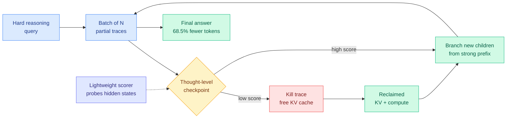

# Gambit: Thought-Level Beam Search for Reasoning

**arXiv:** [2608.08020](https://arxiv.org/abs/2608.08020) · COLM 2026
**Authors:** Lijie Yang (Princeton), Hongyin Luo (MIT CSAIL), Jiawei Zhao (Meta AI), Tri Dao (Princeton), Ravi Netravali (Princeton)
**Raw source:** [raw/huggingface/2026-08-16-thought-level-beam-search-for-reasoning.md](../../raw/huggingface/2026-08-16-thought-level-beam-search-for-reasoning.md)
**Topic:** test-time compute allocation, KV cache pressure, serving throughput

## TL;DR

Parallel sampling at test time (generate N independent reasoning traces, vote on the answer) wastes most of its compute on traces that were already going wrong at step three. Gambit reframes test-time reasoning as a **constrained compute-allocation problem over partial trajectories**: periodically pause the batch, score every partial trace with a lightweight probe on hidden states, kill the weak ones, and immediately **re-branch** from the strong prefixes so the hardware never idles. Under identical hardware constraints it gains up to **+6.7 points absolute on HMMT-24** and **+3.3 on AIME-25** over pruning baselines, delivers **more than 2x throughput** on trace completion, and cuts **total token consumption by up to 68.5%** against standard parallel sampling.

## Diagram

## What the paper actually claims

The framing is the contribution. Test-time compute scaling has been argued about as a *how much* question. Gambit formalises it as a *where* question: given a fixed hardware budget, which partial trajectories should receive the next unit of compute?

Two existing paradigms both fail that question, and they fail it in opposite directions.

**Parallel sampling** (the canonical version is Self-Consistency, which samples N traces independently and majority-votes) treats every trace as isolated. Nothing learned from trace 3's early collapse is used anywhere. Worse, holding N long reasoning contexts in flight is a **memory** problem before it is a compute problem: the KV cache (the stored attention keys and values that let a model avoid recomputing earlier tokens) for N long traces is what actually caps the batch size.

**Subtractive pruning** (DeepConf, STEP, Slim-SC) fixes the memory half by early-terminating unpromising traces. But it then throws the freed capacity away. The batch shrinks, the GPU starves, and the output distribution never shifts toward the good region, because nothing new was spawned to occupy the space.

Gambit is the additive half of pruning. When a trace dies, its freed KV budget is immediately spent branching a new child from the highest-scoring surviving prefix. Utilisation stays high and the sampled distribution actively concentrates.

The empirical premise, and the reason a *thought-level* checkpoint is the right granularity: successful and failed trajectories share their opening steps and diverge later, so useful computation is disproportionately concentrated in early intermediate states. Pausing traces midway, scoring them, and branching only from the top scorer measurably improves the outcome distribution. The scorer itself is cheap, a light probe over hidden states rather than a full process reward model, which matters because a heavy verifier's own cost eats the savings.

## Key numbers

- **+6.7 points absolute** on HMMT-24, **+3.3** on AIME-25 versus pruning baselines under identical hardware.
- **>2x throughput** on trace completion.
- **Up to 68.5% reduction in total token consumption** versus standard parallel sampling.
- Claimed to **strictly dominate** existing baselines, not trade off against them.

## How this relates to prior wiki pages

**Extends the compute-rationing line.** This wiki has tracked several attempts to spend inference compute where it pays: [PUMA (05-19)](2026-05-19-puma-semantic-preserving-early-exit-reasoning.md) exits a reasoning chain early when meaning has stabilised, [AdaSR (06-15)](2026-06-15-adasr-streaming-reasoning-hrpo.md) adapts streaming reasoning depth, and [SLPO (07-23)](2026-07-23-slpo-latent-reasoning-surrogate-policy.md) moves reasoning into a latent surrogate. Every one of those operates **within** a single trajectory. Gambit is the first on this page to operate **across** trajectories in a live batch, which is why its win shows up as throughput rather than only as tokens.

**Direct contradiction risk, and it is on the same Kurate board this week.** [Sampling Luck Masquerades as Allocation Gain](http://arxiv.org/abs/2608.13087) (Kurate cs.LG #6 this week) audits test-time budget allocation for neural combinatorial optimization and argues that reported allocation gains are frequently just the variance of drawing more samples, not a real allocation effect. Gambit's design is exactly the thing that audit targets: prune-and-rebranch changes the effective number of independent draws. Gambit's defence is that it reports **lower total token consumption** alongside higher accuracy, which sampling luck alone cannot produce, but the paper does not run the specific audit. This is unresolved and it is the sharpest question to ask of the result.

**Relation to KV cache work.** The mechanism is a KV-budget reallocation policy dressed as a search algorithm. Everything on [KV Cache](kv-cache.md) about eviction assumes a single sequence; Gambit evicts *whole sequences* to fund *new sequences*. That is a different eviction unit than any policy on that page.

**Relation to routing.** Under [LLMRouter's five-component formulation (08-14)](../ai-routing/2026-08-14-llmrouter-unified-routing-infrastructure.md), which casts routing as a sequential decision process with context encoders, model encoders, scoring functions, decision rules, and learning signals, Gambit is a router whose candidate set is *partial trajectories of one model* rather than a pool of models. The formalism covers it; no routing paper has claimed the axis.

## Gaps

The scorer is a learned probe on hidden states, so it needs to be trained per model family and the paper does not report how it degrades under distribution shift. Benchmarks are competition math (HMMT, AIME), which have short verifiable answers and unusually clean prefix quality signal; whether hidden-state scoring separates good from bad prefixes on open-ended reasoning is untested. And the sampling-luck audit above is not run.

## Industrial implication

This is a serving-stack change, not a training change, so it ships fast. Any inference engine already doing continuous batching can implement prune-and-rebranch with a checkpoint hook and a small scorer head. The 68.5% token reduction lands directly on the API bill for reasoning-mode traffic, and the >2x completion throughput lands on capacity. If the sampling-luck objection does not stick, this is the cheapest available win in reasoning inference right now.

## Related pages

- [Test-Time Compute Allocation](test-time-compute-allocation.md) (concept)
- [KV Cache](kv-cache.md)
- [CaRL: Knowing When to Quit (08-16)](2026-08-16-carl-knowing-when-to-quit.md)
- [LLM Routing](../ai-routing/llm-routing.md)
