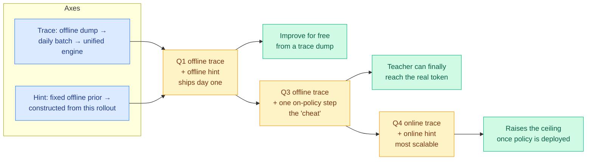

# Hinting: Self-Distillation Without a Golden Answer (Applied Compute)

**Source:** Samuel Denton, Applied Compute, at AI Engineer · [Talk](https://www.youtube.com/watch?v=ZTA0GwpAUak)
**Raw:** [raw/youtube-ai-tech/2026-08-12-Applied-Compute-Denton-Hinting-Distillation-Quadrants.md](../../raw/youtube-ai-tech/2026-08-12-Applied-Compute-Denton-Hinting-Distillation-Quadrants.md)
**Topic:** on-policy distillation, privileged information, continual learning, production deployment

## TL;DR

Distillation needs a teacher smarter than the student. If you are self-distilling from the same model, the only available source of that asymmetry is **privileged information the student does not get**, and Denton calls that privileged information a **hint**. You roll out the model conditioned on the hint, then pull the unhinted policy toward its hinted self. The constraint he insists on, and the one that separates this from most of the distillation literature, is that there is **no golden answer**: no reference solution, no hand-written per-task rubric. The hint encodes a *direction*, not a target.

He then separates continual learning into two independent axes and gets a 2x2 out of it. **How online the trace is**: a single historical dump of production traces (where he says most enterprises actually sit), a daily batch, or a unified engine where serving and training are the same system (his "holy grail"). **How online the hint is**: a fixed prior injected into every rollout, versus a hint constructed dynamically from what the on-policy model just did. Two experiments carry it, and the second one contains the practically important negative result.

## The 2x2

## Key findings

- **Experiment 1 (offline trace, offline hint).** Qwen 3.5 thinking on SWE-bench was taking up to 80 turns to submit; the goal was to call the submit tool before turn 40. The hint is a behavioural nudge, quoted almost verbatim: *you are near your 40-turn limit, roughly three turns left, you often keep exploring and forget to wrap up, so finalise and verify your fix and call this tool.* **Task-complete rate went 22% to 60%, with test-pass rate flat and slightly up.**
- **The mechanism is the interesting part, not the number.** Because the rollout is conditioned on an off-policy production trace that never called the tool, the teacher *cannot* force the tool-call tokens. It instead shifts the reasoning trajectory that leads to them. **The behaviour was installed without ever supervising the tokens that constitute it.**
- **Experiment 2 (online trace, online hint), and the negative result.** A customer harness required a hyperlink format far out of distribution for the post-trained model. **Reward shaping for the format and SFT on correctly formatted traces both degraded general coding performance.** Online hinting ("in your prior rollout you formatted hyperlinks like this, next time format them like this") took correct formatting from about **15% to about 80%**. The same behaviour targeted with a fixed offline hint applied to every rollout barely moved.
- **Trick 1, per-step hinting.** Do not inject the hint at the start of a rollout. Use a judge to pick which step to inject at, and distil only on the next step or few.
- **Trick 2, relevance masking.** Have an LLM judge select which teacher tokens contribute to the loss, because otherwise you inherit the teacher's connector-word preferences and pay for it in catastrophic degradation.
- **Metric design worth copying.** Three metrics, not one: task-complete rate (did it call the tool), test-pass rate (did the environment's tests pass regardless, the regression guard), and the intersection.

## Relation to prior wiki pages

**This is the production form of the privileged-information self-distillation family, and it independently reproduces the failure that family's falsifier identified.** The [knowledge-distillation page](knowledge-distillation.md) records [Privileged, but Biased (08-10)](2026-08-10-privileged-but-biased-self-distillation.md), which showed that when a teacher has seen one particular reference solution, its per-token target is pulled toward *that trajectory* rather than toward correctness, so the loss mass falls on low-information tokens (stopwords, punctuation, uncertainty markers) and the student flattens. **Denton's relevance masking is a direct, independently-derived mitigation for exactly that failure**: he says without it you inherit the teacher's connector-word preferences and pay in catastrophic degradation. Same diagnosis, from production, four days apart, no mutual citation.

**And his "no golden answer" constraint is the structural fix, not a preference.** Privileged, but Biased's causal chain starts with the teacher having seen a reference solution. Denton's hints are *directions* rather than targets, so there is no reference trajectory for the teacher's distribution to collapse toward. That is a cleaner answer than any of the nine filtering axes on the distillation page, all of which accept a reference-derived target and then decide how much of it to trust. **If the hint framing holds, the cluster has been patching a target it did not need to accept.**

**Per-step hinting is TurnSight's and SMRC-SD's claim from the deployment side.** [TurnSight (08-05)](2026-08-05-turnsight-turn-level-hindsight-distillation.md) argued the standard privileged context is the wrong context because it derives from the ground-truth answer rather than from the state the agent reached. [SMRC-SD (08-10)](../ai-routing/2026-08-10-smrc-sd-state-matched-routing.md) implemented per-turn state matching and got ALFWorld 0.746 to 0.865. Denton's judge-selects-the-injection-step is the same principle with a cheaper estimator, and it is running in customer deployments. **Three independent arrivals at "supervise at the state the student actually reached, not at a globally chosen point."**

**The negative result matters more than the positive ones.** Reward shaping and SFT both degrading general coding performance while online hinting did not is a head-to-head the distillation page has been complaining about the absence of for months: nine axes, zero comparisons. This is a comparison. It is n=1, from a vendor talking about a customer, with no numbers on the regression magnitude, so it is evidence rather than proof. But it is the first time the alternatives were run on the same task.

## Gaps

Vendor talk, no paper, no ablations published, no cost accounting for the judge calls that per-step hinting and relevance masking both require. The judge is itself an LLM in the loop twice per training step, and whether hinting is cheaper than SFT once you count it is unmeasured. Both experiments are single-behaviour installs (call a tool sooner, format a link correctly), which is a narrower target than "make the model better at the task."

## Related pages

- [knowledge-distillation.md](knowledge-distillation.md)
- [2026-08-10-privileged-but-biased-self-distillation.md](2026-08-10-privileged-but-biased-self-distillation.md)
- [../agentic-systems/agent-harness-engineering.md](../agentic-systems/agent-harness-engineering.md)
- [../llms-foundation-models/rl-for-llms.md](../llms-foundation-models/rl-for-llms.md)
