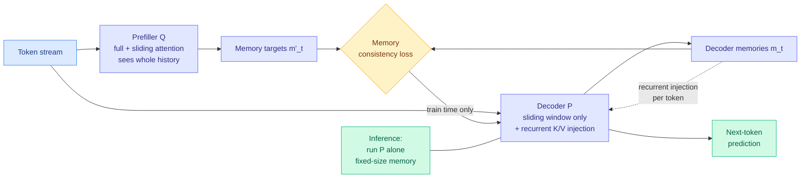

# Maglev: Sliding Recurrent Memory

**Source:** HuggingFace Daily Papers · arXiv [2608.02870](https://arxiv.org/abs/2608.02870)
**Authors:** Bo Liu, Qiang Liu (UT Austin)
**Raw:** [raw/huggingface/2026-08-16-maglev-sliding-recurrent-memory.md](../../raw/huggingface/2026-08-16-maglev-sliding-recurrent-memory.md)
**Topic:** KV cache, fixed-size memory, long-context architecture

## TL;DR

Full causal attention makes the KV cache (the stored attention keys and values that spare the model from recomputing earlier tokens) grow with context length, which is the hard wall on long-context serving. Sliding-window attention bounds the cache by simply forgetting everything outside the window. Maglev is an attempt to keep the bounded cache and get the memory back. It trains **two coupled models**: a prefiller Q with access to the full history, which emits memory targets, and a decoder P with only sliding-window attention plus recurrent key/value injection, which must reproduce those targets. A **memory consistency loss** aligns the decoder's memory with the prefiller's, and at inference **only P runs**. The result is better validation loss and better downstream pretraining benchmarks than both sliding-window and latent recurrent transformer baselines, and **sharing parameters between P and Q preserves most of the gain while cutting parameter memory**.

## Architecture

## What it actually does

The design goal is a property no existing family has all of: **token-wise nonlinear memory that is still parallelizable at training time**.

Look at what each alternative gives up. Classical RNNs update state every token but propagate a small state and cannot be parallelized across the sequence. Memory Transformers (Transformer-XL, Compressive Transformers, Recurrent Memory Transformers, Block-Recurrent Transformers) carry richer state but only update it at segment or block boundaries, which imposes an arbitrary granularity on when the model is allowed to remember. Linear attention and state-space models (Mamba, S5, Hyena, RetNet, RWKV, Griffin, xLSTM) recover token-wise recurrence and parallelism, but their memory transformation is linear, affine, or a specialised gated operator, not the full nonlinear depth of a Transformer layer. Hybrids (Jamba, Samba) mix local attention with recurrent layers and inherit the compromise rather than resolving it.

Maglev's answer is to make the recurrence ride on the **ordinary K/V entries** of the decoder rather than on dedicated memory tokens or extra loop iterations. The memory update therefore traverses the model's full nonlinear depth, once, per token, with no additional Transformer passes.

Training parallelism is recovered by the two-model split. P cannot be unrolled in parallel if it must consume its own previous memory, so Q, which does have full history, supplies the memory targets in a single parallel pass, and P is trained to match them. The recurrence is supervised rather than simulated. At inference the crutch is removed and P runs alone.

The requirement stated in the paper is precise and worth keeping: Q must be **more expressive than P and have access to the full history**. In practice Q uses interleaved full and sliding-window attention, which is a stronger configuration than pure full attention would suggest.

## Key findings

- Improves validation loss and downstream pretraining benchmarks over **both** sliding-window attention and latent recurrent transformer baselines.
- **Parameter sharing between P and Q preserves most of the gains** while reducing parameter memory, so the two-model structure is a training device rather than a doubled deployment cost.
- Inference uses **P alone**, so the served model has a fixed-size memory and bounded KV cache by construction.
- Note: the HuggingFace listing redacts the model's short name in the abstract, leaving a visible gap in the text. Recorded as-is.

## Relation to prior wiki pages

**This attacks the KV cache from the architecture side, which is the side [KV Cache](kv-cache.md) has least evidence on.** Almost everything on that page is a *policy over an existing cache*: what to evict, what to quantize, what to share across heads or layers. Maglev changes the shape of the thing being cached, so the cache is bounded by design rather than pruned after the fact. Those are complementary, not competing, and nobody has stacked them.

**It sharpens the economics recorded on 08-14.** The KV cache page's current state notes that [DeepSeek repriced cache-hit tokens roughly six-fold (08-14)](2026-08-14-deepseek-harness-kv-cache-economics.md) while shipping a harness whose organising commitment is never altering written history, because editing the prefix invalidates every cached token downstream. A fixed-size recurrent memory changes that calculus in an awkward direction: if the served model carries a bounded state rather than a growing prefix, the prefix-stability discipline that just became a billing line matters less, because there is less cached prefix to protect. Maglev does not discuss serving economics at all, but the two results point at each other.

**Against the hybrid-attention line.** [Massive Activations in Hybrid Linear Attention (08-14)](2026-08-14-massive-activations-hybrid-linear-attention.md) found that activation spikes appear immediately before every full-attention layer across five architectures and six hybridization configurations. Maglev is a hybrid in the relevant sense (P is sliding-window, Q is interleaved full and sliding), so the obvious unrun experiment is whether the same pre-attention spike shows up at Q's full-attention layers, and whether the memory consistency loss moves it. If it does, the mixed-precision prediction that page is carrying applies here too.

## Gaps

Results are on validation loss and downstream pretraining benchmarks, which is the right evidence for an architecture paper and the wrong evidence for a long-context claim. No needle-in-a-haystack, no long-document retrieval, no measurement of what actually survives in the fixed-size memory at 100k tokens. Scale is not stated in the abstract. And the whole method depends on Q being strictly more expressive than P, so there is a latent question about whether the gains shrink as P approaches frontier scale, which is the same shape as the capability-threshold problem in [the Extrapolation Cliff (05-14)](2026-05-14-extrapolation-cliff-on-policy-distillation.md), which found a closed-form threshold above which on-policy distillation collapses. This is teacher-student distillation of a memory state, so it may inherit the failure mode.

## Industrial implication

A pretraining-time architecture change is the slowest thing on this page to reach production, so the honest timeline is a year, not a quarter. But the payoff is the one the serving stack most wants: constant memory per sequence at arbitrary context length, with no eviction heuristic to tune and no accuracy cliff to discover in production. If the long-context evaluations land, this is the kind of result that shows up in a frontier pretraining run rather than in an inference library.

## Related pages

- [KV Cache](kv-cache.md)
- [Attention Mechanisms](../llms-foundation-models/attention-mechanisms.md)
- [Massive Activations in Hybrid Linear Attention (08-14)](2026-08-14-massive-activations-hybrid-linear-attention.md)
- [Knowledge Distillation](knowledge-distillation.md)
