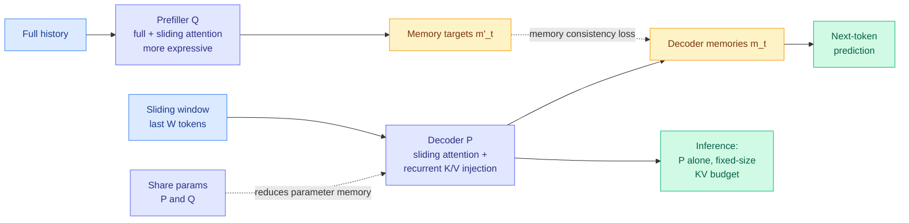

# Maglev: Sliding Recurrent Memory

**Source:** HuggingFace Daily Papers · arXiv [2608.02870](https://arxiv.org/abs/2608.02870)
**Raw:** [raw/huggingface/2026-08-16-maglev-sliding-recurrent-memory.md](../../raw/huggingface/2026-08-16-maglev-sliding-recurrent-memory.md)
**Topic:** KV cache, recurrent memory, attention architectures

## TL;DR

Sliding-window attention is the standard way to make a Transformer's memory cost constant instead of growing with sequence length: each token attends only to the last W tokens, so the KV cache (the store of already-computed attention keys and values that lets the model skip recomputing tokens it has seen) never exceeds a fixed size. The cost is that everything outside the window is simply gone. Maglev keeps the fixed-size budget but stops throwing the history away, by training **two coupled models**. A prefiller **Q** sees the full history with full attention and produces *memory targets*. A decoder **P** sees only a sliding window, plus a recurrent injection of its own K/V state, and produces the memories it will actually use at inference. A **memory consistency loss** pulls P's memories toward Q's targets during training. At inference you run P alone, so you pay sliding-window cost and get something closer to full-attention quality. Validation loss and downstream pretraining benchmarks improve over both sliding-window and latent recurrent Transformer baselines, and sharing parameters between P and Q shrinks parameter memory while keeping most of the gain.

## Architecture

## Key findings

- **Fixed-size memory that generalizes sliding-window attention, still parallelizable during training.** The second half of that sentence is the constraint most recurrent-memory designs fail: a strictly sequential recurrence is cheap at inference and unusable at pretraining scale.
- **The asymmetry is the mechanism.** The requirement is not that Q be a specific architecture but that Q be *more expressive than P and have access to the full history*. In practice they interleave full and sliding-window attention in Q because it performs better. Q is a training-time teacher for the memory state, not a component you ship.
- **Improves validation loss and downstream pretraining benchmarks** over both sliding-window and latent recurrent Transformer baselines. Two baselines matter here: one is the thing it generalizes, the other is the closest prior family.
- **Parameter sharing between P and Q preserves most of the gains** while cutting parameter memory. That is the difference between a two-model research artifact and something a lab would actually train.

## Relation to prior wiki pages

**This is a distillation result wearing a KV-cache costume, and neither of the wiki's two pages on those topics would catch it alone.** The [knowledge-distillation page](knowledge-distillation.md) has tracked a year of work on *which parts of a teacher's signal deserve a gradient*: TIP (04-16, roughly 10% of teacher tokens carry signal), TA-OPD, TrOPD, SPOT, and the rest of the nine-axis selective-supervision cluster. Every one of those supervises the teacher's **output distribution**. Maglev supervises the teacher's **memory state**. The target is not a probability over next tokens, it is a compressed representation of history that the student must reproduce without ever seeing that history. Same teacher-student shape, different quantity transferred, and the distillation cluster has no entry for it.

**Against the KV-cache page's current state.** The [KV cache page](kv-cache.md) recorded on 08-14 that the cache "stopped being an implementation detail and became a line item on a customer invoice," after DeepSeek raised cache-hit token prices roughly six-fold. That entry is about the *economics* of a cache you keep. Maglev is about not needing to keep it: a fixed-size memory means the cache does not grow with context at all, which removes the pricing exposure rather than optimizing against it. If cache-hit tokens are becoming the expensive part of an agent workload, an architecture whose cache is O(1) in context length changes the calculus more than any eviction policy can. Nobody has priced the two against each other.

**And it lands in the same week as the massive-activations result.** [Massive Activations in Hybrid Linear Attention LLMs (08-14)](2026-08-14-massive-activations-hybrid-linear-attention.md) found that activation spikes appear immediately before every full-attention layer across five architectures and six hybridization configurations. Maglev is a hybrid in exactly that sense (interleaved full and sliding-window attention in Q), so whether its Q model exhibits the same pre-attention-spike morphology, and whether the memory-consistency loss interacts with it, is a directly checkable question that neither paper asks.

## Gaps

The abstract's model-name tokens are missing from the HuggingFace summary extraction, so the reported scale is not visible from the raw capture. No wall-clock or memory-footprint numbers are given for inference, only the architectural argument that P is sliding-window cost. The comparison is against pretraining benchmarks and validation loss, not long-context retrieval evals, which is where a fixed-size memory would be most likely to break: a needle-in-a-haystack task at 200k tokens is the test that separates "compressed history" from "history quietly discarded."

## Related pages

- [kv-cache.md](kv-cache.md)
- [knowledge-distillation.md](knowledge-distillation.md)
- [../llms-foundation-models/attention-mechanisms.md](../llms-foundation-models/attention-mechanisms.md)
- [2026-08-14-massive-activations-hybrid-linear-attention.md](2026-08-14-massive-activations-hybrid-linear-attention.md)
