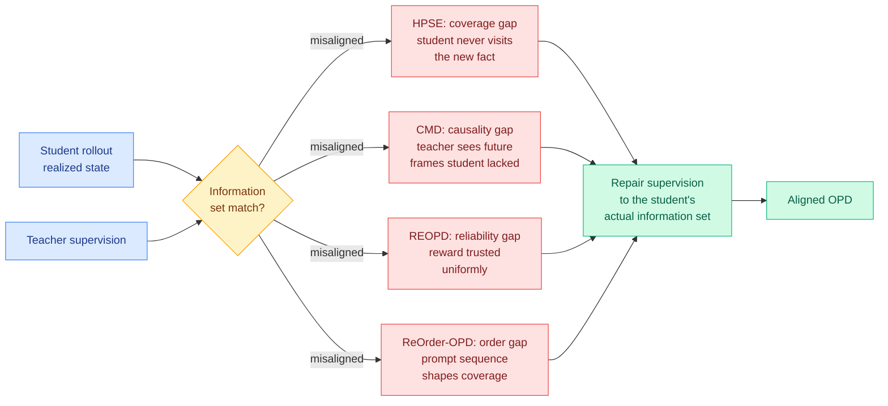

# The Teacher-Student Alignment Cluster: four papers, one diagnosis (2026-08-16)

**Sources:** HuggingFace Daily Papers + Kurate cs.LG / cs.AI weekly leaderboards
**Raw:** [raw/huggingface/2026-08-16-hybrid-policy-self-editing-for-composable-unstructured-knowl.md](../../raw/huggingface/2026-08-16-hybrid-policy-self-editing-for-composable-unstructured-knowl.md) · [raw/huggingface/2026-08-16-context-matched-distillation-teacher-causality-for-autoregre.md](../../raw/huggingface/2026-08-16-context-matched-distillation-teacher-causality-for-autoregre.md) · [raw/kurate/2026-08-16-cs-lg.md](../../raw/kurate/2026-08-16-cs-lg.md)
**Topic:** on-policy distillation, teacher supervision, knowledge editing

## TL;DR

Four papers landed in one week, from four unrelated application domains, making the same diagnosis: **on-policy distillation fails when the teacher's supervision is computed over information the student did not actually have.** On-policy distillation (OPD) trains a student on its own generated rollouts, with a stronger teacher scoring each step. The premise is that training on the student's own distribution avoids the exposure mismatch of offline distillation. These four papers all find the same leak in that premise, and each patches a different part of it.

| Paper | Where the misalignment lives | The fix |
|---|---|---|
| **HPSE** ([2608.11660](https://arxiv.org/abs/2608.11660), HuggingFace) | The student's rollouts never *cover* newly injected knowledge, so on-policy supervision has nothing to attach to | Hybrid rollout: step in and place missing facts on the student's own trajectory exactly where coverage fails, stay on-policy elsewhere |
| **CMD** ([2608.13391](https://arxiv.org/abs/2608.13391), HuggingFace) | The teacher scores complete clips, so its score depends on *future* frames the causal student never saw | Causal teacher that evaluates each target without future access, plus Prefix Scoring against the student's realized cached prefix |
| **REOPD** ([2608.11698](http://arxiv.org/abs/2608.11698), Kurate cs.LG #4) | The teacher's reward signal is not uniformly reliable across states | Reliability-adaptive reward extrapolation |
| **ReOrder-OPD** ([2608.10905](http://arxiv.org/abs/2608.10905), Kurate cs.LG #20) | The *order* in which prompts are presented changes what the student's trajectory covers | Reliability-aware prompt ordering |

Add [SkillLens](http://arxiv.org/abs/2608.10775) (Kurate cs.AI #19, retrieval-augmented GUI action prediction *and* on-policy distillation) and the count is five in one Kurate cycle.

## Diagram

## HPSE, in detail

Knowledge editing updates a specific fact inside a model without disturbing everything else. Unstructured knowledge editing (UKE) does it with a free-form passage that may state several facts at once. HPSE's diagnosis of the existing editors is sharp: they **inject the passage but the model cannot use it**. The edited model can recite the passage back, and then fails to answer an atomic question about any single fact in it, and fails harder to chain two of its facts into a multi-hop answer. The authors name the missing property **composability** and blame the editors' passive reliance on the fixed passage as the sole learning source.

Their reframing is to treat editing as **proactive self-distillation from a privileged in-context state of the same model**. Put the passage in context, and the model can already answer questions about it; that in-context version is the teacher, and it requires no external supervision.

Then comes the part that puts this paper in the cluster. Pure on-policy distillation does not work here, because the injected knowledge is *novel*: the pre-edit model's own rollouts almost never wander into the region where the new facts would be used, so on-policy training gets almost no signal about them. HPSE builds a **hybrid rollout** that intervenes only where the student's coverage fails, placing the missing fact onto the student's own trajectory at that point, and stays on-policy everywhere else. They give a theoretical argument for why this beats pure OPD and report plug-and-play gains across four backbones and two editors.

## CMD, in detail

Context-Matched Distillation targets interactive autoregressive video generation, which is a Tier 3 domain by this wiki's attention hierarchy but carries a Tier 1 mechanism. Few-step distillation makes generation fast by cutting denoising steps. Online control imposes causality: a frame may depend only on history and on controls that existed when it was generated.

The bug CMD names is that distribution matching distillation pipelines supervise a **causal** student with a **bidirectional** teacher that scores the complete clip. The teacher's score for frame *t* can therefore depend on frames and camera controls from *t+k*, which the student demonstrably did not have. The supervision is computed in a different information set than the one the student inhabited.

Three fixes, all of them information-set repairs. A **causal teacher** that scores each target without future access, and which also initialises the student, so teacher training, distillation, and inference all share one causal formulation. **Prefix Scoring**, which evaluates each target under the cached student-generated prefix that actually produced it rather than under a generic context. **Prefix Corruption**, which perturbs the unreliable prefixes the student emits early in training so that training does not lock onto garbage while still preserving target-context alignment. State-of-the-art aggregate performance among autoregressive methods on short and long video benchmarks, with notably better adherence to time-varying camera controls.

## Relation to prior wiki pages

**This is the N-of-a-kind threshold, crossed.** [Knowledge Distillation](knowledge-distillation.md) has been accumulating filtering axes for on-policy distillation since spring: which tokens carry signal, which teacher states are trustworthy, how to weight the loss. [Privileged-but-Biased (08-10)](2026-08-10-privileged-but-biased-self-distillation.md) found that a privileged teacher's advantage comes bundled with a bias the student inherits, and demanded a reliability measurement that nobody had run. REOPD is that measurement, arriving on the Kurate board six days later. The [08-14 Looking Ahead](../daily-digest/2026-08/2026-08-14.md) flagged REOPD as worth tracking on topic alone. Today it has three siblings.

**The abstraction the cluster implies has not been written down.** Every one of the five patches a specific misalignment: coverage (HPSE), causality (CMD), reliability (REOPD), order (ReOrder-OPD), retrieval (SkillLens). None of them cites another. The general statement is available and unclaimed: *on-policy distillation is only sound when the teacher's scoring function is measurable with respect to the student's realized information set*, and every failure in this cluster is a violation of that condition. That is a one-paragraph formalism and a paper's worth of consequences.

**It also sharpens the transfer-medium question.** [Knowledge Distillation](knowledge-distillation.md) opened on 08-13 with the claim that the artifact carrying capability from teacher to student stopped being a gradient: [AI4AI at Test-Time](2026-08-13-ai4ai-test-time-harness-transfer.md) took a weak target from 0.49 to 0.91 on Theory-of-Mind benchmarks by writing it a harness rather than updating its weights, and [AutoPrune (08-16)](2026-08-16-autoprune-llm-designed-visual-token-pruning.md) did the same at the compression layer. Set that against this cluster. Five papers this week are spending their effort repairing gradient-based teacher supervision, while two papers in four days demonstrated the gradient can be skipped entirely. Nobody has priced the two approaches against each other, which is the same missing comparison the [08-13 and 08-14 Looking Ahead](../daily-digest/2026-08/2026-08-14.md) bullets have been asking for.

**Relation to the Extrapolation Cliff.** [The Extrapolation Cliff (05-14)](2026-05-14-extrapolation-cliff-on-policy-distillation.md) found a closed-form threshold above which on-policy distillation collapses. HPSE's coverage failure is a plausible mechanism for part of that: when the target knowledge lies outside the student's sampling support, on-policy supervision has measure-zero contact with it, and no amount of training fixes what the student never visits. HPSE does not cite the cliff and does not test at the threshold, but the two are describing the same wall from different sides.

## Gaps

HPSE's hybrid rollout requires knowing *where* coverage failed, which is easy when you injected the fact yourself and hard in general. CMD's causal teacher is strictly weaker than the bidirectional one it replaces, and the paper reports aggregate wins without isolating how much capability was surrendered to get alignment. REOPD and ReOrder-OPD are Kurate leaderboard entries only; the tournament has not run for a fifth consecutive week, so all entries sit at the 1200 TrueSkill baseline with 0% win rate and the ranking carries no quality signal. Neither has been read in full.

## Related pages

- [Knowledge Distillation](knowledge-distillation.md)
- [Privileged-but-Biased Self-Distillation (08-10)](2026-08-10-privileged-but-biased-self-distillation.md)
- [The Extrapolation Cliff (05-14)](2026-05-14-extrapolation-cliff-on-policy-distillation.md)
- [AI4AI at Test-Time (08-13)](2026-08-13-ai4ai-test-time-harness-transfer.md)
