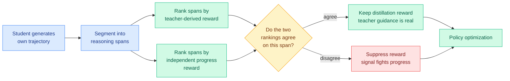

# Beyond Imitation: Filtering On-Policy Distillation by Reasoning Progress (R2-OPD)

**Date:** 2026-08-25
**Source:** [HuggingFace Daily Papers](https://huggingface.co/papers/2608.19408) (5 upvotes) · [arXiv 2608.19408](https://arxiv.org/abs/2608.19408)
**Authors:** Chen Yang, Haiyuan Wan, Rengrong Xiong, Yize Chen, Danny H. K. Tsang
**Raw:** [raw/huggingface/2026-08-25-beyond-imitation-filtering-on-policy-distillation-by-reasoni.md](../../raw/huggingface/2026-08-25-beyond-imitation-filtering-on-policy-distillation-by-reasoni.md)

## TL;DR

On-policy distillation (OPD) post-trains a student by having it generate its own trajectories and scoring every token with dense supervision from a teacher. The hidden assumption is that **teacher-derived reward is a good proxy for reasoning progress**. R2-OPD shows it often is not: a reasoning step that clearly advances the solution can receive a *low* distillation reward purely because it worded things differently from the teacher. The student is then pushed to imitate surface form at the expense of substance. The fix is a disagreement filter. Build two rankings of the reasoning spans within a trajectory, one from teacher-derived reward and one from an independently estimated progress reward, then **suppress the distillation reward wherever the two rankings disagree**. Consistent gains over standard OPD, concentrated on reasoning benchmarks.

## What breaks in standard OPD

OPD's appeal is signal density. Unlike outcome-reward RL, which gives one scalar at the end of a long trajectory, OPD gives a reward at every token, and it does so on the student's *own* distribution rather than the teacher's, which avoids the exposure-mismatch problem of pure SFT.

The failure mode R2-OPD identifies is a **proxy failure, not a noise problem**. Teacher-derived reward measures agreement with the teacher's output distribution. Reasoning progress measures whether the solution actually advanced. These correlate, which is why OPD works at all, but they come apart in a specific and consequential way: when the student finds a *different valid path*, teacher agreement drops while progress is fine. OPD then penalizes exactly the behaviour you most want, independent correct reasoning.

Note that this is a sharper claim than "the reward is noisy." Noise averages out. A systematic penalty on divergence-from-teacher does not average out; it biases the student toward mimicry.

## Core novelty

The mechanism is deliberately cheap. R2-OPD does not build a better reward model. It builds a *second* one, cheaply, and uses only the **disagreement** between the two as its signal:

1. Segment the student trajectory into reasoning spans.
2. Rank spans by teacher-derived reward.
3. Rank spans independently by an estimated progress reward.
4. Where the rankings disagree, suppress the distillation reward on that span.

Working with **within-trajectory rankings rather than absolute values** is the right call: the two reward sources are not on a shared scale, so comparing their orderings is the only well-posed comparison. It also means the filter is a bolt-on to existing OPD pipelines rather than a replacement.

## Where this sits against prior wiki knowledge

**This is the third distinct result the wiki has logged where disagreement between two signals is itself the useful signal.** Name the prior two:

- The **08-08 weekly cluster** (Requential Coding and OPD²) established that a single teacher signal is not trustworthy at token granularity.
- **AgentOPSD (08-07)** located *pivotal turns* in agent trajectories by disagreement, rather than by absolute reward.

Three papers making the same architectural choice crosses this wiki's stated threshold for declaring a pattern. The design principle: **do not trust a single supervision signal, and treat the conflict between two independent signals as the highest-information location in the trajectory.**

**Today it appears twice in different subfields, which is the more interesting observation.** [Task-CoEvolve (08-25)](../agentic-systems/2026-08-25-task-coevolve-adaptive-validation-selection.md) uses variance-weighted sampling to concentrate harness evaluation on validation tasks where *candidate harnesses disagree*, cutting evaluation count 80%. R2-OPD uses ranking disagreement to decide which *tokens to trust*. One is harness evaluation, one is distillation. Same statistical idea, same day, no shared authors. The underlying principle is standard active-learning theory (information is maximal where models disagree), and its independent rediscovery in two subfields on one day suggests the field is converging on it without naming it as a shared tool.

**Against the distillation page's prior state.** [Knowledge distillation](knowledge-distillation.md) has tracked a run of papers arguing that most teacher tokens carry no signal and should be dropped or reweighted. R2-OPD refines that from "most tokens are uninformative" to "some tokens are actively harmful," which is a different and stronger claim. Downweighting a useless token costs you nothing. Downweighting a *misleading* token recovers something.

## Key results

- Consistent improvement over standard OPD, with gains concentrated on reasoning benchmarks (which is where the proxy failure predicts they should be).
- The mechanism is a filter, not a new reward model, so it composes with existing OPD infrastructure.

## Gaps

- **The independently estimated progress reward is itself a model, and its quality is the load-bearing assumption.** The sensitivity ablation is the paper's key missing experiment. If the progress estimator is systematically wrong in the same places as the teacher, the filter silently does nothing; if it is wrong in different places, the filter suppresses good supervision.
- **No cost accounting.** Running a second reward estimator over every span is not free, and the paper does not put its overhead against its gain.
- **Span segmentation is a design choice with no ablation.** How reasoning spans are delimited plausibly matters as much as the filter.

## Research angle

The composition experiment the [08-08 weekly](../daily-digest/2026-08/2026-08-08.md) left open now has both its parts available. **AgentOPSD (08-07)** finds pivotal *turns* by disagreement; R2-OPD finds untrustworthy *tokens* by disagreement. Filtering the pivotal tokens of the pivotal turns is a two-level version of the same principle, and R2-OPD is the concrete building block that was missing.

Second, unexplored: nothing here uses disagreement *magnitude*. The filter is binary (agree/disagree). Weighting by how strongly the two rankings conflict is the obvious refinement, and it is what Task-CoEvolve does on its side of the analogy with variance-weighted sampling.

## Related pages

- [Knowledge distillation](knowledge-distillation.md)
- [Task-CoEvolve (08-25)](../agentic-systems/2026-08-25-task-coevolve-adaptive-validation-selection.md) — the same disagreement principle in harness evaluation, same day
- [VoI routing for MoLE (08-25)](../ai-routing/2026-08-25-voi-routing-mixture-of-lora-experts.md) — also depends on an unvalidated learned estimator
- [Daily digest 2026-08-25](../daily-digest/2026-08/2026-08-25.md)
