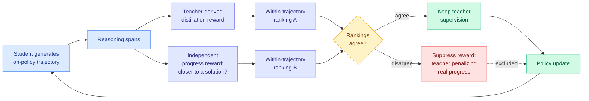

# R2-OPD: Filtering On-Policy Distillation by Reasoning Progress

**Source:** HuggingFace Daily Papers (5 upvotes) · [arXiv 2608.19408](https://arxiv.org/abs/2608.19408) · raw: [`raw/huggingface/2026-08-25-beyond-imitation-filtering-on-policy-distillation-by-reasoni.md`](../../raw/huggingface/2026-08-25-beyond-imitation-filtering-on-policy-distillation-by-reasoni.md)

**Authors:** Chen Yang (HKUST Guangzhou), Haiyuan Wan (Tsinghua), Rengrong Xiong (Zhejiang), Yize Chen (Alberta), Danny H. K. Tsang (HKUST Guangzhou)

## TL;DR

On-policy distillation (OPD) trains a small student by letting the student generate its own reasoning attempts and having a large teacher score every token of them. Letting the student generate is the point: it fixes exposure bias, the mismatch where a model trained only on teacher text has never practiced recovering from its own mistakes.

R2-OPD identifies the assumption underneath OPD that nobody had questioned. OPD treats the teacher's token-level reward as a proxy for **reasoning progress**. But the teacher's reward measures one thing only: how close the student's token is to what the teacher would have said. A student step that genuinely advances toward the correct answer, by a route the teacher would not have taken, gets a **low** reward for the crime of being different. OPD then penalizes it. The framework is systematically suppressing correct alternative reasoning paths.

The fix is a **disagreement filter**, not a new reward. R2-OPD builds two rankings of the reasoning spans within a single trajectory: one ordered by teacher-derived distillation reward, one ordered by an independently estimated **progress reward** (how much closer to a solution this state is, judged without reference to the teacher's output). Where the two rankings agree, the teacher's supervision is trusted and kept. Where they disagree, the distillation reward is **selectively suppressed**. Teacher guidance survives; teacher-similarity-masquerading-as-progress does not.

---

---

## Why rank disagreement rather than reward arithmetic

The obvious alternative designs are worse in instructive ways.

*Optimize the progress reward directly* and you have abandoned distillation for process-reward RL, losing the dense per-token signal that made OPD attractive and inheriting every reward-hacking failure mode of process reward models.

*Blend the two rewards* (a weighted sum) and you need the two to be on a common scale. They are not. Teacher log-probabilities and a learned progress estimate have no shared units, and the weight becomes a hyperparameter that has to be retuned per domain.

Using **within-trajectory rankings** sidesteps calibration entirely. Rankings are scale-free, and comparing them only inside one trajectory avoids cross-trajectory difficulty confounds. Disagreement then becomes a clean binary signal: these two views of this span point different directions, so do not trust the teacher here. The filter is conservative by construction. It only ever removes supervision, never adds a new objective, so it cannot introduce a new thing to hack.

## Relation to prior wiki state

**This is the sixth paper in three weeks on the same bug.** The [08-16 digest](../daily-digest/2026-08/2026-08-16.md) named the pattern outright: five papers that week all found the same flaw in on-policy distillation, that **the teacher scores the student using information the student never had**. The wiki has a [teacher-student alignment cluster page (08-16)](2026-08-16-teacher-student-alignment-cluster.md) for exactly this. The prior members attacked different facets:

- [SA-OPD (08-06)](2026-08-06-sa-opd-input-groundedness-distillation.md) — the teacher is scoring against inputs the student was not grounded in.
- [Privileged but Biased (08-10)](2026-08-10-privileged-but-biased-self-distillation.md) — privileged teacher information biases the self-distillation signal.
- [Counterfactual Recoverability (08-11)](2026-08-11-counterfactual-recoverability-opd.md) — whether the student could have recovered from a given state at all.
- [Hinting Self-Distillation (08-16)](2026-08-16-hinting-self-distillation-applied-compute.md) — matching applied compute between teacher and student.
- [TurnSight (08-05)](2026-08-05-turnsight-turn-level-hindsight-distillation.md) — turn-level hindsight rather than token-level.

R2-OPD adds the **semantic** facet, and it is the sharpest statement of the family so far. The others say the teacher's reward is miscalibrated for the student's *situation*. R2-OPD says it is miscalibrated for the *task*: teacher-similarity and reasoning-progress are simply different quantities, and OPD conflated them. Six papers, one claim, three weeks. Under the wiki's own threshold of three, this stopped being a trend and became the field's current consensus correction.

**It confirms the TIP result from a new angle.** TIP (04-16) found that most teacher-generated tokens carry no learning signal and you only need about 10% of them. R2-OPD reaches a stronger version: some teacher supervision is not merely uninformative, it is **actively wrong**, pushing the student off correct paths. Skipping useless tokens saves compute; suppressing harmful ones changes the outcome.

## Key takeaways

- Teacher-derived reward and genuine reasoning progress **routinely disagree** within a single trajectory. The paper's contribution is measuring this rather than assuming it away.
- Filtering by **rank disagreement** avoids the calibration problem that blending two rewards would create, and is scale-free.
- Consistent improvement over standard OPD, concentrated on reasoning benchmarks, which is where alternative valid solution paths are most common.
- The method is **subtractive**: it only removes supervision. That makes it composable with the other five OPD corrections rather than competing with them.

## Gaps

"Consistent improvement" without headline numbers in the abstract is a weak way to report a result, and it suggests the gains are real but modest. The bigger unaddressed question is where the progress reward comes from. If it is a learned process reward model, then the method has imported that model's failure modes and its training cost, and the honest comparison is against spending the same budget on a better teacher. If it is a cheap heuristic, that should be stated because it changes the cost story completely.

No ablation is described isolating the ranking construction from the suppression rule, and no analysis of **how often** the two rankings disagree. That frequency is the most diagnostic number in the paper: if disagreement is rare, the effect size is capped; if it is common, standard OPD is broken more badly than anyone assumed and the result deserves far more attention than five upvotes.

None of the six papers in this family have been combined. Whether the corrections are redundant (all detecting one underlying problem through different lenses) or additive is unknown, and it is the obvious next experiment.

## Industrial implication

Distillation is how frontier capability reaches deployable model sizes, so a correction that makes the student's reasoning better at no inference cost is free margin. The practical read for anyone running an OPD pipeline today is that the teacher's disagreement with the student is not automatically the student's error, and pipelines that treat it that way are training out correct behaviour. The cheapest version of this insight, worth trying before implementing the paper, is simply to log how often teacher reward and any available progress signal disagree.

## Related

- [Knowledge distillation](knowledge-distillation.md) — concept page
- [Teacher-student alignment cluster](2026-08-16-teacher-student-alignment-cluster.md) — the family this joins
- [SA-OPD](2026-08-06-sa-opd-input-groundedness-distillation.md) · [Counterfactual recoverability](2026-08-11-counterfactual-recoverability-opd.md) · [Privileged but biased](2026-08-10-privileged-but-biased-self-distillation.md) · [Hinting self-distillation](2026-08-16-hinting-self-distillation-applied-compute.md)
