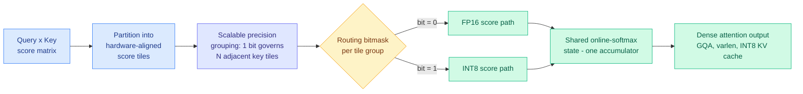

# TileMix: Tile-Centric Mixed-Precision Attention for LLM Inference Acceleration

**Date:** 2026-08-25
**Source:** [HuggingFace Daily Papers](https://huggingface.co/papers/2608.17336) · [arXiv 2608.17336](https://arxiv.org/abs/2608.17336) · [Code](https://github.com/HanzhiZhang-Ulrica/TileMix)
**Authors:** Hanzhi Zhang, Qiao Zhang, Qinglei Cao, Heng Fan, Yan Huang, Kewei Sha, Yunhe Feng
**Raw:** [raw/huggingface/2026-08-25-tilemix-tile-centric-mixed-precision-attention-for-llm-infer.md](../../raw/huggingface/2026-08-25-tilemix-tile-centric-mixed-precision-attention-for-llm-infer.md)

## TL;DR

TileMix makes numerical precision a **spatial decision inside the attention kernel**. It partitions the query-key score matrix into hardware-aligned tiles, packs a routing bit per tile group into a compact bitmask, and dispatches each group through either an FP16 or an INT8 score path. Both paths update a single shared online-softmax state, so the output is still one dense attention result. Because it routes *all* legal tile groups rather than dropping any, dense token connectivity is preserved: this is not sparse attention. It requires no training, supports grouped-query attention, variable-length batches, and INT8 key/value caches. On LongEval, LV-Eval and A100 prefill benchmarks across LLaMA, Qwen and Vicuna, it recovers the long-context quality that uniform INT8 loses while improving prefill throughput over FP16.

## What it actually does

Long-context prefill (processing the entire prompt before the first output token is generated) is dominated by dense self-attention, whose score matrix grows quadratically with sequence length. The two standard escape routes are both blunt:

1. **Uniform low precision** casts the whole score computation to one low format (typically INT8). Fast, but long-context quality degrades because a minority of score regions genuinely need the dynamic range.
2. **Sparsity / token selection** keeps only some query-key interactions. This preserves precision but breaks dense connectivity, and the selection policy becomes a new source of error.

TileMix occupies the gap neither covers: **spatial precision routing over hardware-aligned score tiles inside fused dense attention**. Precision stops being a global compile-time setting and becomes a per-region runtime decision.

Three engineering details carry the result:

- **Hardware-aligned tiles.** The partition matches the tile geometry the GPU's tensor cores already want, so neither path fights the memory layout.
- **Scalable precision grouping.** One routing bit governs several adjacent key tiles. This is what keeps the metadata small at very long contexts. If each tile carried its own bit, the bitmask itself would become a long-context problem.
- **Shared online-softmax state.** FP16 and INT8 tile groups write into one running softmax accumulator, which is why the output remains a single dense attention result rather than a stitched approximation.

## Where this sits against prior wiki knowledge

**Precision routing is model routing, one level down the stack.** The [LLM routing concept page](../ai-routing/llm-routing.md) currently catalogues six routing axes: model-tier, task/expert, attention-head, trajectory, latent-trajectory, and adapter. All six route *work* to a *component*. TileMix routes a *numerical format* to a *region of a matrix*. It is the same decision structure at a granularity below anything the routing page has recorded, and it makes the routing frame look less like a serving-layer pattern and more like a general principle that recurs at every level of the stack.

**It composes with, rather than competes against, INT8 KV caches.** The [KV cache page](kv-cache.md) has tracked INT8 KV quantization as a memory play whose cost is quality at long context. TileMix explicitly supports INT8 key/value caches while recovering the quality uniform INT8 loses, which means the two techniques stack instead of trading off. That is the practically useful claim.

**Training-free is the deployment argument.** Most of the compression work this wiki has logged needs calibration, fine-tuning, or a distillation pass. TileMix needs none, which is exactly the property that gets a kernel merged into a serving framework rather than published and forgotten.

**The workload data published the same week says this is the right target.** SemiAnalysis's AgentX release (08-24) measured production agentic coding sessions at input-sequence-length p50 88k, p90 272k, p95 404k, and p99 675k tokens, against output lengths with a p50 of 413. At that ratio prefill dominates time-to-first-token, and TTFT is one of the three numbers frontier labs actually optimize alongside performance-per-dollar and end-to-end task completion. A training-free prefill kernel that avoids uniform INT8's quality loss is aimed squarely at the workload that now dominates production traffic, which is a much stronger adoption argument than the A100 microbenchmarks in the paper.

## Key results

- Recovers long-context quality lost under uniform INT8 on LongEval and LV-Eval.
- Improves prefill throughput over FP16 on A100.
- Produces a **controllable accuracy-efficiency frontier** across LLaMA, Qwen and Vicuna, so the routing threshold is a deployment knob rather than a fixed operating point.
- Preserves dense token connectivity by routing all legal tile groups, so it is not subject to the failure modes of sparse-attention selection.

## Gaps

- **Prefill-focused.** The decode phase, where the KV cache is read rather than built, is not the headline. End-to-end serving latency under realistic continuous batching is unshown.
- **Routing policy overhead is asserted rather than deeply ablated.** Scalable grouping is argued to keep metadata compact at long context, but the cost of computing the routing bits themselves is not the paper's focus.
- **The routing policy is a heuristic.** Nothing here is learned against downstream loss.
- **A100 only.** Hopper and Blackwell have different tensor-core precision support (FP8 in particular), and the tile geometry argument is hardware-specific by construction.

## Research angle

Two obvious next steps, neither taken:

1. **Temporal precision routing.** TileMix routes precision spatially across the score matrix at one step. Nobody routes it *temporally* across decode steps, where the natural hypothesis is that early decode steps tolerate less precision loss than later ones.
2. **A learned tile-precision router.** Replace the heuristic with a policy trained against downstream task loss. This is the direct analogue of the learned-vs-prompted router question that [When Is Routing Meaningful? (07-20)](../ai-routing/2026-07-20-when-is-routing-meaningful.md) raised at the model level, where learned KNN routers collapsed under paraphrase while prompted routing stayed stable. Whether learned routers are similarly brittle at the kernel level is untested, though the input distribution here (score magnitudes) is far more stationary than natural-language queries, so the brittleness argument may not transfer.

A third, more speculative: FP8 is a third precision point on Hopper and Blackwell. A three-way tile router has strictly more headroom than a binary one, and the bitmask generalizes to two bits per group without changing the design.

## Related pages

- [KV Cache](kv-cache.md)
- [LLM Routing](../ai-routing/llm-routing.md)
- [Pandora's Router (08-25)](../ai-routing/2026-08-25-pandoras-router-costly-value-estimation.md) — routing with priced value estimation, the same day, two levels up the stack
- [Daily digest 2026-08-25](../daily-digest/2026-08/2026-08-25.md)
