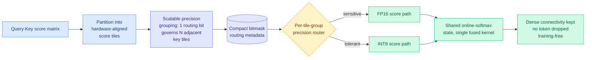

# TileMix: Tile-Centric Mixed-Precision Attention for LLM Inference Acceleration

**Source:** HuggingFace Daily Papers (2 upvotes) · [arXiv 2608.17336](https://arxiv.org/abs/2608.17336) · [code](https://github.com/HanzhiZhang-Ulrica/TileMix) · raw: [`raw/huggingface/2026-08-25-tilemix-tile-centric-mixed-precision-attention-for-llm-infer.md`](../../raw/huggingface/2026-08-25-tilemix-tile-centric-mixed-precision-attention-for-llm-infer.md)

**Authors:** Hanzhi Zhang, Qiao Zhang, Qinglei Cao, Heng Fan, Yan Huang, Kewei Sha, Yunhe Feng

## TL;DR

Long-context prefill, the phase where a model reads a long prompt before generating anything, is dominated by dense self-attention, whose cost grows with the square of the sequence length. Two families of fix exist and both give something up. **Uniform low precision** runs the whole attention matrix in INT8 (8-bit integers instead of 16-bit floats), which is fast but loses long-context quality. **Sparsity methods** keep high precision but drop token interactions, which breaks dense connectivity and usually needs training or calibration.

TileMix's move is to treat **numerical precision as a spatial routing decision inside the attention kernel**. It partitions the query-key score matrix into hardware-aligned tiles, packs a routing decision per tile group into a compact bitmask, and dispatches each group down either an FP16 or an INT8 path. The crucial detail is that both paths update a **shared online-softmax state**, so the two precisions merge into one numerically consistent result rather than being stitched together afterward. Because every legal tile group is routed somewhere, **no token interaction is dropped**: dense connectivity is preserved.

It requires no training, supports grouped-query attention, variable-length batches, and INT8 KV caches. Across LongEval, LV-Eval, and A100 prefill benchmarks on LLaMA, Qwen, and Vicuna, it recovers the long-context quality that uniform INT8 loses while improving prefill throughput over FP16.

---

---

## Why the tile is the right unit

The design choice worth understanding is *why route at tile granularity* rather than per-head, per-layer, or per-token, all of which have been tried.

Per-head and per-layer precision assignment is coarse: it commits an entire head to INT8 even though only some of its score regions are numerically benign. Per-token or per-element routing is fine-grained enough to be accurate but destroys the thing that makes attention fast, which is that GPUs compute attention in fixed-size blocks fused into one kernel. Metadata and divergent control flow at element granularity cost more than the precision saves.

A **hardware-aligned score tile** is exactly the unit the kernel already operates on. Routing at that granularity means the routing decision costs a bitmask lookup and does not disturb the tiling. **Scalable precision grouping** pushes this further: one routing bit can govern several adjacent key tiles, so as context length grows the metadata stays compact instead of growing with the score matrix. That is the detail that makes the method survive at long context, which is the only regime where it matters.

The shared online-softmax state is the correctness half. Online softmax is the running-maximum-and-sum trick that lets FlashAttention-style kernels normalize without materializing the full score matrix. Having FP16 and INT8 tiles both feed the same running state is what keeps the result a single coherent softmax rather than two partial ones combined with an error term.

## Relation to prior wiki state

**It is precision routing, which puts it on the routing axis as much as the quantization axis.** The wiki's [LLM routing](../ai-routing/llm-routing.md) thread has tracked routing migrating steadily inward: across models ([Kilo cost routing, 07-31](../ai-routing/2026-07-31-kilo-open-weights-cost-routing.md)), then across experts ([coherent-overlap MoE routing, 07-31](../ai-routing/2026-07-31-coherent-overlap-moe-routing.md)), then across attention heads ([multi-head latent control, 07-27](../ai-routing/2026-07-27-multi-head-latent-control.md)), then across spectral components ([Chiaroscuro, 06-09](../ai-routing/2026-06-09-chiaroscuro-attention-spectral-routing.md)). TileMix is the innermost instance so far: routing **inside a fused kernel, over score tiles, choosing a numeric format**. The routing abstraction has now reached the arithmetic.

**It extends the block-level quantization thread.** [ICBQ (08-12)](2026-08-12-icbq-interleaved-cross-block-quantization.md) worked on interleaved cross-block quantization, and the shared instinct is the same: quantization error is not uniformly distributed, so the allocation of bits should not be uniform either. TileMix applies that to the score matrix during prefill rather than to weights.

**Training-free matters here.** Much of the recent efficiency work in the wiki needs a calibration or distillation pass. TileMix, like [AutoPrune (08-16)](2026-08-16-autoprune-llm-designed-visual-token-pruning.md), which discovered a visual-token pruning policy dropping 94.4% of tokens at over 99% accuracy with no training, is deployable as a kernel swap. That is a much shorter path to production than anything requiring a retrain.

## Key takeaways

- Precision becomes an **executable spatial decision** over score tiles, inside fused dense attention. Prior work put precision decisions outside the kernel.
- **Dense token connectivity is preserved.** Unlike sparse attention, nothing is dropped; every legal tile group is routed to some precision.
- Recovers long-context quality lost under uniform INT8 and beats FP16 prefill throughput, giving a **controllable accuracy-efficiency frontier** rather than a fixed operating point.
- Composes with the rest of a serving stack: grouped-query attention, variable-length batches, INT8 KV caches.

## Gaps

The abstract reports a frontier, not headline numbers. No speedup multiple, no accuracy delta, no A100 throughput figure is quoted, which for a kernel paper is the thing that decides adoption. Evaluation is A100-only, so behaviour on Hopper and Blackwell, where FP8 is native and the FP16-versus-INT8 tradeoff looks completely different, is unaddressed. That is the most consequential omission: on a chip with fast FP8, the interesting comparison is FP8-versus-INT8, not FP16-versus-INT8.

It is also prefill-only. Decode is memory-bandwidth-bound rather than compute-bound, so a score-tile precision router is unlikely to help there, but the paper does not say so.

Finally, how the routing decisions are produced is not described in the abstract. If the bitmask comes from a calibration pass over representative inputs, "training-free" is doing lighter work than it sounds.

## Industrial implication

Prefill is where long-context serving cost concentrates, and long-context agentic traffic is now the dominant production workload. SemiAnalysis's AgentX benchmark (08-24) reports agentic sessions with input-sequence-length p90 around 272k and p99 around 675k tokens. At those lengths prefill dominates time-to-first-token, and TTFT is one of the three numbers frontier labs actually optimize. A training-free kernel that improves prefill throughput without the quality loss of uniform INT8 is directly deployable against that. Expect the idea, if not this implementation, to show up as a vLLM or SGLang kernel option.

**Research angle.** The obvious open question is where the routing bits should come from. TileMix presents them as given. A learned or online predictor of per-tile precision sensitivity, ideally one that reads cheap statistics already computed during the first tiles of a row, would turn a fixed frontier into an adaptive one. The second question is whether the same tile-routing frame extends to the KV cache itself: per-tile precision for stored keys and values, rather than the current all-or-nothing INT8 KV cache, is the natural sequel and would attack decode as well as prefill.

## Related

- [KV cache](kv-cache.md) · [LLM routing](../ai-routing/llm-routing.md) — concept pages
- [ICBQ: interleaved cross-block quantization](2026-08-12-icbq-interleaved-cross-block-quantization.md)
- [AutoPrune](2026-08-16-autoprune-llm-designed-visual-token-pruning.md) — the other training-free allocation result
- [Massive activations in hybrid linear attention](2026-08-14-massive-activations-hybrid-linear-attention.md)
