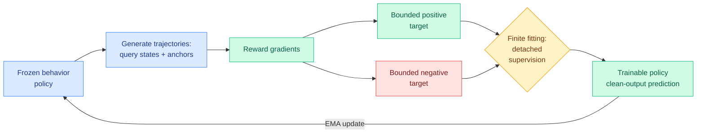

# DiffusionOPSD: on-policy self-distillation turns image rewards into intermediate targets

**Source:** HuggingFace Daily Papers, [arXiv 2608.24646](https://arxiv.org/abs/2608.24646) (35 upvotes) · [raw](../../raw/huggingface/2026-08-26-on-policy-self-distillation-in-diffusion-models.md)
**Authors:** DiffusionOPSD Team — ByteDance Seed (Wei Zhou, Xiongwei Zhu, Bo Chen, Xiaoxia Hou, Wei Liu, corresponding), NUS, UC San Diego, HKUST, Duke, UC Berkeley

---

## TL;DR

Reinforcement learning can align a diffusion model with human preferences, but the reward arrives only after the final image is decoded, and it says nothing about how any *intermediate* denoising prediction should change. DiffusionOPSD closes that gap by converting an image-level reward into explicit supervised targets for the model's clean-output predictions at sampled points along the trajectory. A frozen behavior policy generates trajectories and supplies anchors; reward gradients build bounded positive and negative targets around each anchor; the trainable policy fits those targets as detached supervision; an exponential-moving-average update refreshes the behavior policy. It wins on **19 of 20 reward-matched settings** across two backbones and ten evaluators, beats the strongest competitor by up to **44.0%**, and cuts training GPU-hours by **40% on SD 3.5-M and 63% on the step-distilled Z-Image-Turbo**.

---

## Mechanism

The design separates two things prior work conflated, and that separation is the paper's real contribution. **Target construction** is how good a supervision target you can build from a reward gradient. **Finite realization** is how much of that target the student actually captures in one fitting update. Because DiffusionOPSD makes both measurable, its controlled same-query experiments can report a finding that is genuinely counterintuitive: **larger target-construction gains do not necessarily translate into larger realized gains after a single fitting update.** A better target is not automatically a better step, which is exactly the kind of thing an end-to-end policy-gradient method cannot tell you.

The alternatives it is arguing against, per the alphaxiv overview: reward-weighted likelihood and preference objectives translate scores into likelihood updates but supervise individual denoising predictions only indirectly; policy-gradient methods (FlowGRPO, DanceGRPO, AWM) rely on trajectory credit estimation that is sensitive to sample budget, likelihood estimation and sampler choice; differentiable-reward methods like ReFL backpropagate a differentiable reward through a single late-state clean-output prediction, which couples reward and timestep in a way that is hard to control.

---

## Key takeaways

- **Best final held-out scores in 19 of 20 reward-matched settings**, across SD 3.5-M and Z-Image-Turbo, ten evaluators. Up to **44.0% over the strongest competing method**.
- **GPU-hours cut 40% (SD 3.5-M) and 63% (Z-Image-Turbo) relative to DiffusionNFT.** The larger saving on the *step-distilled* backbone is the more interesting number, because step-distilled models have fewer denoising steps to place targets in, so a method that makes each one carry more supervision should benefit most there. It does.
- **Self-distillation, not teacher distillation.** There is no stronger external teacher. The frozen EMA behavior policy is the supervisor, refreshed from the student. This makes the method a reward-shaping technique wearing distillation clothing.
- **The framework is diagnosable by construction.** Target construction and finite realization can be measured independently, which is unusual in RL post-training and is what makes the negative result above reportable at all.

## Gaps

Text-to-image only; no video, no other modality. Two backbones. The EMA refresh rate is a hyperparameter whose sensitivity is not reported in the abstract, and it is the one knob that controls how far the supervisor can drift from the student. "Bounded" positive and negative targets implies a clipping radius that is also unreported. And the headline efficiency claim is relative to DiffusionNFT specifically, not to the cheapest available baseline.

---

## Relation to prior wiki pages

**This is the first entry on the [knowledge-distillation](knowledge-distillation.md) page where the teacher is the student.** Every prior instance in that page's long selective-supervision thread — TIP (04-16, most teacher tokens carry no learning signal), TA-OPD (06-01), TrOPD (06-03), FiRe-OPD (06-04), R2-OPD (08-25, suppress supervision where teacher ranking and progress ranking disagree) — assumed a stronger external teacher and argued about which of its outputs to trust. OPRD (06-05) changed the layer, aligning hidden states rather than output probabilities. DiffusionOPSD removes the teacher entirely and manufactures dense intermediate supervision out of a sparse terminal reward plus a frozen copy of itself.

**That makes it structurally the same move as [OPDVR (today)](2026-08-26-opdvr-distillation-verifiable-reward.md), from the opposite direction, and the pair is worth reading together.** OPDVR starts from dense distillation supervision and adds sparse verified correctness to break the teacher ceiling. DiffusionOPSD starts from a sparse terminal reward and manufactures dense intermediate supervision to fix credit assignment. Two papers on the same HuggingFace page, no shared authors, one shared diagnosis: **dense-but-uncorrelated and sparse-but-correct are each half a training signal, and the win is in the conversion between them.** That is a sharper statement than either paper makes alone and it is the kind of claim this page exists to record.

**The GPU-hour number is the part that belongs to the efficiency tier rather than the generative-vision tier.** A 40–63% reduction in training GPU-hours at *better* final quality is a cost result, and [compute-economics](../hardware/compute-economics.md) records why that multiplier matters more this month than last: Blackwell-generation capacity cleared auctions at 15% above the previous record, so every training-efficiency result gained economic value without a new experiment. It also sits in useful tension with that page's central warning, that token price is not task cost and a 34.5% cross-vendor tokenizer penalty can erase a state-of-the-art token saving. GPU-hours are not subject to that distortion. Denominating a saving in hardware time rather than tokens sidesteps the unit problem entirely, which is a small methodological point worth carrying into how this wiki reads efficiency claims.

---

## Related pages

- [Knowledge distillation](knowledge-distillation.md)
- [OPDVR (08-26)](2026-08-26-opdvr-distillation-verifiable-reward.md)
- [Quantization-Aware Healing (08-26)](2026-08-26-quantization-aware-healing.md)
- [Compute economics](../hardware/compute-economics.md)
