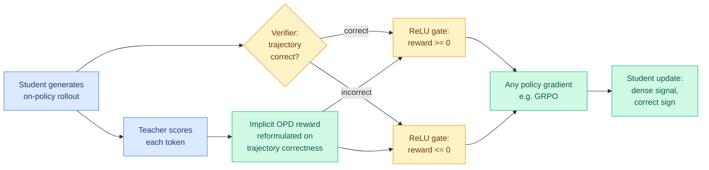

# OPDVR: On-policy Distillation with Verifiable Reward

**Source:** HuggingFace Daily Papers, [arXiv 2608.24696](https://arxiv.org/abs/2608.24696) (7 upvotes) · [raw](../../raw/huggingface/2026-08-26-on-policy-distillation-with-verifiable-reward.md)
**Authors:** Wenze Lin, Jiale Zhao, Xitai Jiang, Songde Rao, Yining Li, Shenzhi Wang, Bingxiang He, Gao Huang (LeapLab Tsinghua, Beihang, SMS Peking, NLPLab Tsinghua)
**Code:** https://github.com/LeapLabTHU/OPDVR

---

## TL;DR

Two post-training paradigms have complementary flaws. Reinforcement learning with verifiable rewards (RLVR, where a checker confirms whether the final answer is right and that binary outcome is the only reward) knows about correctness but gives you one bit of feedback at the end of a long generation, so credit assignment to intermediate steps is guesswork. On-policy distillation (OPD, where a stronger teacher model supplies a target distribution at every token the student generates) gives dense per-token guidance but has no notion of whether the answer was right, so the student's ceiling is the teacher. OPDVR fuses them **without adding a single hyperparameter**: it reformulates OPD's implicit reward in terms of trajectory correctness, then applies a ReLU gate so correct trajectories can only receive non-negative reward and incorrect ones only non-positive. The side effect matters as much as the result — the reformulation turns sampled-token OPD into a *proper* RLVR method, so it drops into any policy-gradient algorithm including GRPO. Gains are consistent over standard OPD across six reasoning benchmarks.

---

## Mechanism

The paper's own framing of the prior art is the useful part. Existing attempts to combine OPD and RLVR "rely on weighted combination or heuristic switching, introducing extra hyperparameters and trade-offs" — you pick a mixing coefficient, or a rule for when to switch objectives, and both choices are arbitrary and dataset-specific. OPDVR's claim is that no mixing is required because the two signals were never really separate: once you rewrite OPD's implicit reward as a function of trajectory correctness, the gate is the only thing you need to make the dense signal point in the direction task success actually lies.

---

## Key takeaways

- **The teacher ceiling comes off.** Pure OPD is a distributional objective: it asks the student to look like the teacher, which bounds the student at the teacher. Adding verified correctness means a correct student trajectory the teacher would have scored poorly still gets rewarded.
- **Zero new hyperparameters.** This is the practical selling point over weighted-combination and switching baselines, and it is why the method is credible as a drop-in.
- **It becomes a proper RLVR method.** Sampled-token OPD is transformed into something composable with any policy-gradient algorithm rather than a bespoke objective.
- **Consistent improvement over standard OPD on six reasoning benchmarks.** The abstract does not name per-benchmark deltas.

## Gaps in the study

The abstract reports "consistently outperforms standard OPD" without numbers, which for a method whose entire content is a comparison is the wrong level of reporting. The stronger missing comparison is against RLVR alone at matched compute, since OPDVR's pitch is that it beats *both* parents and only one is benchmarked in the abstract. The ReLU gate is a hard sign constraint, so it discards magnitude information about *how* wrong an incorrect trajectory was; whether a softer gate does better is unexplored. And the method inherits RLVR's fundamental scope limit: it only works where a verifier exists.

---

## Relation to prior wiki pages

**OPDVR is a direct answer to the load-bearing weakness [R2-OPD (08-25)](2026-08-25-r2-opd-reasoning-progress-filtering.md) left open, and it answers it by refusing R2-OPD's whole approach.** R2-OPD's finding was sharp and uncomfortable: on-policy distillation's dense token reward is derived from teacher agreement and implicitly treated as a proxy for reasoning progress, and the two come apart systematically — when the student finds a *different valid reasoning path*, teacher agreement falls while actual progress is fine, so the student is punished for exactly the independent correct reasoning you were trying to produce. R2-OPD's fix was to build a second, cheap progress-reward model and suppress distillation reward wherever the two rankings disagree. The [knowledge-distillation](knowledge-distillation.md) page recorded the weakness immediately: that progress estimator is itself an unvalidated learned model with no sensitivity ablation, and if it errs in the same places as the teacher the filter quietly does nothing. The page went further and named it a shared risk across the family, since VoI-MoLE (08-25) has the identical structural problem in its reducibility estimator: **every method in this family depends on a second estimator nobody has validated.**

OPDVR attacks the same failure mode with a signal that needs no validation. A verifier is not an estimator. Where R2-OPD asks a learned model to guess whether a divergent path is making progress, OPDVR asks a checker whether the path *ended up right*, and gates on that. The student that reasons independently and correctly is protected by construction rather than by a model's opinion. That is a strictly stronger guarantee on the subset of tasks where a verifier exists, and strictly weaker coverage outside it. The trade is clean and the wiki should hold both: **R2-OPD generalizes further, OPDVR is trustworthy where it applies.**

**It also lands on the axis this page has been circling all year.** The selective-supervision thread — TIP (04-16, most teacher tokens carry no learning signal, keep roughly 10%), TA-OPD (06-01, token teachability), TrOPD (06-03, trust-region constraints), FiRe-OPD (06-04, filter then reweight), R2-OPD (08-25, disagreement filtering) — argued about *which tokens* to supervise. OPRD (06-05) moved the venue to *which layer*, aligning student and teacher hidden states and bypassing the LM head, on the argument that output-space variance was an artifact rather than a fact. OPDVR moves it to *which trajectories*, which is a coarser granularity than any of them and works anyway, because the information it adds is orthogonal to everything the token-selection line was fighting over. Together with [QAH (today)](2026-08-26-quantization-aware-healing.md), which moves the venue to *which teacher*, the distillation program now has four distinct axes and today supplied two of them.

**The teacher-ceiling pattern is now established across three subfields.** OPRD (06-05) found output-space OPD *plateaus below the teacher* on AIME 2024/2025 and AIMO. OPDVR states the same bound as a structural property of purely distributional objectives. [QAH (today)](2026-08-26-quantization-aware-healing.md) finds the compression-recovery version: distilling a quantized student from a recovered checkpoint caps it at that checkpoint's ceiling. Three independent results, one diagnosis — **the binding constraint in distillation is usually the supervisor, not the student** — and three different fixes (change the layer, add a verifier, change the teacher).

---

## Related pages

- [Knowledge distillation](knowledge-distillation.md)
- [R2-OPD: reasoning-progress filtering (08-25)](2026-08-25-r2-opd-reasoning-progress-filtering.md)
- [Quantization-Aware Healing (08-26)](2026-08-26-quantization-aware-healing.md)
- [DiffusionOPSD: on-policy self-distillation in diffusion models (08-26)](2026-08-26-diffusion-opsd-self-distillation.md)
