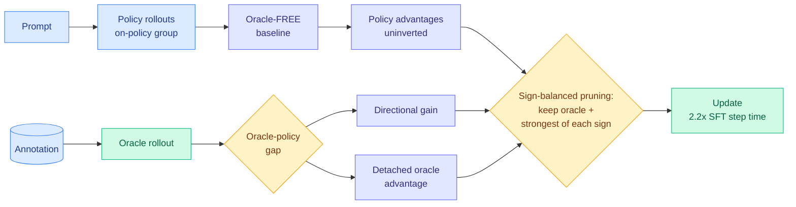

# OraRL: annotations as oracle rollouts, and the advantage-inversion failure

**Source:** HuggingFace Daily Papers, [arXiv 2608.20492](https://arxiv.org/abs/2608.20492) — the day's top paper at 65 upvotes · [raw](../../raw/huggingface/2026-08-26-annotations-as-rollouts-efficient-and-scalable.md)
**Authors:** Yunheng Li, Guohong Mu, Qibin Hou (corresponding), Ming-Ming Cheng (VCIP Nankai, NKIARI Shenzhen); Hao Li, Dingwen Zhang (Brain and AI Lab, NPU); Shengsheng Qian (Institute of Automation, CAS)

---

## TL;DR

Reinforcement learning post-training for video models wastes most of its compute because on-policy sampling rarely produces a rollout good enough to learn from, and chain-of-thought generation makes each wasted rollout longer. OraRL's observation is that the dataset already contains a perfect rollout: the human annotation. Let it enter the on-policy group as an **oracle rollout**, a direct positive optimization target rather than only a scoring reference. Doing that naively breaks the algorithm in a way the paper names precisely — **advantage inversion**, where a high-reward oracle lifts the group baseline so far that genuinely good policy rollouts acquire *negative* advantages and get trained away from. The fix is a decoupled advantage estimator. The efficiency numbers are the reason this is a Tier 1 read despite being a video paper: **2.2x SFT step time against GRPO-with-CoT's 4.9x**, and dropping chain-of-thought entirely takes decode latency from **4,780 ms to 130 ms**.

---

## Mechanism

Two decouplings and a pruning rule. **Policy rollouts alone determine the baseline**, so inserting the oracle cannot shift the reference point the policy rollouts are judged against — that is what kills advantage inversion. The **oracle-policy gap** is then used twice and separately: once as a directional gain modulating the policy advantages, once as a **detached** oracle advantage that supplies the positive target without flowing through the baseline. **Sign-balanced pruning** retains only the oracle plus the strongest rollout of each sign, which is where the step-time saving comes from: you keep the most informative positive and the most informative negative and discard the indistinguishable middle.

Per the alphaxiv overview, the framing against prior work is that supervised fine-tuning uses annotations as maximum-likelihood targets, which enforces output format but gives no task-level signal separating a near-correct prediction from a clearly wrong one, while GRPO-family RL uses annotations only as scoring references and its on-policy rollouts rarely match annotation specificity (exact intervals, boxes, masks, trajectories). OraRL's move is that both uses are available at once.

---

## Key takeaways

- **Sample efficiency as the headline, not accuracy.** 2.2x SFT step time versus 4.9x for GRPO with chain-of-thought, so less than half the training cost of the standard RL recipe.
- **Dropping chain-of-thought at inference is a 37x latency win.** Video-ORA-9B decodes in **130 ms instead of 4,780 ms**. The paper's claim is that annotations-as-rollouts supplies enough dense positive signal that the CoT scaffold becomes unnecessary, which converts a training-method choice into a serving-latency result.
- **Scales on both axes**: surpasses its own backbone from 0.8B to 9B, and beats GRPO up to 100k prompts.
- **Substantial task gains.** Temporal mIoU 62.5 → 66.0; tracking AO 73.0 → 78.2; segmentation 64.3 → 70.4; three-benchmark spatial-intelligence macro average 51.0 → 56.1. On VSI-Bench, **73.1 against 55.0 for GPT-5 and 55.1 for Gemini-3-Pro**.
- **Advantage inversion is a named, reusable failure mode.** Any method that injects an off-policy high-reward sample into a group-relative advantage computation is exposed to it. That includes a lot of things nobody has checked.

## Gaps

The efficiency claim is a step-time ratio against one baseline configuration, and GRPO-with-CoT is the expensive end of the comparison space. The dependence on annotation quality is total and unquantified: an oracle rollout is only an oracle if the annotation is right, and no ablation degrades annotation quality to find the breaking point. The 37x decode win comes from removing CoT, which is a change to the deployed model rather than an OraRL property, so the honest attribution is that OraRL makes CoT-free deployment viable rather than that it accelerates decoding. And the domain is video perception throughout, so nothing here is tested on text reasoning where the annotation-as-rollout idea would be cheapest to try.

---

## Relation to prior wiki pages

**Advantage inversion is the most transferable thing in this paper, and it generalizes a warning [knowledge-distillation](knowledge-distillation.md) has been circling from the other direction.** That page's [R2-OPD (08-25)](2026-08-25-r2-opd-reasoning-progress-filtering.md) entry recorded a systematic, non-averaging bias: on-policy distillation punishes a student for finding a *different valid reasoning path*, because teacher agreement falls while real progress does not, so the student is pushed toward mimicry. OraRL's inversion is the mirror image inside group-relative RL: insert one very good sample and the *relative* machinery inverts the sign on other good samples, punishing them for being merely good. Both are failures of a relative signal, both are systematic rather than noisy, and both are invisible in aggregate reward curves. The shared lesson is worth stating as a rule: **when supervision is relative, adding a strong reference can be actively harmful unless the baseline is decoupled from it.**

**The sign-balanced pruning result belongs to this page's oldest thread.** TIP (04-16) found that most teacher-generated tokens carry no learning signal and roughly 10% suffice. OraRL finds the rollout-level version: keep the oracle and the strongest rollout of each sign, drop the rest, and step time more than halves. Same claim at a coarser granularity, in RL rather than distillation, on video rather than text. That is now the fourth granularity at which this wiki has recorded "most of the supervision is discardable" — tokens (TIP), turns (AgentOPSD, 08-07, locating pivotal turns by disagreement), reasoning spans (R2-OPD), and now whole rollouts.

**The CoT-removal result is a test-time-compute claim.** [test-time-compute-allocation](test-time-compute-allocation.md) tracks the trade between inference-time reasoning and accuracy. OraRL argues the trade can be relocated into training: pay for dense positive supervision once, and the model no longer needs to spend 4,780 ms reasoning at serve time to reach the same or better numbers. If that holds outside video perception it is a significant claim about where chain-of-thought's value actually sits, and it is cheap to falsify on text benchmarks.

---

## Related pages

- [Knowledge distillation](knowledge-distillation.md)
- [Test-time compute allocation](test-time-compute-allocation.md)
- [R2-OPD (08-25)](2026-08-25-r2-opd-reasoning-progress-filtering.md)
- [OPDVR (08-26)](2026-08-26-opdvr-distillation-verifiable-reward.md)
