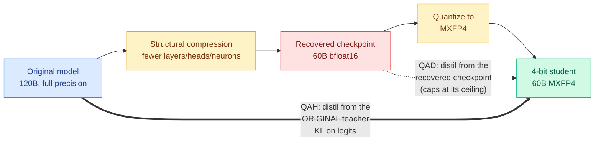

# Quantization-Aware Healing: a 4-bit model that beats its own full-precision checkpoint

**Source:** [Multiverse Computing / HuggingFace blog](https://huggingface.co/blog/MultiverseComputingCAI/quantization-aware-healing) (2026-08-25) · [raw](../../raw/rss/2026-08-25-huggingface-blog-quantization-aware-healing-a-compressed-4-bit-model-tha.md)
**Paper:** "Quantization-Aware Healing: A Practical Recipe for Recovering Compressed, 4-Bit LLMs"

---

## TL;DR

The standard efficiency pipeline is compress the architecture, quantize to 4 bits, then *heal* the damage with more training. Quantization-Aware Healing (QAH) changes exactly one thing about the healing step: it distills from the **original, pre-compression model** instead of from the recovered checkpoint. Applied to GPT-OSS 120B compressed to 60B and quantized to MXFP4, the result beats the 60B architecture's own bfloat16 checkpoint on **7 of 9 benchmarks**. The 4-bit model is smaller, cheaper to serve, and more accurate than the 16-bit model it was quantized from, which inverts the relationship everyone assumes between a quantized model and its source.

---

## Mechanism

**Why the usual healing methods fall short here.** The dominant recipe is quantization-aware training (QAT): insert fake-quantization operators into the forward pass and keep fine-tuning on a task loss so weights learn to tolerate low precision. That means re-running an already expensive multi-stage post-training history (supervised fine-tuning, RLHF, agentic tuning) through a noisier forward pass. It is costly and, the paper shows, unstable if training continues past its best point. The alternative, quantization-aware distillation (QAD), skips that history by distilling a frozen full-precision teacher into the quantized student via KL divergence on logits. QAD works when quantization is the *only* change, because a genuine full-precision version of the same model exists to teach. Once the model has also been **structurally** compressed, that assumption breaks: no independently trained full-precision version of the smaller architecture exists, so the only candidate teacher is the recovered bfloat16 checkpoint, which is itself a lossy approximation. Distilling from it anchors the student to a degraded target and caps accuracy at that checkpoint's ceiling.

**QAH removes the ceiling by removing the constraint that teacher and student share an architecture.** The teacher is full-size and full-precision; the student is half the size running in MXFP4. Because a teacher's output distribution is architecture-agnostic, the shape mismatch does not block transfer. The student sees no hard labels, only the teacher's distribution matched through KL on the logits.

**The reframing is the interesting part.** Under QAH, quantization stops being lossy postprocessing applied after healing finishes. It becomes a *second full pass of distillation against the original teacher* — supervision the bfloat16 checkpoint never received. The 4-bit student is not compensating for information lost to quantization; it is picking up information the earlier recovery stage never had the time or data to transfer. That is why it can exceed its own bf16 parent rather than merely approach it.

**A stability property falls out of the loss.** KL distillation ties the student to a fixed teacher distribution, so once the student catches up there is no further pressure to drift. A cross-entropy task loss keeps pushing toward hard labels indefinitely, which is the mechanism behind QAT's instability when over-trained. Long-context healing (documents to 32k tokens) is made to fit a fixed GPU memory budget by reusing a memory-efficient **chunked KL loss** that computes the divergence one sequence slice at a time and never materializes the full vocabulary-by-sequence grid.

---

## Key findings

- Applied to GPT-OSS 120B → compressed 60B → MXFP4 under QAH, the 4-bit model **wins on 7 of 9 benchmarks against the 60B bfloat16 recovered checkpoint**, the best full-precision version of that architecture in existence.
- The teacher's logits are precomputed offline, so the expensive forward pass is paid once rather than every step.
- QAH is compared head-to-head against QAT, and QAT is shown to degrade if training runs too long past its optimum. QAH does not exhibit that failure, and the blog attributes the difference to the loss form rather than to hyperparameters.
- The compress-then-heal pipeline QAH improves on is already what ships: gpt-oss, NVIDIA's Nemotron family, and Multiverse's own Hypernova 60B all use some version of it.

## Gaps

Single model family, single compression ratio (2x), single quantization format (MXFP4). The result "4-bit beats bf16" is reported against the recovered 60B checkpoint, not against the original 120B in bf16, so it is a statement about recovering compression damage rather than about quantization being free. Two of nine benchmarks still lose and the blog does not say which or why. And the offline-precomputed-logits trick has a storage cost proportional to vocabulary times tokens that is not priced.

---

## Relation to prior wiki pages

**QAH opens a fourth axis in this wiki's distillation program, and it is the one nobody had touched: *which teacher*.** The [knowledge-distillation](knowledge-distillation.md) page records a long spring and summer argument that was entirely about *which tokens* to supervise — TIP (04-16, most teacher tokens carry no signal, keep ~10%), TA-OPD (06-01, token teachability), TrOPD (06-03, trust regions), FiRe-OPD (06-04, filter then reweight), and R2-OPD (08-25, suppress supervision where a teacher ranking and a progress ranking disagree). OPRD (06-05) then moved the argument to *which layer*, aligning hidden states instead of output probabilities and arguing the token-selection debate was managing variance created by working in output space at all. QAH moves it to *which teacher*, and shows that the field's default answer had a structural flaw: after structural compression there is no legitimate same-architecture teacher, and the obvious substitute silently caps the student. The four axes now read: which tokens → which layer → which trajectories ([OPDVR, today](2026-08-26-opdvr-distillation-verifiable-reward.md)) → which teacher.

**It also confirms, from the deployment side, the pattern that page has been building about ceilings.** OPRD's finding was that output-space on-policy distillation *plateaus below the teacher* on AIME and AIMO. OPDVR (today) makes the same diagnosis about pure distributional objectives: a student under on-policy distillation is bounded by its teacher because the objective contains no notion of correctness. QAH is the third instance in the same shape — a distillation setup whose accuracy ceiling is set by the choice of supervision source rather than by the student's capacity. Three independent results in three subfields (representation alignment, reasoning post-training, compression recovery) diagnosing a ceiling and fixing it by changing what the student is taught from, not how much. That crosses this wiki's threshold for a named pattern: **in distillation, the binding constraint is usually the supervisor, not the student.**

**Tier 1 note on the cost axis.** [compute-economics](../hardware/compute-economics.md) records that a 34.5% cross-vendor tokenizer penalty can erase most of the headline savings from a state-of-the-art token-reduction technique, and argues cost-per-completed-task is the only unit in which such effects are commensurable. QAH sits on the other side of that ledger: it is a *pure* win in that unit, because a 2x-smaller 4-bit model that scores higher reduces memory, compute and serving cost simultaneously with no accuracy debt to trade against. That is rare enough in this wiki to be worth naming.

---

## Related pages

- [Knowledge distillation](knowledge-distillation.md)
- [OPDVR: on-policy distillation with verifiable reward (08-26)](2026-08-26-opdvr-distillation-verifiable-reward.md)
- [Compute economics](../hardware/compute-economics.md)
- [GPU kernels](../hardware/gpu-kernels.md)
