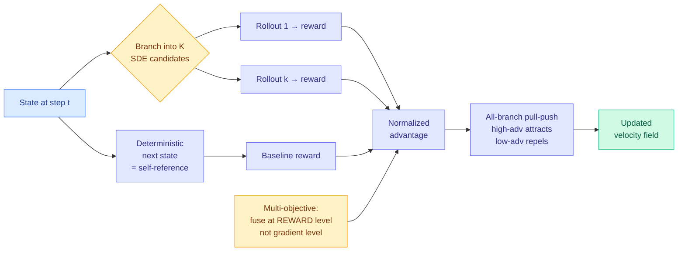

# Self-OPD: On-Policy Distillation for Flow Matching Models without Teacher

**Source:** HuggingFace Daily Papers, [arXiv 2608.26872](https://arxiv.org/abs/2608.26872) · Shiyi Zhang (Tsinghua + Alibaba), Mushui Liu, Yunze Tong, Yunlong Yu (Zhejiang + Alibaba), Wanggui He, Hao Jiang et al.
**Raw:** [raw/huggingface/2026-08-28-self-opd-on-policy-distillation-for-flow-matching-models-wit.md](../../raw/huggingface/2026-08-28-self-opd-on-policy-distillation-for-flow-matching-models-wit.md)
**Enriched with** the [alphaxiv](https://www.alphaxiv.org/abs/2608.26872) overview.

---

## TL;DR

On-policy distillation (giving a student dense per-step supervision from a teacher instead of one score at the end) is the dominant alignment recipe in this wiki, and it has an expensive dependency: **a separate specialized teacher per objective.** Want better text rendering, better compositionality, and better human-preference alignment from one flow-matching image model, and you are training three teachers. Self-OPD deletes the teacher entirely. At each denoising timestep it branches the deterministic next-state prediction into **K stochastic SDE candidates**, rolls each one out to a finished image with the ODE sampler, scores them, and compares those rewards against a **deterministic self-reference baseline** to get normalized advantages. The student's own exploration becomes the step-wise supervision.

---

## The two problems it names

**Cost.** Training or acquiring a specialized teacher for every new objective is expensive, and the expense is per-objective rather than one-time. **Compounding error.** The teacher and student have different distributions, so a student regressed onto teacher velocity predictions drifts further off the teacher's support at each step, and the supervision degrades along the trajectory precisely where it is needed most.

## The part that is not obvious

Two design choices carry the paper. First, the baseline is the **deterministic** next-state prediction, not the mean of the K stochastic branches. That makes the advantage measure "did adding noise here help relative to the confident path," which is a sharper question than "was this branch above average." Second, the objective is **all-branch pull-push**: high-advantage branches attract the student's velocity field and low-advantage branches actively repel it, with direction-aware attenuation and SDE-variance normalization. Standard on-policy distillation only pulls toward the teacher. Explicitly pushing away from bad branches is what lets a teacher-free method extract signal from its own failures rather than discarding them.

Third, and this is the multi-objective contribution: **fuse at the reward level, not the gradient level.** The alphaxiv overview is useful here because it explains why the alternative fails. Teacher-dependent multi-objective on-policy distillation merges several teachers' *velocity fields*, which is gradient-level fusion, and conflicting update directions produce a compromise that satisfies no objective fully, giving models that excel on the prompt family matching one teacher and fail elsewhere. Self-OPD normalizes each reward and fuses the scalars before any gradient is formed, so the conflict is resolved in a space where it is well-defined.

## How this relates to prior wiki pages

**It is the fourth axis of the distillation program, arriving two days after the third.** The [knowledge-distillation concept page](knowledge-distillation.md) tracks a long selective-supervision thread that asked *which tokens* to trust (TIP 04-16 found roughly 10% of teacher tokens carry signal; TA-OPD, TrOPD, FiRe-OPD, SG-OPD and Quality-Aware OPSD refined the gate), then *which trajectories*, then on 08-26 [Quantization-Aware Healing](2026-08-26-quantization-aware-healing.md) opened *which teacher*. Self-OPD asks **whether there needs to be one at all.**

**It is the third instance of the teacher-ceiling pattern in four days, and it resolves it differently from the other two.** [OPRD (06-05)](knowledge-distillation.md) found that output-space distillation plateaus below the teacher on AIME and AIMO. [OPDVR (08-26)](2026-08-26-opdvr-distillation-verifiable-reward.md) diagnosed that a purely distributional objective *bounds the student at its teacher* and broke the bound by gating on a verifier. [QAH (08-26)](2026-08-26-quantization-aware-healing.md) found the ceiling was a degraded intermediate checkpoint and swapped the teacher pointer. Self-OPD removes the ceiling by removing the referent: a student supervised by its own advantage-ranked exploration has no teacher to be bounded by. The [08-26 digest](../daily-digest/2026-08/2026-08-26.md) stated the shared diagnosis as **"the binding constraint in distillation is the supervisor, not the student."** Self-OPD is the strongest form of that claim so far, and it is now four papers deep, well past the wiki's three-instance threshold for a named pattern.

**It sits exactly between DiffusionOPSD and Flow-GRPO, and the comparison is the honest way to read it.** [DiffusionOPSD (08-26)](2026-08-26-diffusion-opsd-self-distillation.md) was already the first entry on the distillation page where the teacher *is* the student: a frozen behavior policy supplies anchors, reward gradients build bounded positive and negative targets, an EMA update refreshes the behavior policy, cutting training GPU-hours 40% on SD 3.5-M and 63% on Z-Image-Turbo. Self-OPD is the same family with a different construction, branching at the SDE level rather than anchoring on a frozen copy. **Two ByteDance-and-Alibaba-scale groups, two days apart, both arriving at teacher-free dense supervision for diffusion and flow models.** Meanwhile Flow-GRPO, the reinforcement-learning baseline, was already teacher-free but derived reward from the *terminal* state of a full denoising trajectory, giving high-variance gradients. Self-OPD's claim is to keep RL's teacher-freedom and OPD's density.

## Gaps

**The compute accounting is the load-bearing omission.** Self-OPD removes the cost of training a teacher and replaces it with K full ODE rollouts *per timestep* per training example. Whether that is cheaper depends entirely on K, on how many timesteps are sampled, and on how expensive the discarded teacher would have been. The abstract reports quality wins on single and mixed reward benchmarks and no compute comparison. Given that DiffusionOPSD, its nearest neighbour, led with a 40-63% GPU-hour reduction, the absence here is notable and it is the first thing to look for in the full paper.

Second, the reward-level fusion claim needs an adversarial test. Fusing normalized scalars avoids gradient conflict but it does not avoid *preference* conflict: if better text rendering genuinely requires worse compositionality on some prompts, a fused scalar picks a fixed trade-off rather than surfacing the frontier. The paper reports mixed-reward benchmark wins, which is consistent with both "resolved the conflict" and "the objectives did not actually conflict on this benchmark."

Third, no ablation isolating the pull-push objective from the deterministic-baseline choice. Those are two independent ideas and either could be carrying the result.

## Industrial implication

For anyone aligning an image or video generator, the practical read is that **the per-objective teacher is now optional**, which changes the marginal cost of adding an alignment objective from "train a model" to "write a reward function." That is a large enough drop to change how many objectives a team is willing to carry, and it points the bottleneck at reward-model quality instead of teacher availability. It also fits the direction the [08-26 digest](../daily-digest/2026-08/2026-08-26.md) flagged: open-weight models are the hardware industry's standard test load now, and techniques that make small open generative models cheap to align are the ones that get adopted fastest.

## Related

- [knowledge-distillation](knowledge-distillation.md) (concept)
- [DiffusionOPSD (08-26)](2026-08-26-diffusion-opsd-self-distillation.md)
- [OPDVR (08-26)](2026-08-26-opdvr-distillation-verifiable-reward.md)
- [Quantization-Aware Healing (08-26)](2026-08-26-quantization-aware-healing.md)
- [TTPO (08-28)](2026-08-28-ttpo-test-time-policy-optimization.md)
