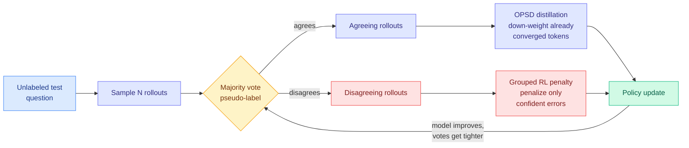

# TTPO: Test-Time Policy Optimization

**Source:** HuggingFace Daily Papers, [arXiv 2608.27448](https://arxiv.org/abs/2608.27448) · Aozhe Wang, Zhengxi Lu, Jianze Wang et al. (Zhejiang University + Alibaba Group); Qianglong Chen and Yongliang Shen corresponding
**Raw:** [raw/huggingface/2026-08-28-ttpo-test-time-policy-optimization.md](../../raw/huggingface/2026-08-28-ttpo-test-time-policy-optimization.md)
**Enriched with** the [alphaxiv](https://www.alphaxiv.org/abs/2608.27448) overview.

---

## TL;DR

The strongest post-training methods all need ground-truth answers, which means none of them can run at test time on data you have never labelled. Swapping the label for a majority-vote pseudo-label is the obvious fix and it fails badly for dense methods: a wrong vote corrupts the teacher and then misleads the student **at every single token**, where a wrong sequence-level reward misleads once per trajectory. TTPO's contribution is an observation that makes the failure survivable. **The error is asymmetric: rollouts that disagree with the pseudo-label are usually wrong regardless of whether the vote itself was right.** So treat the two branches differently. Distil the agreeing rollouts with on-policy self-distillation, and penalize the disagreeing ones with grouped reinforcement learning. Without any labels, TTPO matches label-supervised on-policy self-distillation on five competition benchmarks and takes Qwen3-1.7B from 38.0% to 45.2%.

---

## Why the asymmetry is the whole paper

Prior test-time training for reasoning, notably TTRL (test-time reinforcement learning), used majority-vote pseudo-labels to derive rewards and was therefore only as good as the consensus. Follow-ups (Hi-TTRL, SCRL) reduced that sensitivity but stayed inside reinforcement learning and its coarse sequence-level signal. The natural move, plugging pseudo-labels into on-policy self-distillation to get dense token-level supervision, is strictly worse, because density amplifies label error.

TTPO's insight breaks the symmetry that made that trade-off look forced. A rollout that disagrees with the consensus is a bad bet *even when the consensus is wrong*, because most wrong answers are wrong in idiosyncratic ways while the vote at least concentrates probability mass. So the negative branch is safe to penalize almost unconditionally, and the positive branch, which is the dangerous one, is where the label error actually lives. Applying the *dense* method only to the agreeing side and the *coarse, robust* method to the disagreeing side is a clean allocation of trust to signal quality.

**Token-level selection then refines both branches:** distillation down-weights positions where the model has already converged (no gradient left to extract), and RL penalizes only *confident* errors, which avoids punishing a model for tokens it was already uncertain about. That second rule is the same instinct as gating on reliability rather than on correctness.

## How this relates to prior wiki pages

**TTPO is the label-free member of the selective-supervision family that the [knowledge-distillation page](knowledge-distillation.md) has been tracking all year, and it belongs to the "disagreement is the signal" pattern.** That page records the pattern as settled at three independent instances: the 08-08 cluster established a single teacher signal is untrustworthy at token granularity; **AgentOPSD (08-07)** located pivotal *turns* in agent trajectories by disagreement rather than absolute reward; **[R2-OPD (08-25)](2026-08-25-r2-opd-reasoning-progress-filtering.md)** located untrustworthy *tokens* by disagreement between a teacher-derived ranking and an independently estimated reasoning-progress ranking. TTPO is a fourth instance with the sharpest version of the idea: it does not merely *locate* disagreement, it **routes disagreeing and agreeing samples to different algorithms.** The prior instances used disagreement as a mask; TTPO uses it as a dispatcher.

**It also has the same structural weakness that R2-OPD and VoI-MoLE have, and it solves it better.** The [knowledge-distillation page](knowledge-distillation.md) flagged that R2-OPD's independently estimated progress reward is itself an unvalidated learned model, a risk it shares with [VoI-MoLE (08-05)](../ai-routing/2026-08-05-vi-mole-value-of-information-routing.md)'s reducibility estimator: **every method in this family depends on a second estimator nobody has validated.** [OPDVR (08-26)](2026-08-26-opdvr-distillation-verifiable-reward.md) escaped it by using a verifier, which is not an estimator, but a verifier needs ground truth. TTPO's second signal is a majority vote, which is not a learned model either. It is cheap, it has no parameters, its failure mode is characterized (it fails when the model is confidently and coherently wrong), and it **self-improves as the policy improves** because tighter policies vote more tightly. That is a genuinely better answer than a learned estimator for the label-free setting.

**And it lands on the [test-time-compute-allocation page](test-time-compute-allocation.md) as a different kind of test-time spend than anything there.** Everything on that page allocates *inference* compute (how many samples, how long to think, how to ration across a batch). TTPO spends test-time compute on **gradient updates to the weights**, which is a category the page does not yet cover. The relevant tension: it reports "+25.2% to +36.4% without thinking," meaning it recovers a large part of chain-of-thought's benefit by moving the spend from generated reasoning tokens into a weight update. If that holds, it is a direct substitution between two test-time budgets that the field has been treating as unrelated.

## Gaps

**The compute cost is unreported and it is the whole question.** Test-time training means sampling N rollouts and running optimizer steps *per test distribution*, so the honest comparison is against spending that same compute on more samples plus majority voting at inference, which needs no gradients and no infrastructure. The abstract does not give it. Until it does, "matches label-supervised OPSD" is a capability claim with an unknown price, and this wiki has been complaining about exactly that omission across the whole harness and distillation literature.

Second, the asymmetry claim is empirical and reported as an observation, not as a measured rate. How often a disagreeing rollout is actually correct is the number that bounds how much damage the negative branch does, and it will vary by benchmark difficulty. On problems where the model is below chance, the consensus is systematically wrong and the disagreeing rollouts may be the *only* correct ones, which would invert the method. Five competition-level math benchmarks is a narrow and unusually consensus-friendly setting.

Third, "strong cross-task generalization" needs to be read carefully: a test-time-trained model has adapted to a test distribution, so generalization *away* from that distribution is precisely what the adaptation trades against, and the abstract does not say whether the adapted weights are kept or discarded.

## Industrial implication

The immediate use is deployment on a domain you cannot label. A serving stack that runs a short unsupervised adaptation pass against the first slice of real production traffic, then serves the adapted weights, is a plausible product, and it is more attractive at small scale (Qwen3-1.7B is the reported base) where the update is cheap and the headroom is large. The obstacle is not accuracy, it is operational: adapting weights at test time breaks reproducibility and complicates every rollback and audit path. Expect this to appear first in batch and offline-scoring workloads, where reproducibility can be re-established by pinning the adapted checkpoint, rather than in interactive serving.

## Related

- [knowledge-distillation](knowledge-distillation.md) (concept)
- [test-time-compute-allocation](test-time-compute-allocation.md) (concept)
- [R2-OPD (08-25)](2026-08-25-r2-opd-reasoning-progress-filtering.md)
- [OPDVR (08-26)](2026-08-26-opdvr-distillation-verifiable-reward.md)
- [Self-OPD (08-28)](2026-08-28-self-opd-teacher-free-flow-matching.md)
- [Evolution Strategies vs GRPO (08-28)](../llms-foundation-models/2026-08-28-evolution-strategies-vs-grpo.md)
