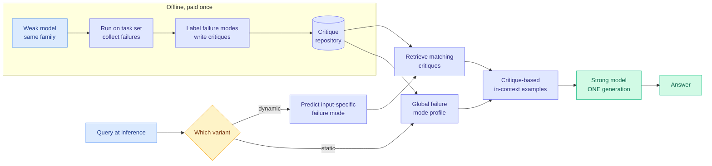

# CritICL: Inference-Time Weak-to-Strong Generalization from Small Language Model Failure Modes

**Source:** HuggingFace Daily Papers · COLM 2026 · [arXiv 2608.27455](https://arxiv.org/abs/2608.27455) · [code](https://github.com/umwyf/CRITICL)
**Raw:** [raw/huggingface/2026-08-28-criticl-inference-time-weak-to-strong-generalization-from-sm.md](../../raw/huggingface/2026-08-28-criticl-inference-time-weak-to-strong-generalization-from-sm.md)
**Authors:** Yufan Wu, Zhengyi Hu, Lang Wei, Ruichen Li, Qifan Yang, Ting Zhu (Ohio State), Yinghui He (Princeton)

---

## TL;DR

Test-time scaling (spending more inference compute to reason better) currently means one of two things: generate many samples and aggregate, or call an external verifier to check the work. Both are expensive at serving time and both pay that cost on every query. CritICL argues you can move almost all of it offline. The observation it rests on is that **a model family's failure modes are structured and transfer across scale**: the mistakes a small model in the family makes on a problem type are the mistakes the large one is at risk of. So you profile the small model's failures once, write natural-language critiques of them, store them, and at inference retrieve the relevant critique as an in-context example. The big model gets targeted "here is how you are likely to get this wrong" guidance for the price of one extra retrieval and one generation. Reported to be competitive with or better than test-time scaling methods at significantly fewer generations and lower token cost.

---

## The mechanism

Two variants, and the difference matters for deployment:

- **CritICL-dynamic** predicts the failure mode likely for *this* input, then retrieves critiques matching it. Higher ceiling, but the prediction step is another decision that can be wrong.
- **CritICL-static** uses one global failure-mode profile for the task family. Lower ceiling, no per-query prediction, and stable, which is what you want if the retrieval is on the serving critical path.

The retrieval objective is the genuinely novel part. Standard in-context-learning retrieval selects demonstrations by **semantic relevance to the query**. CritICL selects by **failure relevance**: which stored example addresses the error this query is likely to induce. Those are different orderings over the same corpus, and the paper's claim is that the second is the useful one for reasoning.

The weak-to-strong framing is also unusual in a practical way. Most weak-to-strong work uses the weak model as a *supervisor* at training time, or queries it online. CritICL never runs the weak model at inference at all. It mines it once for a failure taxonomy and then throws it away, so there is no online dependency on weak-model output quality.

---

## What it changes about cost

The efficiency argument is the reason this belongs in `inference-efficiency` rather than only in reasoning. Test-time scaling methods buy accuracy with **repeated generation**, which is the single most expensive thing you can do at serving time: N samples means N times the decode tokens and, more binding in practice, N concurrent long contexts competing for the same KV cache (the per-request GPU memory that holds attention state for tokens already processed). CritICL converts that recurring serving-time cost into a one-off offline profiling cost plus a retrieval.

That is a cost *relocation*, not a cost reduction, and it only pays off when the offline corpus amortizes across many queries. For a high-traffic endpoint on a stable task distribution, that is obviously right. For a long tail of one-off queries, the offline profile has nothing to say.

---

## Relation to the wiki's prior state

**It is a sixth entry on the [test-time compute allocation page](test-time-compute-allocation.md), and it answers a question that page had not asked.** That page's five decisions are: whether to spend at all, when to stop, where to spend across traces, how to spend more cheaply, and who should spend it. CritICL answers a sixth: **when to spend it.** Its claim is that a large part of the inference budget can be moved to a build step. [SLPO (07-23)](2026-07-23-slpo-latent-reasoning-surrogate-policy.md), the page's "how to spend more cheaply" entry, moves reasoning into a cheaper representation but still does it at inference. CritICL moves it out of inference entirely.

**It is the second result in two days to attack the same target from a different side.** [TTPO (08-28)](2026-08-28-ttpo-test-time-policy-optimization.md) spends test-time compute on gradient updates to the weights rather than on generated reasoning tokens, and reported +25.2% to +36.4% "without thinking," which the page recorded as a direct substitution between two budgets the field had treated as unrelated. CritICL substitutes in the same direction, from generated tokens to a stored artifact, but the artifact is text in a repository rather than a weight delta. **TTPO's artifact is per-test-distribution and breaks reproducibility; CritICL's is a corpus you can inspect, version and diff.** For anything that has to be audited, that is a materially better shape for the same trade, and neither paper cites the other.

**It also sits against the page's live methodological objection.** [Sampling Luck Masquerades as Allocation Gain](http://arxiv.org/abs/2608.13087) (Kurate cs.LG, week of 08-16) argued that reported test-time allocation gains are frequently the variance of drawing more samples rather than a real allocation effect, and the page notes nobody has run that audit on a reasoning benchmark. CritICL has a partial structural defence: it reports gains at **fewer** generations, and sampling luck cannot manufacture accuracy while reducing sample count. That makes it one of the few results on the page that the objection does not obviously reach.

**And it is a mirror image of a result from April.** [TIP (04-16)](knowledge-distillation.md) found that most teacher-generated tokens carry no learning signal and only about 10% need to be trained on, which is a claim that the *useful* part of a strong model's output is a small subset. CritICL claims something structurally similar about the *failures* of a weak model: they are a small structured set, not noise, and that set is the transferable asset. Both are arguments that the informative content of a model's output is far sparser than the output.

---

## Gaps

The abstract reports "competitive with or superior to" test-time scaling at "significantly fewer generations," without per-benchmark deltas in the material available here, so the size of the win is not verifiable from the abstract alone. Three things are missing and all are cheap to run:

- **Cross-family transfer.** The core premise is that failure modes transfer across scale *within a family*. Whether a Qwen-derived critique repository helps a Llama-derived model is untested, and the answer decides whether this is a technique or a per-vendor asset.
- **Staleness.** A critique repository is profiled against one checkpoint. Nothing reports how fast it decays when the strong model is updated, which is the operational question for anyone who would actually deploy it.
- **The honest cost table.** Offline profiling of a weak model across a task set is not free, and the paper compares against test-time scaling on generations rather than on total compute including the build step. This is the same omission the 08-28 digest flagged for Self-OPD and TTPO: three papers in two days deleting a serving-time dependency without publishing what replaced it.

---

## Related pages

- [Test-Time Compute Allocation](test-time-compute-allocation.md)
- [Knowledge Distillation](knowledge-distillation.md)
- [TTPO (08-28)](2026-08-28-ttpo-test-time-policy-optimization.md)
- [KV Cache](kv-cache.md)
