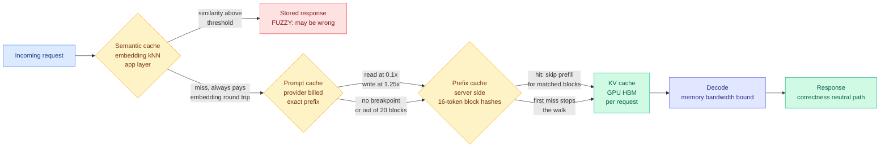

# KV vs Prefix vs Prompt vs Semantic Caching: the four layers, and which one can lie to you

**Source:** Avi Chawla (@_avichawla), X Article, surfaced via saved reading. Public mirror: [Daily Dose of Data Science](https://blog.dailydoseofds.com/p/kv-vs-prefix-vs-prompt-vs-semantic)
**Raw:** enriched bookmark capture, 2026-08-29 morning slot (private)

---

## TL;DR

Four different things in the LLM serving stack are all called "caching," they live at four different layers, and they are keyed on four different things. Three of them are exact-match and correctness-neutral, meaning a miss costs you money and latency and nothing else. The fourth, semantic caching, is fuzzy-match, and it will return a wrong answer with an HTTP 200. This wiki has thirty pages on the first layer and effectively none on the distinction, which is a gap worth closing, because most production cost incidents come from a prefix that broke rather than from a cache that was too small.

---

## The four layers

**1. KV cache. GPU memory, one request, dies with the request.** During prefill the model computes a key and a value vector for every prompt token at every layer; during decode it appends one new pair per generated token. Keeping them turns each decode step from a matrix-matrix multiply over the whole sequence into a matrix-vector one. The cost of that trade is the thing this wiki has been circling for four months: decoding becomes **memory-bandwidth bound**, and the GPU spends most of a decode step waiting on memory rather than computing. The concrete size: a 70B model at BF16 with 128K context needs roughly **40 GB per request**, comparable to the entire model at 4-bit weights. Grouped-query attention, multi-head latent attention and FP8 quantization (roughly doubling capacity) are the standard reductions. The failure this layer alone cannot fix: if blocks are freed after each request, **a 20-turn chat prefills turns 1 through 19 again on turn 20, at full cost.**

**2. Prefix caching. Same tensors, server side, persisted across requests.** vLLM chunks the sequence into fixed 16-token blocks and identifies each block by a hash over the parent block's hash plus the token IDs inside it, so a hash chain gives you prefix matching for free. The scheduler walks the incoming blocks in order and **stops at the first miss**, which is why one changed byte near the front invalidates everything downstream. Partial trailing blocks are recomputed every time. Eviction is least-recently-used when GPU memory is tight, and a larger prefix cache means fewer concurrent sequences, so it trades against batch size. Two caveats worth carrying: it **saves prefill only, decode time is unchanged**, and on traffic with genuinely unique prompts benchmarks have measured a throughput *regression*. The RAG-specific problem is sharp: under chain hashing, **two requests that retrieve the same documents in a different order share nothing at all.**

**3. Prompt caching. The provider's billed version of layer 2.** Still KV tensors, not prompt text, and it requires an exact prefix match on the fully rendered context. Anthropic and OpenAI charge roughly **1.25x the base input rate to write** and **0.1x to read**, with higher multipliers for longer time-to-live. The operational constraints are where teams lose money without noticing. Writes happen only at a breakpoint you placed. On reads the system walks backward through a limited number of blocks, and **Anthropic caps this at 20 blocks**, so adding more than 20 blocks of conversation between two calls pushes the last write out of range and you pay cold. And the one that matters for anything routing-shaped: **cache entries are keyed to a model, so routing to a cheaper one still prefills the whole accumulated history at cold rates.**

**4. Semantic caching. Application layer, and a different kind of object entirely.** It stores finished response strings, keyed by cosine similarity over an embedding, and returns a stored response outright when similarity exceeds a threshold. Unlike the other three, **every request bears an embedding round trip including every miss**, so the overhead is unconditional. The threshold has no good setting: raise it and the hit rate collapses while you keep paying for embeddings on every call; lower it and the hit rate climbs alongside the rate of confidently wrong answers. Published defaults range from 0.75 to 0.97, which is itself the tell. The deeper problem is what embeddings represent: **negated sentences sit close together in vector space**, and two prompts differing in one operational value score near-identical because the frame dominates. This is the only layer that trades correctness for savings.

---

## The four production failure modes

These are the ones that cost real money and are all prefix-shape problems, not capacity problems:

1. **Variable content at the front.** A timestamp, request id or username at the top of the prompt invalidates every block after it. Stable content first, variable content last.
2. **Tool schema reordering.** Schemas usually sit before the system prompt, so a reorder invalidates the whole cache.
3. **Settings rendered into the prompt.** Toggling web search, citations, thinking config or `tool_choice` rewrites the prompt text and invalidates downstream blocks.
4. **History summarization.** Summarizing history rewrites the prefix, so the next call pays full price on cold tokens. **Truncating tool outputs in place keeps the prefix byte-identical and the cache alive.**

---

## How this relates to what the wiki already knows

**It supplies the taxonomy the [KV Cache page](kv-cache.md) has been operating without.** That page holds roughly thirty results, and almost all of them are layer-1 and layer-2 work: eviction policy, quantization, per-head budgets, tiering, addressability. The page has repeatedly reasoned about prefix-cache economics without separating the server-side mechanism from the provider's billing of it, and the distinction turns out to carry the two most decision-relevant facts here (the 20-block backward walk, and model-keyed entries).

**It explains the mechanism behind the two biggest economic findings on that page.** [TokenPilot (06-16)](2026-06-16-tokenpilot-cache-efficient-agent-context.md), which showed that agent context management optimizing token count alone mutates the prompt prefix and triggers a full prefill recompute that cancels the saving, is failure mode 4 stated as a research result. And [DeepSeek's roughly six-fold cache-hit repricing alongside an append-only Harness (08-14)](2026-08-14-deepseek-harness-kv-cache-economics.md), whose central engineering commitment is never altering previously written history, is the same rule enforced by an engineering team rather than discovered by a paper. Three independent arrivals at one rule is a pattern: **append, never edit.**

**It sharpens the routing-versus-caching tension this wiki has not priced.** The [LLM routing page](../ai-routing/llm-routing.md) treats a route to a cheaper model as a pure win on price per token. Model-keyed cache entries say otherwise: on a 140K-token agentic prefix, which is the [median input length SemiAnalysis measured in AgentX (07-25)](../hardware/2026-07-25-semianalysis-amd-cuda-moat.md) from replayed Claude Code and Codex traces, a mid-conversation route to a cheaper model pays a full cold prefill on the entire accumulated history. **Nobody in the routing literature this wiki tracks prices the cache-invalidation cost of switching models mid-session**, and at that context length it plausibly dominates the per-token saving the route was chosen for.

**And it adds a correctness axis the page does not have.** Every result on the KV Cache page is correctness-neutral in intent, and where correctness is at stake the wiki's framing has been that eviction damage is hard to measure: the [07-28 impossibility result](2026-07-28-kv-eviction-error-certificates.md) proved deterministic top-k eviction cannot estimate the error it created, and [Compute Globally, Materialize Locally (07-29)](2026-07-29-sparse-event-kv-memory-contract.md) showed that observing no accuracy loss after dropping a cached fact does not prove the fact was unnecessary. Semantic caching is a different failure class: it does not degrade an answer, it substitutes a different question's answer, and it does so with a clean success status. That belongs on the page as its own row.

---

## Gaps

The article is a practitioner explainer, so it reports mechanism and vendor terms rather than measurements. There is no hit-rate data on real traffic, no comparison of the four layers' savings on the same workload, and no number attached to the semantic-cache wrong-answer rate at any given threshold. That last one is the missing measurement the whole field would benefit from: **published semantic-cache defaults span 0.75 to 0.97 and nobody has published the false-hit rate as a function of threshold on a real query distribution.**

---

## Related pages

- [KV Cache](kv-cache.md)
- [LLM Routing](../ai-routing/llm-routing.md)
- [Agent Harness Engineering](../agentic-systems/agent-harness-engineering.md)
- [Compute Economics](../hardware/compute-economics.md)
