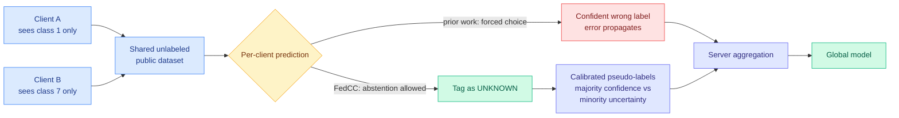

# FedCC: Towards Addressing Label Distribution Skews in Distillation-Based Federated Learning

**Source:** Kurate cs.LG leaderboard #1 this week (ai_rating 5.5/10, published 2026-08-24). Wenxuan Ye, Onur Ayan, Xueli An, Georg Carle.
**Links:** [arXiv 2608.23031](https://arxiv.org/abs/2608.23031) · [raw](../../raw/kurate/2026-08-30-cs-lg.md)

---

**TL;DR.** In distillation-based federated learning, clients never ship weights or data. They run their local model over a shared unlabeled public dataset and ship only predictions, which the server aggregates into pseudo-labels. That is cheap on bandwidth and it breaks badly when clients hold skewed label distributions, because a client that has only seen two classes will confidently classify everything as one of those two, and the server has no ground truth to catch it with. FedCC's fix is almost embarrassingly simple: **let a client say "unknown."** Adding an abstention class plus calibrated pseudo-labels takes accuracy from near-random to **67.3%** in the extreme case where each client holds exactly one of ten classes.

---

---

## What it is and why the failure happens

Standard federated learning ships model updates, which is expensive in bandwidth and leaks more than people like. Distillation-based federated learning replaces that channel with predictions on a shared public dataset: each client applies its local model to the public data, sends only the output distribution, and the server distills a global model from the aggregate. Bandwidth drops to the size of a prediction matrix.

**Label distribution skew is the standing failure of the whole approach.** Real clients hold non-identically-distributed data, so each local model is biased toward its own majority classes. When such a model is forced to classify a public sample from a class it has never seen, it does not produce a flat distribution, it produces a confident wrong one. The server would normally calibrate that away using labels, and in this setting the public dataset has none. So the errors aggregate, and in severe skew the global model collapses toward random.

## The core novelty

Two moves, both about not forcing a decision.

**Abstention.** Clients are given an additional `unknown` class and may tag ambiguous samples with it rather than being compelled to pick among classes they may never have seen. This is the whole idea, and its value is that it converts a confidently wrong vote into an absent vote, which aggregation can handle.

**Calibrated pseudo-labels on the public data.** The server balances confidence on majority classes against uncertainty on under-represented ones when forming pseudo-labels, so a client's high confidence on its own majority class does not automatically dominate.

## Results

- **67.3% accuracy in the extreme one-class-per-client setting with ten classes**, where the paper reports baselines collapsing to near-random. That is the headline and the gap is large enough that the mechanism is doing real work rather than tuning.
- Gains concentrate under severe skew, with the advantage narrowing as client distributions approach IID, which is the expected and honest shape.

## How this relates to prior wiki pages

**It is a distillation result whose lesson is about the teacher's right to abstain, and that connects to a thread this wiki has been building all year.** [Knowledge distillation](knowledge-distillation.md) records a run of papers finding that **most teacher-generated signal is worthless and the win comes from skipping it**: TIP showed most teacher tokens carry no learning signal so roughly 10% suffices, and [token teachability (06-01)](2026-06-01-ta-opd-token-teachability.md) made per-token teachability the selection criterion. FedCC is the same claim in a distributed setting with a twist worth naming: **here the teacher is not merely uninformative on some inputs, it is actively harmful, and the fix is to let it decline rather than to have the student filter afterwards.** Filtering at the source is cheaper than filtering at the sink, and in this setting it is the only option, because the sink has no labels to filter with.

**It shares its structure with today's other two papers, which is why all three landed together.** [RoI](2026-08-30-roi-semi-structured-sparsity.md) selects N weights of M and lets the rest go. [MCL](2026-08-30-mcl-concept-landscape-data-pruning.md) selects samples by marginal coverage gain and drops the redundant remainder. FedCC selects which client votes to count and discards the abstentions. Three papers on one leaderboard, all replacing a forced dense decision with a sparse one plus an explicit "no answer" option.

**It also touches the confidence-calibration thread running through this wiki's agent work.** [Agents are not time aware (08-30)](../agentic-systems/2026-08-30-agents-not-time-aware.md) measures coding agents overrating their own output by roughly 20 points, and this week's Kurate cs.AI board carries "Confident at the moment of action: belief miscalibration in LLM play under hidden information" at #6. FedCC is the same pathology in a different system: **a model asked to answer outside its support does not signal uncertainty, it signals confidence.** The engineering response in all three cases is identical, which is to build the abstention path into the protocol rather than hoping the model self-reports.

## Gaps

The abstention rate is the number that decides whether this is usable and it is not foregrounded. If clients abstain on most public samples under severe skew, the effective communication is much sparser than the bandwidth argument implies, and there is a regime where the server has too few votes per sample to calibrate anything. Where that boundary sits is unreported.

The dependence on the public dataset is also unexamined. The entire mechanism runs through a shared unlabeled corpus, and how much its distribution must overlap the clients' before abstention becomes universal is the practical deployment question. Ten classes with one per client is a clean stress test and a synthetic one; real skew is long-tailed and partial rather than disjoint.

Finally, nothing here is at language-model scale. This is classification with a small class count, and whether an `unknown` class means anything for a generative model, where the output space is not a fixed set of labels, is not a small extension.

## Related pages

- [Knowledge distillation](knowledge-distillation.md)
- [Model pruning and sparsity](model-pruning-sparsity.md)
- [Agents are not time aware](../agentic-systems/2026-08-30-agents-not-time-aware.md)
